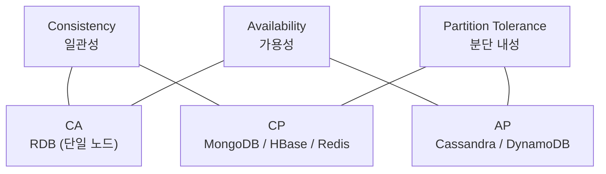
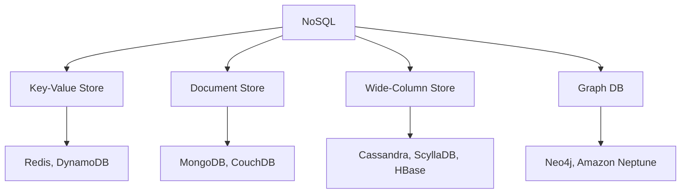
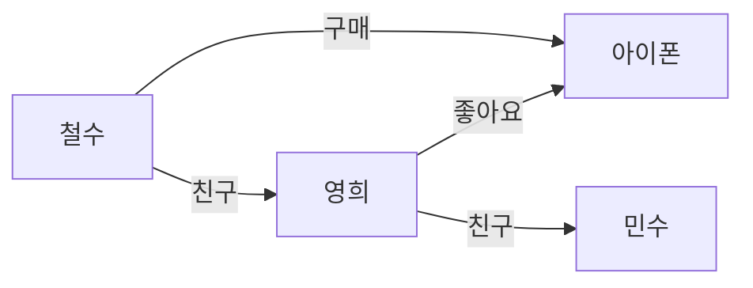
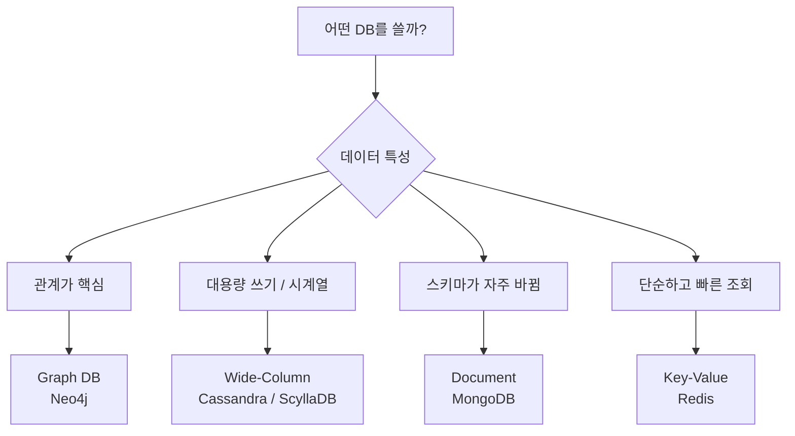

# NoSQL

## RDB와의 차이

NoSQL은 Not Only SQL의 약자로, RDB의 한계를 극복하기 위해 등장했다.

| | RDB | NoSQL |
|---|---|---|
| 스키마 | 고정 | 유연 (없거나 동적) |
| 확장 방식 | 수직 확장 (Scale-Up) | 수평 확장 (Scale-Out) |
| 트랜잭션 | ACID | BASE (대부분) |
| 관계 표현 | JOIN으로 강력하게 | 어렵거나 제한적 |
| 쿼리 | SQL 표준 | DB마다 다름 |

---

## ACID vs BASE

### ACID — RDB가 추구하는 것

```
Atomicity   — 트랜잭션은 전부 성공하거나 전부 실패
Consistency — 항상 일관된 상태 유지
Isolation   — 트랜잭션끼리 서로 간섭 없음
Durability  — 커밋된 데이터는 영구 보존
```

### BASE — NoSQL이 추구하는 것

```
Basically Available   — 일단 항상 응답은 한다
Soft state            — 데이터 상태가 시간에 따라 변할 수 있다
Eventually Consistent — 언젠가는 일관성이 맞춰진다
```

**Eventually Consistent** 가 핵심이다. 모든 노드에 즉시 동기화하는 대신, 잠깐의 불일치를 허용하고 나중에 맞춰진다. 정확성보다 속도와 가용성을 택한 것이다.

---

## CAP 정리

분산 시스템에서 아래 세 가지를 **동시에 모두 만족할 수 없다**는 이론이다.

```
C — Consistency    모든 노드가 같은 데이터를 본다
A — Availability   항상 응답을 반환한다
P — Partition      네트워크가 끊겨도 동작한다
    Tolerance
```



현실의 분산 시스템에서 네트워크 장애는 반드시 발생한다. 따라서 **P는 포기할 수 없고**, 실질적 선택은 **C냐 A냐**다.

| 선택 | 동작 | 대표 DB |
|---|---|---|
| CP | 네트워크 장애 시 응답 안 함, 데이터는 정확 | MongoDB, HBase, Redis |
| AP | 네트워크 장애 시에도 응답함, 데이터가 틀릴 수 있음 | Cassandra, DynamoDB, CouchDB |

> NoSQL = AP 라는 공식은 틀렸다. MongoDB는 NoSQL이지만 CP다.

---

## NoSQL 4가지 유형



---

## Key-Value Store

### 개념

가장 단순한 구조. 키와 값이 한 쌍이다. 키를 알면 즉시 값을 꺼낸다.

```
"session:user:1234" → { token: "abc", expiry: 3600 }
"rank:weekly"       → ["철수", "영희", "민수"]
```

### 특징

- 조회 속도가 압도적으로 빠름 (O(1))
- 구조가 단순한 만큼 복잡한 쿼리나 관계 표현은 불가
- 키를 모르면 찾기 어려움

### 대표 DB

| DB | 특징 |
|---|---|
| Redis | 인메모리, 다양한 자료구조 지원 (List, Set, ZSet 등) |
| DynamoDB | AWS 완전관리형, 무한 확장 |

### 유스케이스

- 세션 저장 (로그인 토큰)
- 캐시 (DB 앞단, 자주 읽는 데이터)
- 장바구니
- 실시간 랭킹, 카운터

---

## Document Store

### 개념

JSON(또는 BSON) 형태의 문서 단위로 저장한다. 문서마다 구조가 달라도 된다.

```json
// 상품 A (의류)
{ "id": 1, "name": "티셔츠", "color": "white", "size": ["S", "M", "L"] }

// 상품 B (전자기기)
{ "id": 2, "name": "노트북", "cpu": "M3", "ram": 16, "storage": 512 }
```

RDB라면 수백 개의 컬럼이나 EAV 패턴으로 억지로 맞춰야 하는 구조를 자연스럽게 표현한다.

### 특징

- 스키마가 유연해서 필드 추가/변경이 자유로움
- 중첩 구조(배열, 객체) 지원
- 인덱스 없이 전체 탐색(COLLSCAN) 시 성능 저하 → 인덱스 필수
- 복잡한 JOIN은 어려움

### 대표 DB

| DB | 특징 |
|---|---|
| MongoDB | 가장 널리 쓰이는 Document DB, 4.0 이후 ACID 트랜잭션 지원 |
| CouchDB | HTTP API 기반, 오프라인 동기화 강점 |

### 유스케이스

- 상품 카탈로그 (상품마다 속성이 다름)
- 콘텐츠 관리 (블로그, 뉴스)
- 사용자 프로필
- 로그 수집

---

## Wide-Column Store

### 개념

얼핏 보면 RDB 테이블처럼 생겼지만 완전히 다르다. **행마다 컬럼이 달라도 된다.**

```
user:1 → { name: "철수", age: 25, city: "서울" }
user:2 → { name: "영희", email: "y@y.com" }       ← age, city 없어도 됨
user:3 → { name: "민수", age: 30, phone: "010-xxxx", job: "개발자" }
```

행마다 컬럼 수가 수백 개가 될 수도 있고 없을 수도 있다. 그래서 "넓은 컬럼"이다.

### 특징

- 쓰기 성능이 극단적으로 빠름
- 수평 확장에 최적화 (노드 추가만으로 확장)
- AP 선택 → Eventually Consistent
- 집계/분석 쿼리는 약함

### 대표 DB

| DB | 특징 |
|---|---|
| Cassandra | AP 선택, 마스터 없는 분산 구조, 쓰기 극강 |
| ScyllaDB | Cassandra 호환, C++로 재구현해 성능 극대화 |
| HBase | CP 선택, Hadoop 생태계 통합 |

### ScyllaDB vs Cassandra

ScyllaDB는 Cassandra를 Java에서 C++로 재구현한 DB다. JVM GC 오버헤드를 없애고 CPU 코어를 직접 제어해서 동일 하드웨어에서 Cassandra 대비 수 배 ~ 수십 배 성능이 나온다. API가 완전히 호환되어 Cassandra를 쓰던 곳에서 드롭인 교체가 가능하다.

### 유스케이스

- IoT 센서 데이터 (초당 수만 건 쓰기)
- 시계열 메트릭
- 대규모 활동 피드, 타임라인
- 로그/이벤트 수집

> Netflix는 실제로 Cassandra를 사용한다. 초당 수백만 건의 쓰기를 감당하기 위해서다.

---

## Graph DB

### 개념

데이터를 **노드(Node)** 와 **엣지(Edge)** 로 표현한다. 관계 자체가 데이터다.



RDB에서 "친구의 친구의 친구" 를 찾으려면 JOIN을 수십 번 해야 한다. Graph DB는 엣지를 따라가면 되니까 관계가 깊어질수록 압도적으로 빠르다.

### 특징

- 관계 탐색이 빠름 (깊이가 깊어질수록 RDB 대비 격차 커짐)
- 관계 자체에 속성 부여 가능 ("친구가 된 날짜", "구매 금액" 등)
- 단순 CRUD나 대용량 쓰기는 다른 DB보다 느림

### 대표 DB

| DB | 특징 |
|---|---|
| Neo4j | 가장 널리 쓰이는 Graph DB, Cypher 쿼리 언어 |
| Amazon Neptune | AWS 완전관리형 Graph DB |

### 유스케이스

- SNS 친구 추천 ("친구의 친구")
- 추천 시스템 ("이 상품을 산 사람이 저것도 샀어요")
- 사기 탐지 (계좌 간 관계 패턴 분석)
- 권한/역할 계층 관리

---

## 유형별 선택 기준



---

## 폴리글랏 퍼시스턴스 (Polyglot Persistence)

실무에서는 하나의 DB만 쓰지 않는다. 각 도메인에 맞는 DB를 조합해서 쓰는 전략이다.

커머스 서비스를 예로 들면:

| 도메인 | DB | 이유 |
|---|---|---|
| 주문 / 결제 | RDB (MySQL) | ACID 필수, 돈이 오가는 영역 |
| 상품 카탈로그 | MongoDB | 상품마다 속성이 다름 |
| 세션 / 캐시 | Redis | 빠른 조회 |
| 로그 / 이벤트 | Cassandra | 대용량 쓰기 |
| 상품 검색 | Elasticsearch | 전문 검색 |

> "NoSQL이 RDB를 대체한다"가 아니라 "각자 잘하는 걸 맡긴다"가 현실이다.

---

## 참고 자료

- [MongoDB 공식 문서](https://www.mongodb.com/docs/)
- [Cassandra 공식 문서](https://cassandra.apache.org/doc/latest/)
- [ScyllaDB 공식 문서](https://docs.scylladb.com/)
- [Neo4j 공식 문서](https://neo4j.com/docs/)
- [CAP 정리 — Martin Kleppmann](https://martin.kleppmann.com/2015/05/11/please-stop-calling-databases-cp-or-ap.html)
