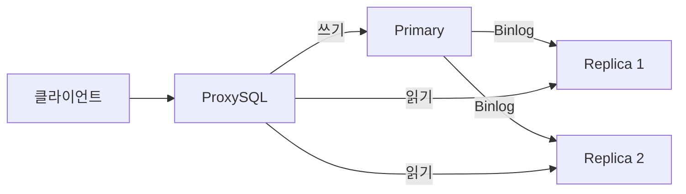
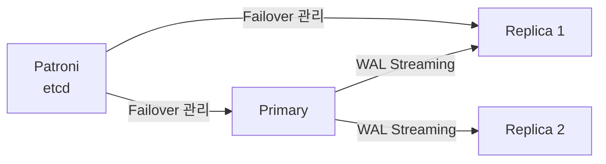
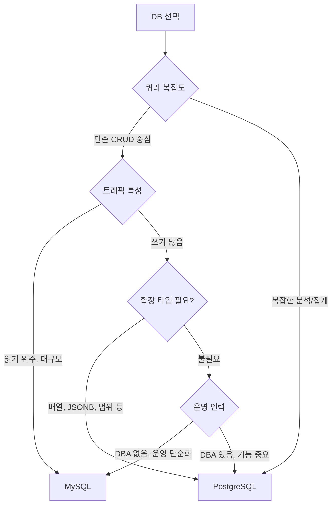

# MySQL vs PostgreSQL

## 한눈에 비교

| | MySQL | PostgreSQL |
|---|---|---|
| 출시 | 1995 | 1996 |
| 라이선스 | GPL / 상용 | PostgreSQL License (자유로움) |
| 아키텍처 | 스토리지 엔진 분리 | 단일 저장 엔진 |
| MVCC | Undo Log (Dead Tuple 없음) | Dead Tuple (VACUUM 필요) |
| 타입 시스템 | 기본적 | 배열, JSONB, 범위 타입 등 풍부 |
| 인덱스 종류 | B-Tree, Hash, Full-Text | B-Tree, Hash, GIN, GiST, BRIN 등 |
| 쿼리 플래너 | 단순 | 정교 (JIT, 병렬 쿼리) |
| 확장성 | 스토리지 엔진 교체 | Extension 시스템 |
| 자동 Failover | Group Replication 내장 | Patroni 외부 도구 필요 |
| 커넥션 모델 | 스레드 기반 | 프로세스 기반 |
| 운영 복잡도 | 낮음 | 높음 |

---

## MVCC 구현 방식

두 DB 모두 MVCC를 지원하지만 구현 방식이 근본적으로 다르다.

### MySQL — Undo Log

```
UPDATE users SET name = '철수수' WHERE id = 1

테이블:   { id: 1, name: "철수수" }  ← 최신 버전만
Undo Log: { id: 1, name: "철수" }   ← 구버전 별도 저장
```

- 테이블에 항상 최신 버전만 존재
- Purge 스레드가 자동 정리
- **함정**: Long Transaction 시 Undo Log 폭발, ibdata 파일 증가

### PostgreSQL — Dead Tuple

```
UPDATE users SET name = '철수수' WHERE id = 1

테이블: { id: 1, name: "철수",   xmin: 100, xmax: 200 }  ← Dead Tuple
        { id: 1, name: "철수수", xmin: 200, xmax: null } ← Live Tuple
```

- 구버전 데이터가 테이블 안에 쌓임
- VACUUM이 주기적으로 정리
- **함정**: VACUUM 안 하면 Table Bloat, Transaction ID Wraparound

---

## 인덱스 구조

### 클러스터드 인덱스 (MySQL InnoDB)

PK B-Tree의 리프 노드에 실제 행 데이터가 있다. PK 조회 시 한 번만 읽으면 된다.

```
Secondary Index → PK 찾기 → 클러스터드 인덱스 조회 (이중 조회)
```

PK 설계가 성능에 직결된다. UUID처럼 랜덤한 PK는 페이지 분할을 유발한다.

### 힙 기반 스토리지 (PostgreSQL)

인덱스와 데이터 파일이 분리된 힙(Heap) 구조다. 모든 인덱스가 힙을 가리키는 포인터를 가진다.

```
인덱스 → 힙(데이터 파일) 포인터 → 실제 행
```

PK도 Secondary Index도 구조가 동일하다. PK 선택이 MySQL만큼 성능에 민감하지 않다.

---

## 쿼리 플래너

### MySQL

상대적으로 단순한 플래너. 복잡한 쿼리에서 비효율적인 실행 계획을 선택하는 경우가 있다.

```sql
-- 힌트로 직접 인덱스 지정하는 경우가 생김
SELECT * FROM orders USE INDEX (idx_user_id)
WHERE user_id = 1;
```

### PostgreSQL

여러 실행 계획 후보를 비용 기반으로 평가한다.

```
복잡한 JOIN 순서 최적화
서브쿼리 → JOIN 변환 (Subquery Flattening)
파티션 프루닝
병렬 쿼리 실행
JIT 컴파일 (복잡한 집계)
```

쿼리가 복잡해질수록 PostgreSQL 플래너가 유리하다.

---

## 타입 시스템

### MySQL

```sql
INT, BIGINT, VARCHAR, TEXT, DATETIME, JSON
-- JSON 저장 가능하나 인덱스/쿼리 기능 제한적
```

### PostgreSQL

```sql
-- 배열
tags TEXT[]

-- JSONB (바이너리, 인덱스 가능)
payload JSONB

-- 범위 타입
period DATERANGE

-- 네트워크 타입
ip INET

-- 기하 타입
location POINT
```

스키마가 자주 바뀌거나 복잡한 데이터 구조가 필요하면 PostgreSQL이 유리하다.

---

## 복제 생태계

### MySQL



- **Binlog** 기반 복제
- **GTID**로 Failover 자동화
- **Group Replication** 내장 자동 Failover
- **ProxySQL** 미들웨어 생태계 성숙

### PostgreSQL



- **WAL Streaming** 기반 복제
- **Patroni** (외부 도구) 로 자동 Failover
- **PgBouncer** 커넥션 풀링
- **PgPool-II** Read/Write Splitting

복제/운영 생태계 성숙도는 MySQL이 앞선다.

---

## 커넥션 모델

```
MySQL
→ 커넥션 1개 = 스레드 1개
→ 상대적으로 가벼움
→ 커넥션 풀러 없이도 감당 가능

PostgreSQL
→ 커넥션 1개 = 프로세스 1개
→ 상대적으로 무거움
→ PgBouncer 없이 운영하면 커넥션 폭발 위험
```

---

## 운영 복잡도

### MySQL 운영 주의사항

```
Long Transaction  → Undo Log 폭발
ibdata 파일       → 한번 커지면 줄이기 불가
utf8 vs utf8mb4  → 이모지는 utf8mb4 필수
대용량 DDL        → ALTER TABLE 느림
```

### PostgreSQL 운영 주의사항

```
VACUUM           → Table Bloat 방지, 주기적 실행 필요
Autovacuum 튜닝  → 쓰기 많으면 따라가지 못할 수 있음
Transaction ID   → Wraparound 감시 필요
커넥션 관리      → PgBouncer 거의 필수
Patroni 운영     → etcd/ZooKeeper 추가 인프라 필요
```

---

## 실무 선택 기준



### MySQL을 선택하는 경우

```
✅ 단순 CRUD 서비스 (SNS 피드, 간단한 커머스)
✅ 읽기 트래픽이 압도적으로 많은 경우
✅ 운영 인력이 적고 DB 관리 부담을 낮추고 싶을 때
✅ 기존 MySQL 인프라가 있어서 전환 비용이 높을 때
✅ AWS RDS, Aurora MySQL 등 관리형 서비스 활용 시
```

### PostgreSQL을 선택하는 경우

```
✅ 복잡한 쿼리, 집계, 분석이 많은 경우
✅ JSONB, 배열, 범위 타입 등 확장 타입이 필요한 경우
✅ 지리 데이터 (PostGIS)
✅ 시계열 데이터 (TimescaleDB)
✅ 유사 문자열 검색 (pg_trgm)
✅ 오픈소스 라이선스 제약이 중요한 경우
```

### 실제 사례

| 서비스 | DB | 이유 |
|---|---|---|
| 카카오 | MySQL | 대규모 복제, 안정적 운영 생태계 |
| 네이버 | MySQL | 대규모 트래픽, 검증된 복제 |
| 인스타그램 | PostgreSQL | 복잡한 피드 알고리즘, 데이터 분석 |
| 깃허브 | MySQL | 단순 CRUD 중심, 대규모 복제 |
| Notion | PostgreSQL | 유연한 데이터 구조, JSONB 활용 |

---

## 참고 자료

- [MySQL 공식 문서](https://dev.mysql.com/doc/)
- [PostgreSQL 공식 문서](https://www.postgresql.org/docs/)
- [PostgreSQL vs MySQL — AWS 비교](https://aws.amazon.com/ko/compare/the-difference-between-mysql-vs-postgresql/)
