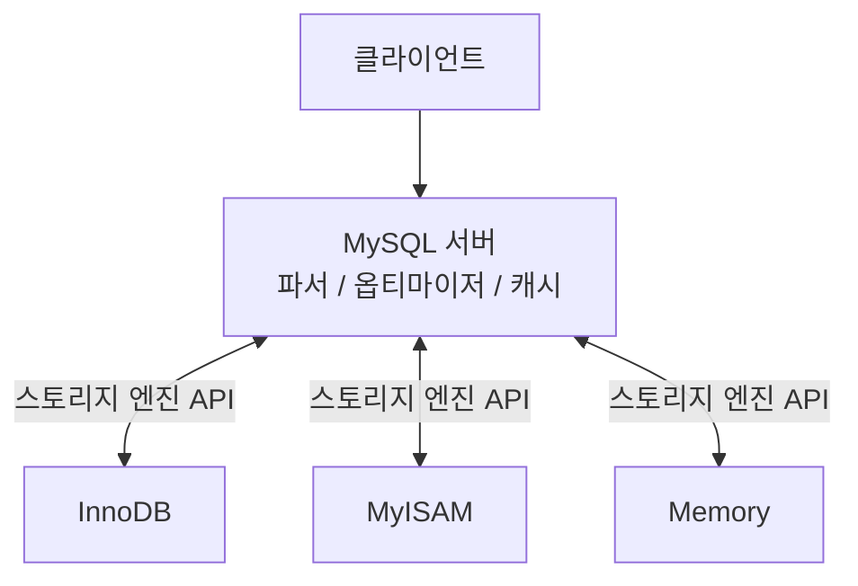
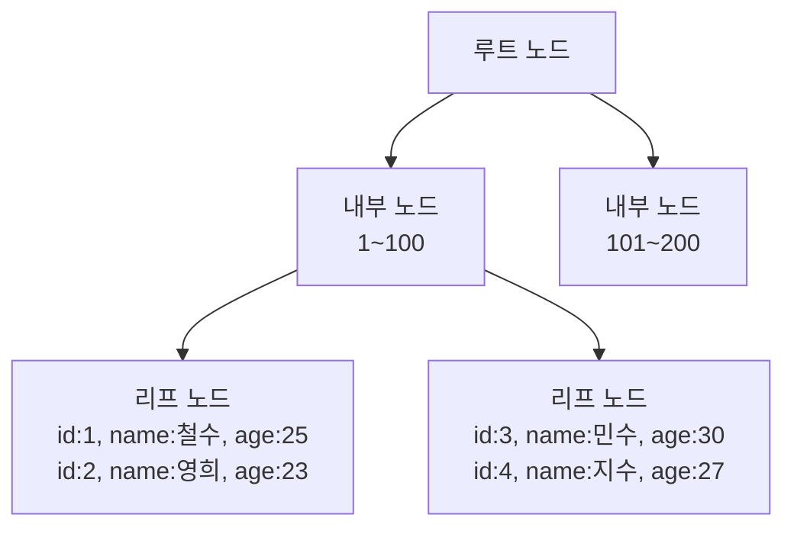

# MySQL

## 개요

MySQL은 오픈소스 관계형 데이터베이스다. 단순 CRUD 중심의 서비스에서 읽기 성능이 뛰어나고, 복제 생태계가 성숙해서 대규모 트래픽 처리에 강점이 있다. 카카오, 네이버, 라인 등 국내 대형 서비스들이 오랫동안 사용해온 DB다.

```
MySQL이 유리한 상황
→ 단순 CRUD가 대부분인 서비스
→ 읽기 성능이 최우선
→ 복제 생태계 안정성이 중요한 경우
→ 운영 부담을 낮추고 싶은 경우
```

---

## 스토리지 엔진 아키텍처

MySQL만의 독특한 구조다. 쿼리 처리 레이어와 실제 데이터 저장 레이어가 분리되어 있다.



테이블마다 다른 엔진을 사용할 수 있다.

```sql
CREATE TABLE orders (id INT, amount DECIMAL) ENGINE = InnoDB;
CREATE TABLE logs   (id INT, message TEXT)   ENGINE = Archive;
```

### 스토리지 엔진 종류

| 엔진 | 특징 | 용도 |
|---|---|---|
| InnoDB | 트랜잭션, 외래키, MVCC, 행 레벨 락 | 기본값. 대부분의 테이블 |
| MyISAM | 트랜잭션 없음, 테이블 레벨 락 | 구버전 레거시 (현재 거의 미사용) |
| Memory | 메모리 저장, 재시작 시 초기화 | 임시 테이블 |
| Archive | INSERT만 가능, 높은 압축률 | 로그성 데이터 |

### MyISAM → InnoDB 전환 이유

MySQL 5.5 이전 기본 엔진은 MyISAM이었다. 치명적인 단점 때문에 InnoDB로 전환됐다.

```
MyISAM 단점
→ 트랜잭션 없음
→ 외래키 없음
→ 장애 시 데이터 손상 위험
→ 테이블 레벨 락 (쓰기 시 전체 테이블 잠금)
```

현재 MySQL = InnoDB라고 봐도 무방하다.

---

## InnoDB 핵심 구조

### MVCC — Undo Log 방식

InnoDB는 MVCC를 Undo Log 방식으로 구현한다.

```
UPDATE users SET name = '철수수' WHERE id = 1

테이블:   { id: 1, name: "철수수" }  ← 최신 버전만 유지
Undo Log: { id: 1, name: "철수" }   ← 구버전 별도 저장
```

테이블에는 항상 최신 버전만 존재한다. Purge 스레드가 불필요한 Undo Log를 자동 정리한다.

PostgreSQL과 달리 Dead Tuple이 테이블 안에 쌓이지 않아서 VACUUM 같은 별도 유지보수 작업이 필요 없다.

**Long Transaction 주의**

```
Long Transaction 발생 시
→ 트랜잭션 시작 시점의 스냅샷 유지 필요
→ 그 이후 변경된 모든 Undo Log를 지울 수 없음
→ Undo Log 폭발적 증가
→ ibdata 파일이 커짐 (한번 커지면 줄일 수 없음)
```

### 버퍼 풀 (Buffer Pool)

InnoDB의 핵심 메모리 구조다. 자주 접근하는 데이터와 인덱스를 메모리에 캐싱한다.

```
# my.cnf
innodb_buffer_pool_size = 4G  # 전체 메모리의 70~80% 권장
```

버퍼 풀 히트율이 높을수록 디스크 I/O가 줄어 성능이 좋아진다.

```sql
-- 버퍼 풀 히트율 확인
SELECT (1 - (innodb_buffer_pool_reads / innodb_buffer_pool_read_requests)) * 100
AS hit_rate
FROM information_schema.INNODB_METRICS
WHERE name IN ('buffer_pool_reads', 'buffer_pool_read_requests');
```

### Redo Log / Undo Log

```
Redo Log → 장애 복구용. 커밋된 변경사항을 기록
Undo Log → MVCC용. 이전 버전 데이터 저장
```

---

## 클러스터드 인덱스

InnoDB의 핵심 특징이다. **PK가 곧 데이터 파일**이다.

### 일반 인덱스 vs 클러스터드 인덱스

일반 B-Tree 인덱스는 인덱스 파일과 데이터 파일이 분리되어 있다.

```
인덱스 파일         데이터 파일
email → 포인터  →  실제 행 데이터
→ 두 번 읽어야 함
```

클러스터드 인덱스는 PK B-Tree의 리프 노드에 실제 행 데이터가 있다.



PK로 조회 시 인덱스 탐색 한 번으로 데이터까지 바로 가져온다.

### Secondary Index — 이중 조회

PK 외 컬럼에 인덱스를 걸면 리프 노드에 해당 컬럼 값 + PK가 저장된다.

```
SELECT * FROM users WHERE email = 'chul@chul.com'

1. email 인덱스에서 PK 찾기
2. PK로 클러스터드 인덱스 다시 조회 (Row Lookup)
3. 실제 데이터 반환
→ 두 번 읽어야 함
```

### PK 설계가 중요한 이유

```
좋은 PK — AUTO_INCREMENT (단조 증가)
→ 새 데이터가 항상 맨 끝에 삽입
→ 페이지 분할 없음
→ 쓰기 성능 좋음

나쁜 PK — UUID v4 (랜덤)
→ 새 데이터가 B-Tree 중간에 삽입
→ 페이지 분할 빈번 → 쓰기 느려짐
→ 데이터 단편화
```

### Covering Index

쿼리에 필요한 컬럼을 전부 인덱스에 포함시켜 Row Lookup을 제거한다.

```sql
-- email로 name을 자주 조회한다면
CREATE INDEX idx_email_name ON users (email, name);

-- Row Lookup 없이 인덱스만으로 처리
SELECT name FROM users WHERE email = 'chul@chul.com';
```

---

## Binary Log (Binlog)

MySQL의 모든 변경 사항을 기록하는 로그다. 복제와 장애 복구의 핵심이다.

```
INSERT, UPDATE, DELETE 발생
→ 실제 데이터 변경
→ Binlog에 기록
→ Replica가 Binlog를 읽어서 동일하게 실행
```

### Binlog 형식

| 형식 | 기록 방식 | 특징 |
|---|---|---|
| STATEMENT | SQL문 그대로 기록 | 용량 작음. 비결정적 함수(NOW(), RAND()) 있으면 불일치 위험 |
| ROW | 변경된 행 데이터 기록 | 용량 큼. 완벽한 일관성 |
| MIXED | 기본 STATEMENT, 비결정적이면 ROW | 절충안 |

실무에서는 **ROW** 포맷을 주로 사용한다.

---

## 복제 생태계

### GTID (Global Transaction ID)

MySQL 5.6부터 지원. 각 트랜잭션에 전역 고유 ID를 부여한다.

```
GTID = server_uuid:transaction_id
예) 3E11FA47-71CA-11E1-9E33-C80AA9429562:23
```

Failover 시 새 Primary를 바라보도록 Replica를 재설정할 때 자동으로 위치를 파악한다.

```sql
-- 기존 방식 (Binlog 파일명과 위치 직접 지정)
CHANGE MASTER TO
    MASTER_HOST='new-primary',
    MASTER_LOG_FILE='mysql-bin.000123',
    MASTER_LOG_POS=456789;

-- GTID 방식 (자동)
CHANGE MASTER TO
    MASTER_HOST='new-primary',
    MASTER_AUTO_POSITION=1;
```

### 복제 토폴로지

**Single Primary**
```
Primary → Replica 1
        → Replica 2
        → Replica 3
```

**Multi-Source Replication**
```
Primary 1 ─┐
Primary 2 ─┼→ Replica (여러 샤드 데이터를 분석 DB로 집계)
Primary 3 ─┘
```

### Group Replication / InnoDB Cluster

MySQL 8.0부터 Paxos 기반 자동 Failover를 내장 지원한다.


과반수 동의로 새 Primary를 자동 선출한다. Split-Brain을 방지한다.

### ProxySQL

MySQL 생태계에서 가장 많이 쓰는 미들웨어다.

```
애플리케이션 → ProxySQL → Primary  (쓰기)
                        → Replica (읽기)
```

```
주요 기능
→ Read/Write Splitting
→ Connection Pooling
→ 쿼리 캐싱
→ 쿼리 룰 기반 라우팅
→ Failover 자동 처리
```

---

## 운영 특징

### VACUUM 없음

InnoDB의 Undo Log 방식 덕분에 Dead Tuple이 테이블 안에 쌓이지 않는다. PostgreSQL처럼 VACUUM 관련 모니터링이 필요 없다.

### 커넥션 — 스레드 기반

```
PostgreSQL → 커넥션 1개 = 프로세스 1개 (무거움)
MySQL      → 커넥션 1개 = 스레드 1개  (가벼움)
```

PostgreSQL은 PgBouncer 없이 운영하면 커넥션 폭발 위험이 있다. MySQL은 상대적으로 부담이 적다.

### 운영의 함정

```
Long Transaction  → Undo Log 폭발, ibdata 파일 증가
ibdata 파일       → 한번 커지면 줄이기 불가 (DB 재구축 필요)
Character Set     → utf8 vs utf8mb4 혼란 (이모지는 utf8mb4 필수)
대용량 DDL        → ALTER TABLE이 느림 (Online DDL 지원하지만 제약 있음)
```

### 주요 설정

```ini
# my.cnf
innodb_buffer_pool_size = 4G       # 전체 메모리의 70~80%
innodb_log_file_size = 512M        # Redo Log 크기
max_connections = 500              # 최대 커넥션 수
binlog_format = ROW                # Binlog 형식
gtid_mode = ON                     # GTID 활성화
character-set-server = utf8mb4     # 이모지 지원
```

---

## 참고 자료

- [MySQL 공식 문서](https://dev.mysql.com/doc/)
- [InnoDB 스토리지 엔진](https://dev.mysql.com/doc/refman/8.0/en/innodb-storage-engine.html)
- [MySQL Group Replication](https://dev.mysql.com/doc/refman/8.0/en/group-replication.html)
- [ProxySQL 공식 문서](https://proxysql.com/documentation/)
