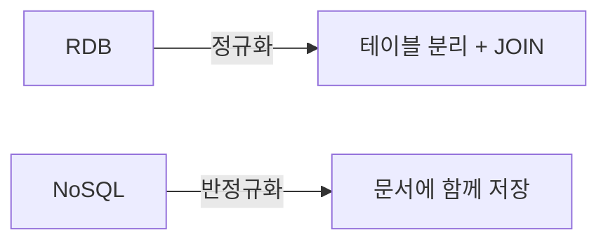
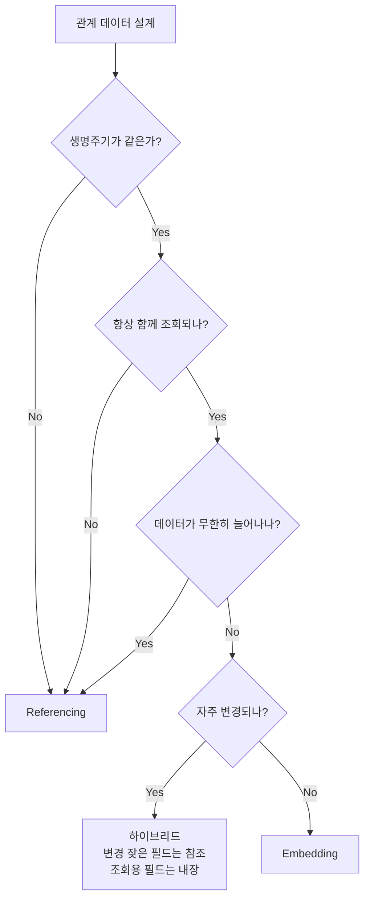

# NoSQL 데이터 모델링

> 태그: `#db` `#nosql` `#data-modeling`<br>
> 작성일: 2026-06-23<br>
> 최종 수정일: 2026-06-23

## 정의

NoSQL 데이터 모델링은 RDB의 정규화 대신 반정규화를 기본으로 하며, 관련 데이터를 한 문서에 내장(Embedding)할지 별도 문서로 참조(Referencing)할지를 생명주기·조회 패턴·변경 빈도에 따라 선택하거나 혼합한다.

## 특징 / 상세

### RDB와의 근본적 차이

RDB는 **정규화**가 기본 원칙이다. 중복을 없애고 테이블을 쪼개서 JOIN으로 연결한다.

NoSQL은 반대로 **반정규화**가 기본이다. JOIN이 없거나 매우 제한적이기 때문에 관련 데이터를 함께 저장하는 방식으로 설계한다.



### Embedding vs Referencing

NoSQL 데이터 모델링의 핵심 선택이다.

#### Embedding (내장)

관련 데이터를 한 문서 안에 전부 넣는다.

```json
{
  "order_id": "001",
  "user": {
    "name": "철수",
    "email": "chul@chul.com"
  },
  "items": [
    { "product": "아이폰", "price": 1200000 },
    { "product": "케이스", "price": 20000 }
  ]
}
```

조회 한 번으로 필요한 데이터를 전부 가져올 수 있다.

#### Referencing (참조)

RDB의 외래키처럼 다른 문서를 참조한다. 단, DB가 관계를 강제하지 않으며 애플리케이션이 직접 두 번 조회해야 한다.

```json
// orders 컬렉션
{
  "order_id": "001",
  "user_id": "user_123",
  "item_ids": ["p001", "p002"]
}

// users 컬렉션
{ "user_id": "user_123", "name": "철수" }
```

### 선택 기준

#### Embedding을 선택하는 경우

```
✅ 생명주기가 같다       — 주문 삭제 시 주문 상품도 같이 삭제
✅ 항상 함께 조회된다    — 주문 볼 때 항상 상품 목록도 같이 봄
✅ 1:1 또는 1:少 관계    — 관계 데이터가 적을 때
✅ 데이터 변경이 적다    — 자주 바뀌면 내장된 곳 전부 업데이트 필요
```

#### Referencing을 선택하는 경우

```
✅ 생명주기가 다르다     — 유저 삭제 후에도 주문 내역은 남아야 함
✅ 독립적으로 조회된다   — 유저 정보만 볼 때도 있음
✅ 1:多 또는 多:多 관계  — 유저 하나가 주문 수천 개
✅ 데이터 변경이 잦다    — 상품 가격 변경 시 참조 하나만 바꾸면 됨
✅ 일관성이 중요하다     — 데이터 어노말리 방지
```

### 문서 크기 제한 주의

MongoDB 문서 하나의 최대 크기는 **16MB**다. Embedding을 무한정 하면 문서가 터진다.

```json
// 위험한 설계 — 주문이 계속 쌓이면 16MB 초과
{
  "user_id": "123",
  "orders": [
    { "items": [...] },
    { "items": [...] },
    ... (주문이 수천 개)
  ]
}
```

1:多에서 "多"가 무한히 늘어날 수 있으면 Referencing이 맞다.

### 하이브리드 방식

실무에서는 Embedding과 Referencing을 섞어 쓴다.

```json
{
  "order_id": "001",
  "user_id": "user_123",    ← 참조 (유저는 독립적 생명주기)
  "user_name": "철수",      ← 내장 (조회 시 항상 필요)
  "items": [
    {
      "product_id": "p001", ← 참조 (상품 원본은 독립적)
      "name": "아이폰",     ← 내장 (주문 당시 이름 스냅샷)
      "price": 1200000      ← 내장 (주문 당시 가격 스냅샷)
    }
  ]
}
```

`price`를 내장한 건 어노말리가 아니라 **의도적인 반정규화**다. 상품 가격이 나중에 바뀌어도 주문 당시 가격은 보존돼야 하는 비즈니스 요구사항이다.

### 모델링 결정 흐름



### 스키마 버전 관리

NoSQL은 스키마가 없어서 자유롭지만, 시간이 지나면 문서마다 구조가 달라지는 문제가 생긴다.

```json
// 초기 버전
{ "user_id": "123", "name": "철수" }

// 개편 후 — address 필드 추가
{ "user_id": "456", "name": "영희", "address": { "city": "서울" } }

// 또 개편 후 — address 구조 변경
{ "user_id": "789", "name": "민수", "address": "부산" }
```

애플리케이션이 세 가지 구조를 전부 처리해야 한다. 이를 관리하기 위해 **schema_version 필드**를 추가한다.

```json
{ "user_id": "123", "schema_version": 1, "name": "철수" }
{ "user_id": "456", "schema_version": 2, "name": "영희", "address": { "city": "서울" } }
```

```java
// 버전에 따라 변환 처리
public User mapToUser(Document doc) {
    int version = doc.getInteger("schema_version", 1);
    return switch (version) {
        case 1 -> mapV1(doc);
        case 2 -> mapV2(doc);
        default -> throw new UnsupportedSchemaVersionException(version);
    };
}
```

### Bucket 패턴

시계열 데이터처럼 동일한 엔티티에 데이터가 계속 쌓이는 경우, 문서 하나에 일정 기간의 데이터를 묶어서 저장한다.

**문제 상황 — IoT 센서 데이터**

```json
// 센서 데이터 1개 = 문서 1개 → 문서가 수억 개
{ "sensor_id": "s001", "timestamp": "2024-01-01 00:00:01", "temp": 23.5 }
{ "sensor_id": "s001", "timestamp": "2024-01-01 00:00:02", "temp": 23.6 }
{ "sensor_id": "s001", "timestamp": "2024-01-01 00:00:03", "temp": 23.4 }
```

**Bucket 패턴 적용 — 1시간치 데이터를 하나의 문서로**

```json
{
  "sensor_id": "s001",
  "hour": "2024-01-01 00:00",
  "count": 3600,
  "readings": [
    { "ts": 1, "temp": 23.5 },
    { "ts": 2, "temp": 23.6 },
    { "ts": 3, "temp": 23.4 }
  ],
  "avg_temp": 23.5,
  "max_temp": 23.6,
  "min_temp": 23.4
}
```

문서 수가 3600배 줄어들고, 집계 값을 미리 저장해서 조회도 빠르다. 단, 버킷이 꽉 찰 경우 새 버킷을 생성하는 로직이 필요하다.

## 트레이드오프

해당 없음 — Embedding/Referencing 선택 기준은 위 특징/상세 참고.

## 실무 경험

해당 없음

## 참고

원본 학습 노트(TIL)에서 이전한 링크. 확인일 미기재 — 필요 시 재검증.

- [MongoDB 데이터 모델링 공식 문서](https://www.mongodb.com/docs/manual/data-modeling/)
- [MongoDB Embedding vs Referencing](https://www.mongodb.com/developer/products/mongodb/mongodb-schema-design-best-practices/)

## 관련 내용

- [nosql-개요](nosql-개요.md)
- [nosql-도큐먼트-db](nosql-도큐먼트-db.md)
- [nosql-ttl](nosql-ttl.md)
- [nosql-인덱스](nosql-인덱스.md)
