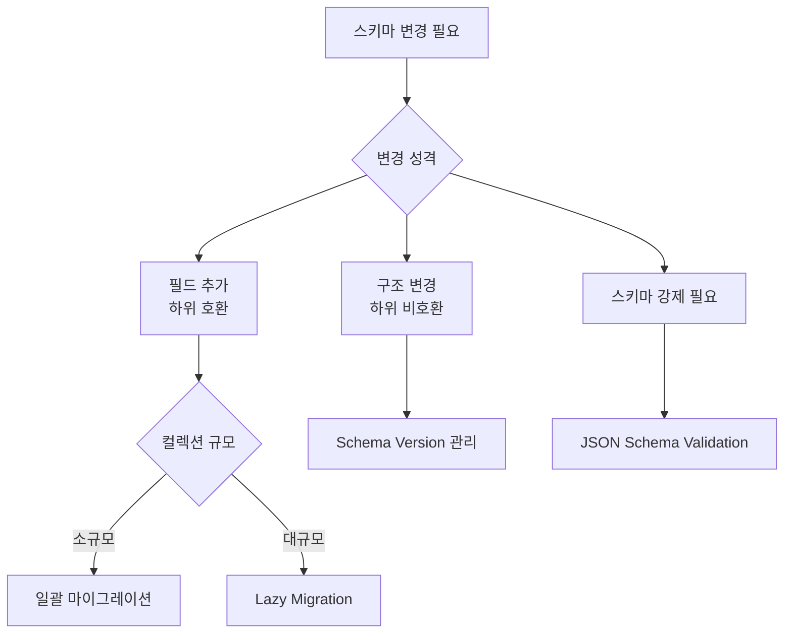

# Document DB (문서 데이터베이스)

> 태그: `#db` `#nosql` `#mongodb` `#document-db`<br>
> 작성일: 2026-06-23<br>
> 최종 수정일: 2026-06-23

## 정의

Document DB는 JSON/BSON 문서 단위로 데이터를 저장하며 문서마다 구조가 달라도 되는 NoSQL 유형으로, MongoDB가 대표적이며 쿼리 패턴 중심 설계와 인덱스·트랜잭션 비용 관리가 핵심 운영 포인트다.

## 특징 / 상세

### 개념

JSON(또는 BSON) 형태의 문서(Document) 단위로 데이터를 저장한다. 문서마다 구조가 달라도 되며, 중첩 구조(배열, 객체)를 그대로 저장할 수 있다.

```json
// 상품 A (의류)
{ "id": 1, "name": "티셔츠", "color": "white", "size": ["S", "M", "L"] }

// 상품 B (전자기기)
{ "id": 2, "name": "노트북", "cpu": "M3", "ram": 16, "storage": 512 }
```

RDB였으면 수백 개의 컬럼이나 EAV 패턴으로 억지로 맞춰야 하는 구조를 자연스럽게 표현한다.

### 대표 DB

| DB | 특징 |
|---|---|
| MongoDB | 가장 널리 쓰이는 Document DB. 4.0 이후 ACID 트랜잭션 지원 |
| CouchDB | HTTP API 기반. 오프라인 동기화 강점 |
| Firestore | Google Firebase 기반. 실시간 동기화 |
| DynamoDB | AWS 완전관리형. Document + Key-Value 혼합 |

### RDB와의 비교

| | RDB | Document DB |
|---|---|---|
| 스키마 | 고정 | 유연 |
| 관계 표현 | JOIN | Embedding / Referencing |
| 트랜잭션 | 강력한 ACID | 단일 문서 원자성 (멀티 문서는 제한적) |
| 확장 | 수직 확장 | 수평 확장 (샤딩) |
| 적합한 데이터 | 정형화된 관계형 | 유연한 구조, 중첩 데이터 |

### MongoDB 심화

#### BSON

MongoDB는 JSON을 이진 형태로 저장하는 **BSON(Binary JSON)**을 사용한다.

```
JSON  → 텍스트 기반, 파싱 느림
BSON  → 이진 기반, 파싱 빠름
      → Date, Binary, ObjectId 등 추가 타입 지원
      → 최대 문서 크기 16MB
```

#### ObjectId

MongoDB가 자동 생성하는 기본 `_id` 타입이다. 12바이트로 구성된다.

```
┌────────────┬──────────┬──────────┬──────────────┐
│  timestamp │ machine  │   pid    │   counter    │
│  (4 bytes) │ (3 bytes)│ (2 bytes)│   (3 bytes)  │
└────────────┴──────────┴──────────┴──────────────┘
```

앞 4바이트가 타임스탬프라 **시간순 정렬이 가능**하다. Snowflake ID와 유사한 개념이다.

```java
ObjectId id = new ObjectId();
id.getTimestamp();  // 생성 시각 추출 가능
```

#### 쿼리

```js
// 기본 조회
db.products.find({ category: "전자기기", price: { $lt: 1000000 } })

// 중첩 필드 조회
db.users.find({ "address.city": "서울" })

// 배열 필드 조회
db.posts.find({ tags: { $in: ["java", "spring"] } })

// 정렬 + 페이징
db.products.find({}).sort({ price: -1 }).skip(0).limit(20)
```

#### Aggregation Pipeline

여러 단계를 파이프라인으로 연결해서 데이터를 집계한다. SQL의 GROUP BY + JOIN을 대체한다.

```js
db.orders.aggregate([
    // 1단계: 필터
    { $match: { status: "PAID", createdAt: { $gte: ISODate("2024-01-01") } } },

    // 2단계: 그룹핑
    { $group: {
        _id: "$userId",
        totalAmount: { $sum: "$amount" },
        orderCount: { $count: {} }
    }},

    // 3단계: 정렬
    { $sort: { totalAmount: -1 } },

    // 4단계: 상위 10명
    { $limit: 10 },

    // 5단계: 다른 컬렉션과 조인
    { $lookup: {
        from: "users",
        localField: "_id",
        foreignField: "_id",
        as: "userInfo"
    }}
])
```

### Change Stream

MongoDB 4.0부터 지원하는 실시간 변경 감지 기능이다. 컬렉션의 INSERT/UPDATE/DELETE를 실시간으로 구독할 수 있다.

```java
MongoCollection<Document> collection = database.getCollection("orders");

collection.watch().forEach(change -> {
    String operationType = change.getOperationType().getValue();
    Document document = change.getFullDocument();

    switch (operationType) {
        case "insert" -> handleNewOrder(document);
        case "update" -> handleOrderUpdate(document);
        case "delete" -> handleOrderDelete(change.getDocumentKey());
    }
});
```

**내부 동작**

Change Stream은 MongoDB의 **Oplog(Operation Log)**를 기반으로 동작한다. Oplog는 MongoDB가 모든 변경 사항을 기록하는 내부 로그다. Change Stream은 이 Oplog를 구독하는 방식이다. 따라서 Replica Set 환경에서만 사용 가능하다.

**유스케이스**
- 주문 상태 변경 시 실시간 알림
- 데이터 변경을 Kafka로 전달 (CDC — Change Data Capture)
- 캐시 무효화 트리거

**Debezium과 비교**

| | Change Stream | Debezium |
|---|---|---|
| 설정 복잡도 | 낮음 (MongoDB 내장) | 높음 (Kafka Connect 필요) |
| 지원 DB | MongoDB 전용 | MySQL, PostgreSQL 등 다양 |
| 필터링/변환 | 제한적 | 강력 |
| 적합한 상황 | MongoDB 단독 환경 | 멀티 DB, 복잡한 파이프라인 |

### 스키마 설계 원칙

MongoDB는 스키마가 없다고 해서 아무렇게나 써도 된다는 뜻이 아니다. 스키마 강제를 DB가 안 할 뿐이고, 설계를 안 하면 운영 중 대참사가 난다.

#### 쿼리 패턴 먼저

RDB는 정규화 먼저 하고 나중에 쿼리를 맞춘다. MongoDB는 반대다. **쿼리 패턴을 먼저 정하고 거기에 맞게 모델링**한다.

```
블로그 서비스 설계 시
→ 자주 하는 조회가 뭔가?
  1. 특정 유저의 최신 글 목록
  2. 글 상세 + 댓글
  3. 태그별 글 목록

→ 이 세 가지를 단일 문서 조회로 해결하도록 설계
```

#### 쿼리 패턴에 따른 설계 결정

```
"글 상세 + 댓글을 항상 같이 본다"
→ 댓글을 글 문서에 Embedding

"댓글이 수천 개 달릴 수 있다"
→ 댓글은 별도 컬렉션으로 Referencing

"태그로 자주 검색한다"
→ tags 필드에 인덱스 필수
```

### 운영 모니터링

#### 인덱스 사용 통계

```js
// 인덱스별 사용 횟수 확인
db.orders.aggregate([{ $indexStats: {} }])

// 사용 횟수 0인 인덱스 → 삭제 후보
// 인덱스가 많을수록 쓰기 성능 저하
```

#### 문서 크기 모니터링

Embedding 설계를 하면 문서가 점점 커진다. 16MB 제한에 가까워지면 장애가 난다.

```js
// 컬렉션 평균 문서 크기
db.orders.stats().avgObjSize

// 큰 문서 찾기
db.orders.find().sort({ "items": -1 }).limit(10)
```

#### 느린 쿼리 모니터링

```js
// 100ms 이상 걸린 쿼리 프로파일링
db.setProfilingLevel(1, { slowms: 100 })
db.system.profile.find().sort({ ts: -1 }).limit(10)
```

### 유스케이스

| 도메인 | 이유 |
|---|---|
| 상품 카탈로그 | 상품마다 속성이 다름 (의류: 사이즈/색상, 전자기기: CPU/메모리) |
| 콘텐츠 관리 | 블로그, 뉴스 — 구조가 자주 바뀜 |
| 사용자 프로필 | 사람마다 입력한 정보가 다름 |
| 게임 데이터 | 캐릭터 속성, 아이템 정보 — 종류마다 구조 상이 |
| 로그 수집 | 로그마다 포함된 필드가 다름 |

### 주의사항

#### COLLSCAN

인덱스가 없으면 전체 컬렉션을 탐색한다. 개발 환경에선 데이터가 적어 빠르지만 운영에서 데이터가 쌓이면 갑자기 느려진다.

**함정 1 — 인덱스 있는데 안 쓰이는 경우**

```js
// user_id 인덱스 있음
db.orders.createIndex({ user_id: 1 })

// 이 쿼리는 COLLSCAN — status 인덱스 없음
db.orders.find({ status: "PAID" })
```

**함정 2 — 복합 인덱스 선두 필드 누락**

```js
db.orders.createIndex({ user_id: 1, status: 1 })

// status만 조건으로 쓰면 인덱스 못 씀
db.orders.find({ status: "PAID" })  // COLLSCAN
```

**실행 계획 확인**

```js
db.orders.find({ userId: "123" }).explain("executionStats")
// COLLSCAN → 인덱스 필요
// IXSCAN   → 인덱스 사용 중

// totalDocsExamined >> nReturned → 비효율적, 인덱스 필요
```

#### 트랜잭션 비용

멀티 문서 트랜잭션이 비싼 이유:

```
단일 문서 쓰기
→ 해당 문서 락만 잡고 바로 해제

멀티 문서 트랜잭션
→ 여러 문서/컬렉션에 락
→ 모든 참여 노드가 준비될 때까지 대기 (2PC)
→ 트랜잭션이 길수록 락 점유 시간 증가
→ 샤드 클러스터면 네트워크 왕복 추가
```

**실무 원칙**

```
트랜잭션 안에서 금지
→ 외부 API 호출
→ 무거운 계산
→ 불필요한 조회

가능하면 단일 문서로 해결
→ Embedding 설계로 트랜잭션 필요 자체를 없애기
```

#### 조인 비용 ($lookup)

`$lookup`은 기본적으로 **Nested Loop Join**이다.

```
orders 컬렉션 (10만 건)
  └─ 각 주문마다 users 컬렉션에서 조회
     └─ users에 인덱스 없으면 매번 COLLSCAN
        → 10만 × COLLSCAN = 대참사
```

**$lookup 전에 반드시 인덱스 확인**

```js
db.users.createIndex({ _id: 1 })  // localField/foreignField에 인덱스 필수
```

**$match를 $lookup 앞에 배치**

```js
// 나쁜 예 — 전체 조인 후 필터
db.orders.aggregate([
    { $lookup: { from: "users", ... } },  // 전체 조인
    { $match: { status: "PAID" } }        // 그 다음 필터
])

// 좋은 예 — 먼저 줄이고 조인
db.orders.aggregate([
    { $match: { status: "PAID" } },       // 먼저 필터
    { $lookup: { from: "users", ... } }   // 줄어든 결과만 조인
])
```

### 스키마 변경 전략

RDB는 `ALTER TABLE` 한 줄로 전체 테이블에 스키마가 적용된다. MongoDB는 스키마가 없으니까 새 필드를 추가해도 **기존 문서에는 아무 변화가 없다.** 컬렉션 안에 구조가 다른 문서가 섞이고, 애플리케이션이 두 가지 구조를 전부 처리해야 한다.

#### 스키마 변경 시 발생하는 문제

**필드 추가**
```json
// 기존: address 없음
{ "name": "철수" }

// 신규: address 있음
{ "name": "영희", "address": { "city": "서울" } }
```
코드에서 `user.address.city` 접근 시 기존 문서에서 NullPointerException 발생.

**필드 구조 변경**
```json
// 기존: address가 String
{ "name": "철수", "address": "서울" }

// 변경: address가 Object
{ "name": "영희", "address": { "city": "서울", "zip": "06234" } }
```
타입이 달라서 코드 처리가 복잡해진다.

**필드 이름 변경**
```json
{ "userName": "철수" }  // 기존
{ "name": "철수" }      // 변경
```
`userName`에 걸린 인덱스를 새 쿼리가 못 쓰게 된다.

#### 방법 1 — Lazy Migration (점진적 마이그레이션)

문서에 접근할 때 구조를 확인하고 그때그때 변환한다.

```java
public User findUser(String id) {
    Document doc = collection.find(eq("_id", id)).first();

    // 구버전 문서면 변환 후 저장
    if (!doc.containsKey("address")) {
        doc.put("address", new Document("city", "unknown"));
        collection.replaceOne(eq("_id", id), doc);
    }
    return mapToUser(doc);
}
```

트래픽이 많으면 자연스럽게 전체가 마이그레이션된다. 단, 트래픽이 없는 오래된 문서는 영원히 변환이 안 될 수 있다.

**적합한 상황**: 대용량 컬렉션, 하위 호환 필드 추가

#### 방법 2 — 일괄 마이그레이션 스크립트

배포 전에 스크립트로 전체 문서를 한 번에 변환한다.

```js
// address 없는 문서에 기본값 추가
db.users.updateMany(
    { address: { $exists: false } },
    { $set: { address: { city: "unknown" } } }
)
```

RDB `ALTER TABLE`과 가장 유사한 방식이다. 문서가 수천만 개면 실행 시간이 길고 그동안 성능 저하가 발생할 수 있다.

**적합한 상황**: 소규모 컬렉션, 빠른 전환이 필요할 때

#### 방법 3 — Schema Version 관리

문서에 버전 필드를 추가해서 어떤 구조인지 명시하고 코드에서 버전별로 처리한다.

```json
{ "schema_version": 1, "name": "철수" }
{ "schema_version": 2, "name": "영희", "address": { "city": "서울" } }
```

```java
public User mapToUser(Document doc) {
    int version = doc.getInteger("schema_version", 1);
    return switch (version) {
        case 1 -> mapV1(doc);
        case 2 -> mapV2(doc);
        default -> throw new UnsupportedSchemaVersionException(version);
    };
}
```

어떤 버전인지 명확하고 버전별 처리가 분리되어 코드가 깔끔하다.

**적합한 상황**: 구조가 크게 바뀌는 경우, 하위 비호환 변경

#### 방법 4 — JSON Schema Validation

MongoDB 3.6부터 스키마 강제가 가능하다. 필수 필드가 없으면 INSERT를 거절한다.

```js
db.createCollection("users", {
    validator: {
        $jsonSchema: {
            bsonType: "object",
            required: ["name", "email"],
            properties: {
                name:  { bsonType: "string" },
                email: { bsonType: "string" },
                age:   { bsonType: "int", minimum: 0 }
            }
        }
    }
})
```

**적합한 상황**: 팀 규모가 크거나, 데이터 품질이 중요한 경우

#### 전략 선택 기준



## 트레이드오프

해당 없음 — RDB와의 비교는 위 특징/상세 참고.

## 실무 경험

해당 없음

## 참고

원본 학습 노트(TIL)에서 이전한 링크. 확인일 미기재 — 필요 시 재검증.

- [MongoDB 공식 문서](https://www.mongodb.com/docs/)
- [MongoDB Aggregation Pipeline](https://www.mongodb.com/docs/manual/aggregation/)
- [MongoDB Change Streams](https://www.mongodb.com/docs/manual/changeStreams/)

## 관련 내용

- [nosql-개요](nosql-개요.md)
- [nosql-데이터-모델링](nosql-데이터-모델링.md)
- [nosql-인덱스](nosql-인덱스.md)
- [nosql-트랜잭션](nosql-트랜잭션.md)
- [nosql-ttl](nosql-ttl.md)
