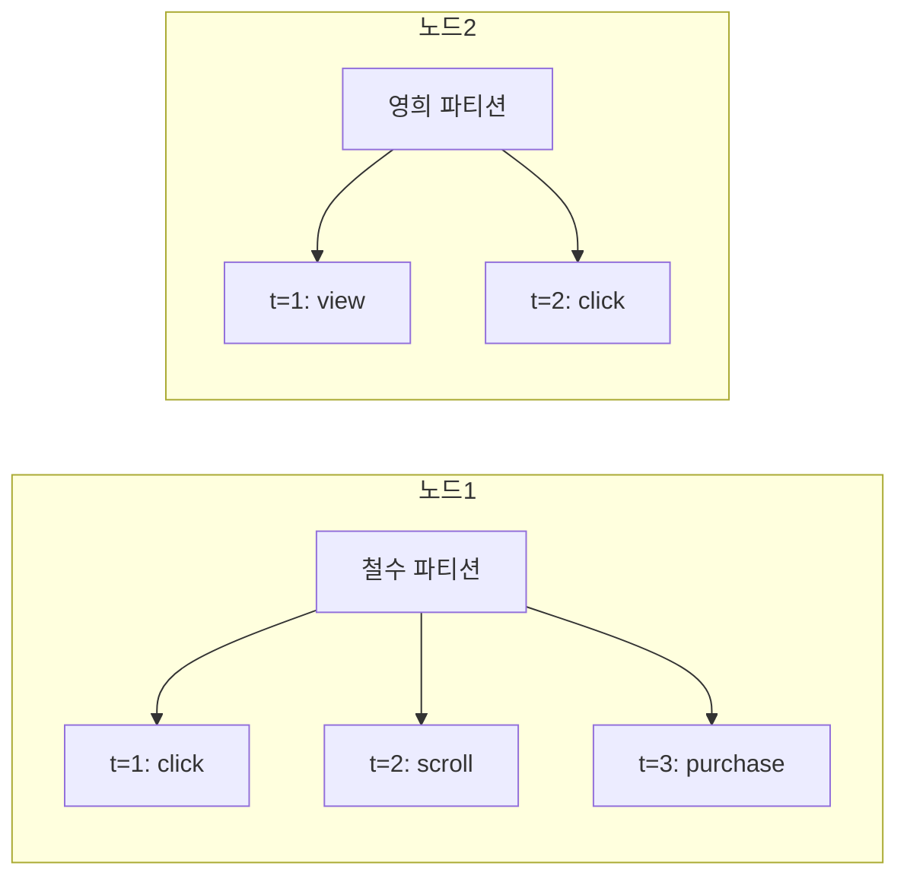
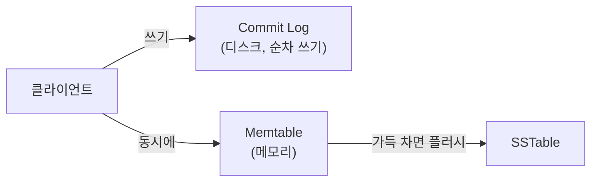
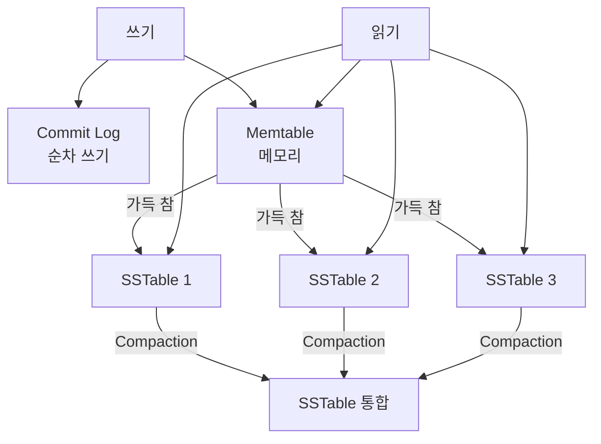
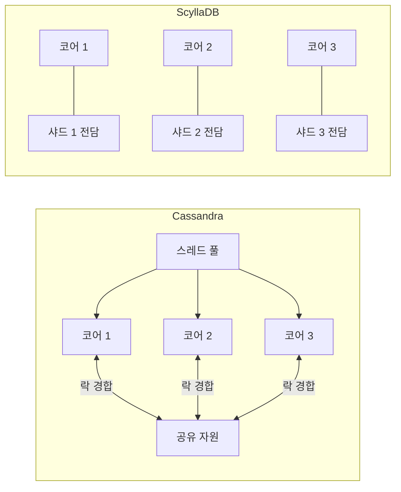

# Wide-Column Store

> 태그: `#db` `#nosql` `#cassandra` `#scylladb` `#wide-column`<br>
> 작성일: 2026-06-23<br>
> 최종 수정일: 2026-06-23

## 정의

Wide-Column Store는 행마다 컬럼이 달라도 되는 NoSQL 유형으로, Cassandra/ScyllaDB가 대표적이며 파티션 키 기반 분산과 SSTable/Compaction 구조로 대용량 쓰기에 최적화되어 있다.

## 특징 / 상세

### 개념

Wide-Column Store는 이름처럼 "넓은 컬럼"을 가진 저장소다. RDB처럼 행과 컬럼 구조를 가지지만 결정적인 차이가 있다.

**RDB** — 모든 행이 같은 컬럼을 가져야 한다. 값이 없으면 NULL로 채운다.

```
id | name  | age | email
1  | 철수  | 25  | chul@...
2  | 영희  | NULL| y@...      ← age 없으면 NULL
3  | 민수  | 30  | NULL       ← email 없으면 NULL
```

**Wide-Column** — 행마다 컬럼이 달라도 된다. 없는 필드는 저장 자체를 안 한다.

```
user:1 → { name: "철수", age: 25, city: "서울" }
user:2 → { name: "영희", email: "y@y.com" }         ← age 아예 없음
user:3 → { name: "민수", age: 30, phone: "010", job: "개발자" }
```

NULL이 아니라 존재 자체가 없어서 메모리도 쓰지 않는다.

### Document DB와의 차이

얼핏 보면 Document DB와 비슷해 보이지만 저장 방식이 다르다.

| | Document DB | Wide-Column |
|---|---|---|
| 저장 단위 | JSON 문서 전체 | 컬럼 단위 |
| 읽기/쓰기 | 문서 전체를 한 번에 | 특정 컬럼만 읽고 쓸 수 있음 |
| 강점 | 유연한 구조, 중첩 데이터 | 대용량 쓰기, 시계열 데이터 |
| 중첩 구조 | 핵심 기능 | 가능하지만 권장 안 함 |

### 대표 DB

| DB | 특징 |
|---|---|
| Cassandra | AP 선택, 마스터 없는 분산 구조, 쓰기 극강 |
| ScyllaDB | Cassandra 호환, C++로 재구현해 성능 극대화 |
| HBase | CP 선택, Hadoop 생태계 통합 |

### Cassandra 데이터 모델

#### 파티션 키와 클러스터링 키

Cassandra `PRIMARY KEY`는 RDB 복합키와 다르다. 두 가지 역할이 완전히 분리되어 있다.

```sql
CREATE TABLE user_activity (
    user_id    UUID,
    event_time TIMESTAMP,
    event_type TEXT,
    device     TEXT,
    PRIMARY KEY (user_id, event_time)
);
```

**파티션 키 (user_id)** — 데이터를 어느 노드에 저장할지 결정

```
hash(user_id) → 노드 결정
user_id: "철수" → 노드 1
user_id: "영희" → 노드 2
```

같은 `user_id`의 데이터는 무조건 같은 노드에 저장된다.

**클러스터링 키 (event_time)** — 같은 노드 안에서 정렬 순서 결정

```
노드 1 (철수 파티션)
  └─ 2024-01-01 00:00:01 → { type: "click" }
  └─ 2024-01-01 00:00:02 → { type: "scroll" }
  └─ 2024-01-01 00:00:03 → { type: "purchase" }
```

같은 user_id의 데이터가 시간순으로 **물리적으로 연속** 저장된다.



#### 쿼리 설계 원칙

**쿼리 패턴을 먼저 정하고 테이블을 설계한다.** 쿼리 패턴이 바뀌면 테이블을 새로 만들어야 한다.

```sql
-- "철수의 최근 활동 100개 조회"가 자주 필요하다면
SELECT * FROM user_activity
WHERE user_id = 'user:철수'
ORDER BY event_time DESC
LIMIT 100;
-- → 노드 1개에서 연속된 디스크 읽기 → 빠름

-- "20대 유저 전체 조회"는 불가
SELECT * FROM user_activity WHERE age = 25;
-- → 파티션 키가 아닌 컬럼으로 조회 → 전체 노드 탐색 → 매우 느림
```

#### 반정규화가 원칙

RDB는 정규화가 원칙이지만 Cassandra는 반대다. **쿼리 패턴마다 테이블을 따로 만드는 것이 정상적인 설계다.**

```sql
-- "유저별 최근 활동 조회"용 테이블
CREATE TABLE activity_by_user (
    user_id    UUID,
    event_time TIMESTAMP,
    event_type TEXT,
    PRIMARY KEY (user_id, event_time)
) WITH CLUSTERING ORDER BY (event_time DESC);

-- "이벤트 타입별 조회"가 필요해지면 → 별도 테이블
CREATE TABLE activity_by_type (
    event_type TEXT,
    event_time TIMESTAMP,
    user_id    UUID,
    PRIMARY KEY (event_type, event_time)
) WITH CLUSTERING ORDER BY (event_time DESC);
```

데이터 중복이 발생하지만 Cassandra에선 의도적인 설계다.

### Secondary Index

Cassandra도 Secondary Index를 지원하지만 RDB 인덱스와 완전히 다르다.

```sql
CREATE INDEX ON user_activity (event_type);
SELECT * FROM user_activity WHERE event_type = 'purchase';
```

**내부 동작**

```
RDB 인덱스    → 중앙화된 B-Tree, 전체 테이블 기준
Cassandra     → 각 노드가 자기 데이터에 대한 로컬 인덱스만 보유

event_type = 'purchase' 조회
→ 모든 노드에 쿼리 전송
→ 각 노드가 로컬 인덱스 탐색
→ 결과 취합
→ 노드 수만큼 네트워크 왕복 → 노드 많을수록 느려짐
```

**사용 지침**
```
✅ 카디널리티 낮은 필드 (성별, 상태값 등)
❌ 카디널리티 높은 필드 (이름, 이메일 등) → 역효과
```

자주 조회하는 패턴은 Secondary Index 대신 **별도 테이블**을 만드는 게 낫다.

### Cassandra 쓰기 내부 구조

#### 왜 쓰기가 빠른가

데이터를 쓸 때 **두 곳에만 쓰고 즉시 응답**한다.



**Commit Log** — 장애 복구용 로그. 순차 쓰기라 빠르다.

```
랜덤 I/O → 디스크 헤드가 이리저리 이동 → 느림
순차 I/O → 디스크 헤드가 한 방향으로만 이동 → 빠름
```

**Memtable** — 메모리에 쌓는다. 가득 차면 SSTable로 플러시.

#### SSTable (Sorted String Table)

Memtable을 디스크에 쓴 파일이다.

```
특징
1. Immutable — 한번 쓰면 수정 안 함
2. Sorted    — 클러스터링 키 기준 정렬된 상태
```

**업데이트/삭제도 쓰기로 처리한다.**

```
UPDATE → 새 버전 데이터를 timestamp와 함께 새로 씀
DELETE → Tombstone(삭제 표시)을 새로 씀
```

기존 데이터를 건드리지 않으므로 쓰기가 항상 빠르다.

```
t=1: { user_id: 1, name: "철수" }     ← SSTable 1
t=2: { user_id: 1, name: "철수수" }   ← SSTable 2 (업데이트)
t=3: { user_id: 1, [tombstone] }      ← SSTable 3 (삭제)
```

#### 읽기 과정

여러 SSTable에 같은 데이터의 다른 버전이 흩어져 있어서 읽기 시 전부 확인해야 한다.

```
읽기
→ Memtable 확인
→ SSTable 1, 2, 3 ... 전부 확인
→ timestamp 기준 최신 버전 반환
```

SSTable이 많이 쌓일수록 읽기가 느려진다.

#### Compaction

여러 SSTable을 합쳐서 하나로 만드는 과정이다.

```
SSTable 1: { name: "철수" }
SSTable 2: { name: "철수수" }   ← 최신
SSTable 3: { tombstone }        ← 삭제 표시

Compaction 후
→ 최신 버전만 남김
→ tombstone이면 완전 삭제
→ SSTable 1개로 통합 → 읽기 빨라짐
```

Compaction 자체가 CPU/디스크를 많이 써서 그 동안 성능 저하가 발생한다. Compaction 전략을 잘 설정하는 게 운영의 핵심이다.

#### 전체 흐름



### ScyllaDB — Cassandra보다 빠른 이유

#### Cassandra의 병목 — JVM GC

```
Memtable 가득 참
→ SSTable 플러시
→ 기존 Memtable 메모리 해제
→ GC 발생 → Stop-the-World
→ 수백ms ~ 수초 전체 멈춤
→ 예측 불가능한 레이턴시 스파이크
```

#### ScyllaDB 해결책 1 — C++ + 직접 메모리 관리

JVM 없애고 C++로 재구현. GC 자체가 없어서 Stop-the-World가 없다. 레이턴시가 일정하게 유지된다.

#### ScyllaDB 해결책 2 — Shard-per-Core 아키텍처



각 CPU 코어가 자기 샤드만 독립적으로 처리한다. 코어끼리 공유 자원이 없으므로 락 경합이 없고 CPU를 100% 활용할 수 있다.

> p99란 전체 요청 중 상위 1%가 경험하는 레이턴시다. 평균이 1ms여도 p99가 500ms면 100명 중 1명은 500ms를 경험한다. 대규모 서비스에서 p99/p999가 중요한 이유다.

### 유스케이스

| 도메인 | 이유 |
|---|---|
| IoT 센서 데이터 | 초당 수만 건 쓰기, 디바이스 ID 기준 조회 |
| 유저 행동 로그 | 대용량 이벤트, 유저 ID + 시간 기준 조회 |
| 시계열 메트릭 | 시간순 정렬, 연속 읽기 |
| 추천 피드 | 유저별 최근 N개 조회 패턴 고정 |
| 메시지 히스토리 | 채팅방 ID + 시간 기준 조회 |

## 트레이드오프

### ScyllaDB vs Cassandra 성능 차이

| | Cassandra | ScyllaDB |
|---|---|---|
| 처리량 | 초당 수십만 ops | 초당 수백만 ops (10배+) |
| p99 레이턴시 | 수십~수백ms (GC 스파이크) | 한 자릿수 ms (일정함) |
| 메모리 관리 | JVM GC | 직접 관리 |
| API 호환 | — | Cassandra 완전 호환 |

### 선택 기준

```
ScyllaDB 유리
→ 레이턴시가 중요한 서비스
→ 하드웨어 비용 절감 필요
→ GC 튜닝이 어려울 때

Cassandra 유리
→ 이미 안정적으로 운영 중
→ 팀에 운영 경험이 많을 때
→ 생태계 성숙도가 중요할 때
```

| 항목 | 내용 |
|---|---|
| 일관성 | 둘 다 AP 선택 — Eventually Consistent, Tunable Consistency로 조정 가능 |
| 가용성 | 마스터 없는 분산 구조로 높음, 노드 장애에도 서비스 지속 |
| 지연 | Cassandra는 GC 스파이크로 p99 변동 큼, ScyllaDB는 일정하게 낮음 |
| 비용 | ScyllaDB는 동일 처리량에 더 적은 하드웨어로 비용 절감 가능 |
| 운영부담 | Cassandra는 생태계/인력 풍부, ScyllaDB는 상대적으로 도입 사례·인력 적음 |

## 실무 경험

해당 없음

## 참고

원본 학습 노트(TIL)에서 이전한 링크. 확인일 미기재 — 필요 시 재검증.

- [Cassandra 공식 문서](https://cassandra.apache.org/doc/latest/)
- [ScyllaDB 공식 문서](https://docs.scylladb.com/)
- [Cassandra 데이터 모델링 가이드](https://cassandra.apache.org/doc/latest/cassandra/data_modeling/)
- [ScyllaDB vs Cassandra 공식 비교](https://www.scylladb.com/scylladb-vs-cassandra/)

## 관련 내용

- [nosql-개요](nosql-개요.md)
- [nosql-데이터-모델링](nosql-데이터-모델링.md)
- [nosql-인덱스](nosql-인덱스.md)
