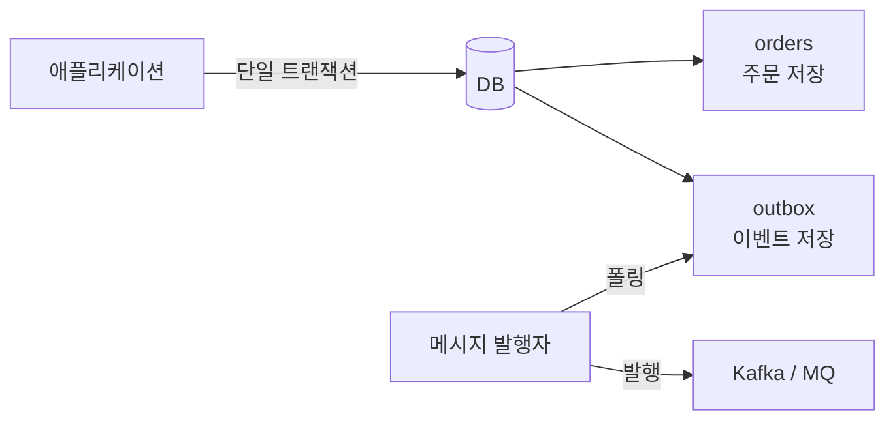
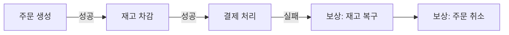
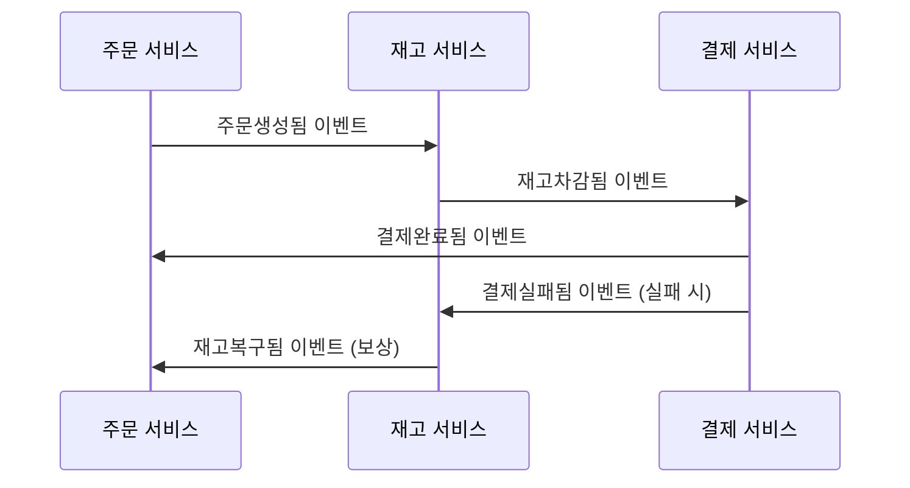
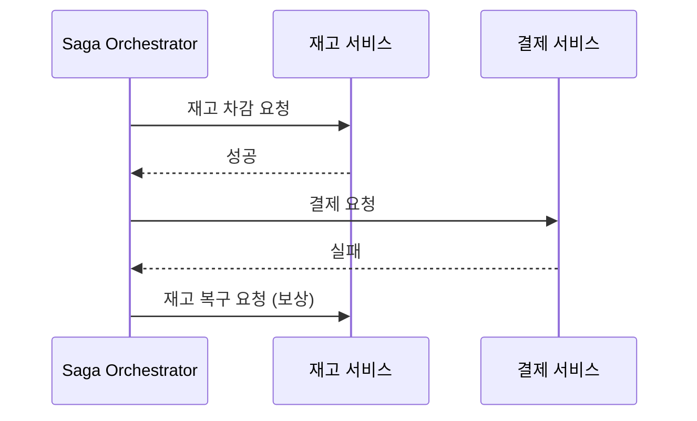
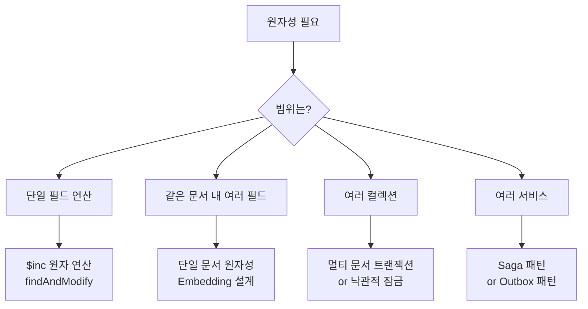

# NoSQL 트랜잭션

> 태그: `#db` `#nosql` `#transaction` `#saga` `#outbox`<br>
> 작성일: 2026-06-23<br>
> 최종 수정일: 2026-06-23

## 정의

NoSQL은 트랜잭션을 전혀 지원하지 않는 게 아니라 DB마다 범위와 성능이 다른 수준으로 지원하며, 단일 문서 원자성·원자적 연산·낙관적 잠금·Outbox·Saga 패턴 중 필요한 원자성 범위에 맞는 도구를 선택해야 한다.

## 특징 / 상세

### NoSQL이 트랜잭션을 못 한다?

NoSQL이 트랜잭션을 아예 지원하지 않는다는 건 오해다. DB마다 지원 수준이 다르다.

| DB | 트랜잭션 지원 수준 |
|---|---|
| MongoDB | 4.0부터 멀티 문서 ACID 트랜잭션 지원 |
| Redis | 단일 명령 원자적, MULTI/EXEC으로 트랜잭션 지원 (롤백 없음) |
| Cassandra | 단일 파티션 내 경량 트랜잭션(LWT) 지원 |
| DynamoDB | 트랜잭션 API 지원 (최대 25개 항목) |

RDB보다 "약하다"는 건 트랜잭션 **범위와 성능** 의 차이다.

### Redis 트랜잭션의 특이점

Redis는 MULTI/EXEC으로 트랜잭션을 지원하지만, **롤백이 없다.**

```
MULTI        ← 트랜잭션 시작 (명령 큐에 쌓기 시작)
SET key1 v1
SET key2 v2
INCR key3
EXEC         ← 큐에 쌓인 명령 한번에 실행
```

EXEC 전까지 명령을 큐에 쌓아뒀다가 한 번에 실행한다. 중간에 `SET key2`가 실패해도 `key1`은 이미 적용된 채로 남는다.

이는 의도적인 설계다. Redis는 성능을 위해 롤백을 포기했다.

### 단일 문서 원자성

NoSQL의 가장 기본적인 원자성 보장이다. **단일 문서 내 연산은 항상 원자적**이다.

트랜잭션이 필요한 데이터를 하나의 문서 안에 설계하면 트랜잭션 문제 자체가 없어진다.

```json
// 재고와 예약을 하나의 문서로
{
  "product_id": "p001",
  "stock": 100,
  "reserved": [
    { "order_id": "o001", "quantity": 2 },
    { "order_id": "o002", "quantity": 1 }
  ]
}
```

> 트랜잭션이 필요한 구조라면 Embedding으로 해결할 수 있는지 먼저 검토하라.

### 원자적 연산 ($inc)

읽고-계산-쓰기 사이에 다른 요청이 끼어드는 문제를 DB 레벨 원자 연산으로 해결한다.

```
문제 상황
요청 A: 재고 읽기 (100) → 차감 계산 (99) → 쓰기
요청 B: 재고 읽기 (100) → 차감 계산 (99) → 쓰기
→ 둘 다 99로 씀 → 실제로는 98이어야 함
```

```java
// findAndModify로 읽기-쓰기를 원자적으로 처리
Query query = Query.query(
    Criteria.where("id").is(productId)
        .and("stock").gt(0)  // 재고 있을 때만
);
Update update = new Update().inc("stock", -1);  // 원자적 차감

Product result = mongoTemplate.findAndModify(
    query, update,
    FindAndModifyOptions.options().returnNew(true),
    Product.class
);

if (result == null) {
    throw new OutOfStockException("재고 없음");
}
```

`$inc`는 읽기-계산-쓰기를 DB 레벨에서 원자적으로 처리한다. 중간에 다른 요청이 끼어들 수 없다.

### 낙관적 잠금 (Optimistic Locking)

충돌이 드문 상황에서 버전 필드로 충돌을 감지한다.

```json
{ "product_id": "p001", "stock": 100, "version": 5 }
```

```java
Query query = Query.query(
    Criteria.where("id").is(id)
        .and("version").is(currentVersion)  // 버전이 맞을 때만
);
Update update = Update.update("stock", newStock)
    .inc("version", 1);  // 버전 증가

UpdateResult result = mongoTemplate.updateFirst(query, update, Product.class);

if (result.getModifiedCount() == 0) {
    throw new OptimisticLockException("충돌 발생, 재시도 필요");
}
```

다른 요청이 먼저 업데이트하면 version이 이미 증가해서 조건 불일치 → 재시도.

### Outbox 패턴

같은 DB에 이벤트를 함께 저장해서 원자성을 보장한다.



```
단일 트랜잭션으로:
  orders 테이블에 주문 저장
  outbox 테이블에 "주문생성됨" 이벤트 저장
→ 둘 다 성공하거나 둘 다 실패

별도 프로세스가 outbox를 폴링해서 Kafka에 발행
→ Kafka가 죽어도 나중에 재발행 가능
```

### 멀티 문서 트랜잭션 (MongoDB)

여러 컬렉션에 걸친 원자성이 필요할 때 사용한다.

```java
session.startTransaction();
try {
    productRepo.decreaseStock(productId, session);
    paymentRepo.createPayment(payment, session);
    orderRepo.updateStatus(orderId, "PAID", session);
    session.commitTransaction();
} catch (Exception e) {
    session.abortTransaction();  // 롤백
}
```

RDB 트랜잭션과 거의 동일하지만 샤드 클러스터 환경에서 성능 비용이 크다.

### Saga 패턴

분산 환경에서 트랜잭션을 단계별로 쪼개서 관리한다.



실패 시 **보상 트랜잭션(Compensating Transaction)** 으로 앞 단계를 되돌린다. 개발자가 보상 로직을 전부 직접 짜야 하므로 복잡도가 높다.

#### Choreography vs Orchestration

Saga를 구현하는 방식이 두 가지다.

**Choreography — 이벤트 기반 자율 조정**

각 서비스가 이벤트를 발행하고 구독해서 스스로 다음 단계를 처리한다. 중앙 제어자가 없다.



장점: 서비스 간 결합도 낮음, 중앙 SPOF 없음
단점: 전체 흐름 파악이 어려움, 디버깅 복잡

**Orchestration — 중앙 오케스트레이터 제어**

중앙 오케스트레이터가 각 서비스에게 직접 명령하고 결과를 받아 다음 단계를 결정한다.



장점: 전체 흐름이 한 곳에서 보임, 디버깅 용이
단점: 오케스트레이터가 SPOF, 서비스 간 결합도 증가

#### 멱등성 (Idempotency)

Saga에서 보상 트랜잭션이나 재시도 시 **같은 요청이 여러 번 실행될 수 있다.** 네트워크 오류로 응답을 못 받아 재시도하면 실제로는 두 번 실행되는 경우다.

멱등성: 같은 요청을 여러 번 실행해도 결과가 같아야 한다.

```java
// 멱등성 없는 경우 — 재고가 두 번 차감될 수 있음
public void decreaseStock(String productId, int quantity) {
    product.setStock(product.getStock() - quantity);
}

// 멱등성 보장 — 요청 ID로 중복 처리 방지
public void decreaseStock(String productId, int quantity, String requestId) {
    if (processedRequests.contains(requestId)) {
        return;  // 이미 처리된 요청 무시
    }
    product.setStock(product.getStock() - quantity);
    processedRequests.add(requestId);
}
```

### 상황별 선택 기준



> 돈이 오가는 핵심 결제는 RDB를 쓰는 게 현실적이다. NoSQL로 구현 못 하는 게 아니라 복잡도 대비 얻는 게 없기 때문이다.

## 트레이드오프

해당 없음 — Choreography/Orchestration 장단점은 위 특징/상세 참고.

## 실무 경험

해당 없음

## 참고

원본 학습 노트(TIL)에서 이전한 링크. 확인일 미기재 — 필요 시 재검증.

- [MongoDB 트랜잭션 공식 문서](https://www.mongodb.com/docs/manual/core/transactions/)
- [Saga 패턴 — microservices.io](https://microservices.io/patterns/data/saga.html)
- [Outbox 패턴 — microservices.io](https://microservices.io/patterns/data/transactional-outbox.html)

## 관련 내용

- [nosql-개요](nosql-개요.md)
- [nosql-도큐먼트-db](nosql-도큐먼트-db.md)
- [트랜잭션-관리](트랜잭션-관리.md)
