# 복제 (Replication)

> 태그: `#db` `#replication` `#raft` `#failover` `#distributed-systems`<br>
> 작성일: 2026-06-23<br>
> 최종 수정일: 2026-06-23

## 정의

복제는 같은 데이터를 여러 노드에 복사해 가용성과 읽기 성능을 확보하는 기법으로, 동기/비동기/반동기 복제 중 선택에 따라 일관성과 응답 속도가 갈리고 Raft 같은 리더 선출 알고리즘으로 Split-Brain을 막으며 비동기 복제 환경에서는 복제 지연(Replication Lag)에 따른 Read-Your-Writes 문제를 추가로 해결해야 한다.

## 특징 / 상세

### 개념

데이터를 여러 노드에 복사해서 저장하는 기법이다. 샤딩이 데이터를 **나눠서** 저장한다면, 복제는 데이터를 **똑같이** 여러 곳에 저장한다.

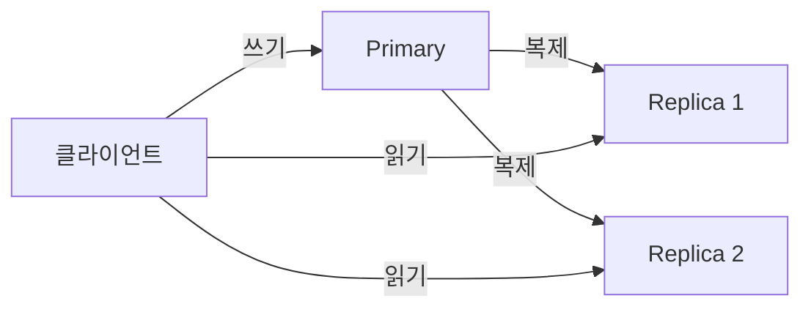

**복제의 목적**
- **고가용성** — 노드 장애 시에도 서비스 유지
- **읽기 성능** — Replica로 읽기 분산
- **장애 복구** — 데이터 유실 방지

### 복제 방식

#### 동기 복제 (Synchronous)

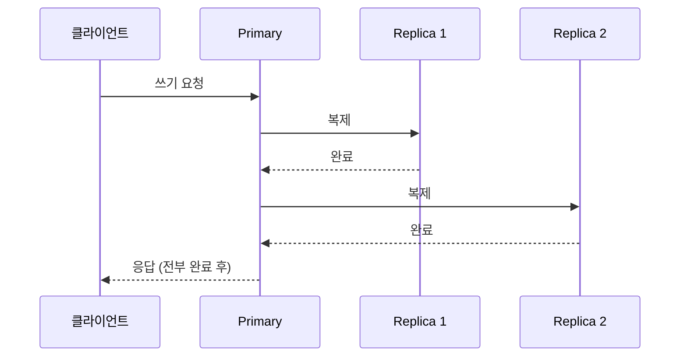

모든 Replica에 복제가 완료된 후 클라이언트에 응답한다.

**장점**: 데이터 일관성 완벽 보장
**단점**: Replica가 느리거나 죽으면 전체가 느려지거나 멈춤

#### 비동기 복제 (Asynchronous)

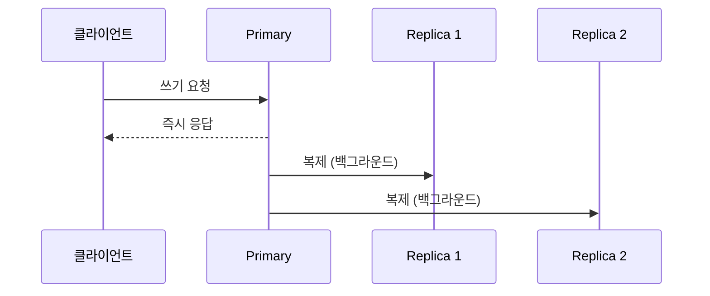

Primary에 저장되면 즉시 응답하고, Replica 복제는 백그라운드에서 이루어진다.

**장점**: 빠른 응답, Primary 장애에 영향 없음
**단점**: Primary 장애 시 복제 안 된 데이터 유실 가능

#### 반동기 복제 (Semi-Synchronous)

동기와 비동기의 절충안. 최소 1개 이상의 Replica 확인 후 응답하고, 나머지는 비동기로 처리한다.

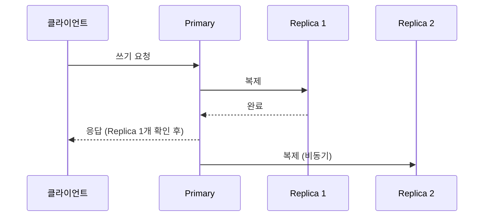

**장점**: 속도와 안전성의 균형
**단점**: 완전한 일관성은 보장 안 됨

실무에서 가장 많이 쓰이는 방식이다.

### Failover

Primary가 죽었을 때 Replica를 새 Primary로 승격하는 과정이다.

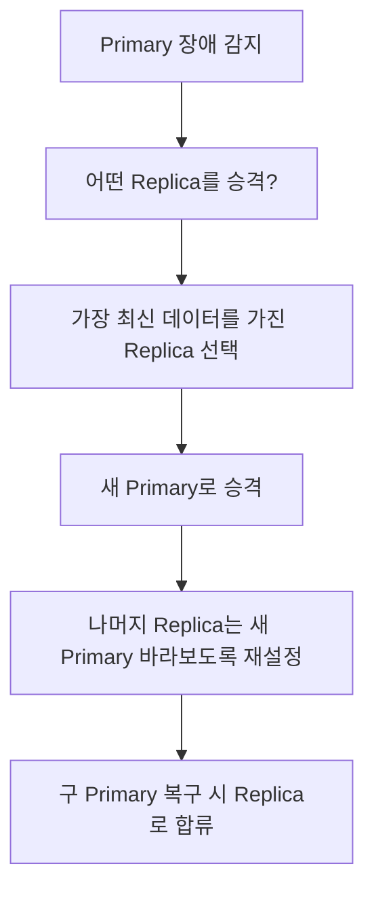

#### 비동기 복제에서의 데이터 유실 위험

```
Primary: 100개 쓰기 완료
Replica A: 98개 복제됨  ← 가장 최신
Replica B: 95개 복제됨
Replica C: 90개 복제됨

Replica B를 실수로 승격 → 95~100번 데이터 유실
```

Failover 시 가장 최신 Replica를 선택해야 한다.

### Split-Brain 문제

네트워크 장애로 Primary가 잠깐 끊겼다가 돌아왔는데, 그 사이 Replica가 승격되면 Primary가 2개가 된다.

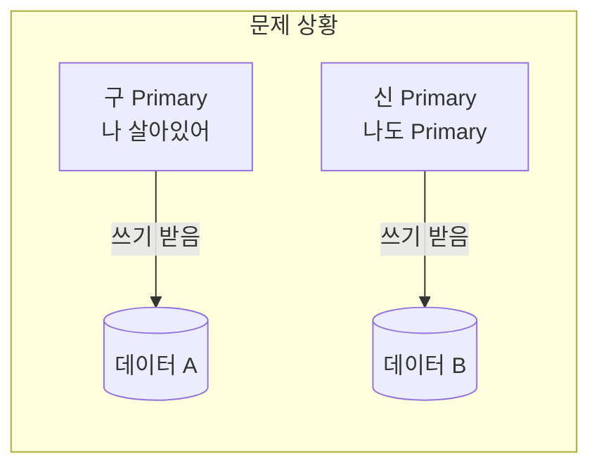

두 노드에 서로 다른 데이터가 쓰여져 데이터가 꼬인다. 이를 **Split-Brain** 이라 한다.

### 리더 선출 알고리즘

Split-Brain을 막기 위해 **과반수(Quorum) 동의** 가 있어야만 리더가 될 수 있다는 원칙을 사용한다.

#### Raft 알고리즘

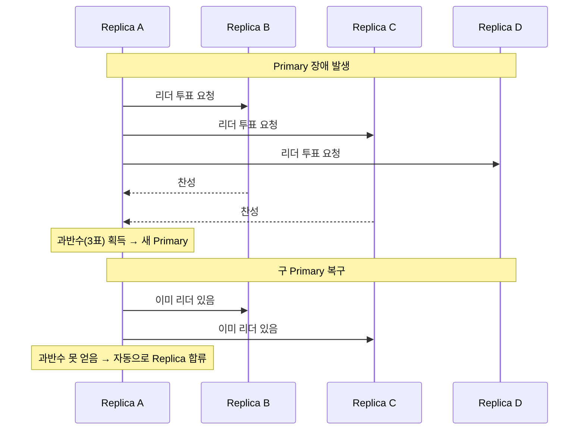

노드 5개면 3개 이상 동의해야 리더가 될 수 있다. 두 노드가 동시에 과반수를 얻는 건 수학적으로 불가능하므로 Split-Brain이 원천 차단된다.

#### 실제 사용 사례

| 시스템 | 알고리즘 | 용도 |
|---|---|---|
| MongoDB | Raft | Replica Set 리더 선출 |
| etcd | Raft | Kubernetes 클러스터 상태 관리 |
| Redis Sentinel | 자체 구현 | Redis Failover 관리 |
| ZooKeeper | ZAB (Paxos 변형) | Kafka 리더 선출 (구버전) |
| Kafka KRaft | Raft | Kafka 자체 리더 선출 (신버전) |

### Kafka와의 연결

복제와 리더 선출은 DB뿐 아니라 분산 시스템 전반에서 동일하게 등장하는 문제다.

```
DB 복제              Kafka
────────────────────────────────
Primary          →  파티션 리더
Replica          →  팔로워 (ISR)
동기/비동기 복제  →  ISR 동기화
Raft/Paxos       →  KRaft
ZooKeeper        →  구버전 리더 선출 담당
Quorum           →  ISR 과반수
```

Kafka가 ZooKeeper에서 KRaft로 전환한 이유도 동일하다. ZooKeeper라는 외부 시스템에 의존하지 않고, Kafka 자체적으로 Raft 기반 리더 선출을 처리해 운영 복잡도를 줄이기 위해서다.

### NoSQL에서의 복제

NoSQL은 DB마다 복제 구조가 다르다.

#### Primary-Replica 구조 (MongoDB)

RDB와 유사하게 Primary-Replica 구조를 가진다. Raft 기반으로 자동 Failover를 지원한다.

```yaml
# MongoDB Replica Set 구성
rs.initiate({
  _id: "myReplicaSet",
  members: [
    { _id: 0, host: "node1:27017" },  // Primary
    { _id: 1, host: "node2:27017" },  // Replica
    { _id: 2, host: "node3:27017" }   // Replica
  ]
})
```

#### 마스터 없는 구조 (Cassandra / ScyllaDB)

모든 노드가 동등하다. 어느 노드에 써도 되고, Replication Factor만큼 자동 복제된다.

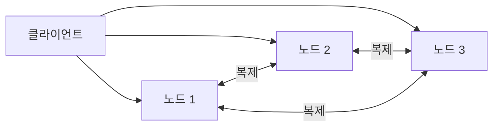

Primary 개념이 없으니 Single Point of Failure가 없다. Consistency Level로 읽기/쓰기 시 몇 개 노드의 응답을 받을지 조절한다.

### 복제 vs 샤딩

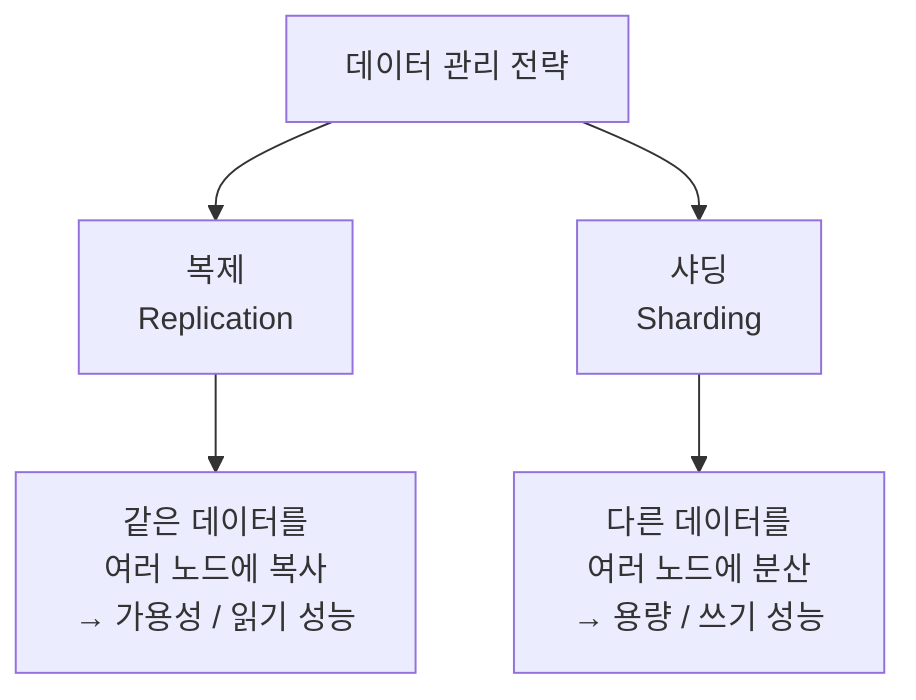

실무에서는 둘을 함께 사용한다.

```
샤딩으로 데이터 분산 → 각 샤드를 복제로 이중화
```

Cassandra가 이 방식이다. Consistent Hashing으로 샤딩하고, Replication Factor로 각 샤드를 복제한다.

### 읽기/쓰기 분리 (Read/Write Splitting)

Primary에서 쓰기, Replica에서 읽기로 분리하는 구현 방식은 두 가지다.

#### 방법 1 — 애플리케이션 레벨 (Spring)

DataSource를 두 개 만들고 트랜잭션 readOnly 여부로 라우팅한다.

```java
@Configuration
public class DataSourceConfig {

    @Bean
    public DataSource routingDataSource(
        @Qualifier("primaryDataSource") DataSource primary,
        @Qualifier("replicaDataSource") DataSource replica
    ) {
        AbstractRoutingDataSource routing = new AbstractRoutingDataSource() {
            @Override
            protected Object determineCurrentLookupKey() {
                // 읽기 전용 트랜잭션이면 Replica, 아니면 Primary
                return TransactionSynchronizationManager.isCurrentTransactionReadOnly()
                    ? "replica" : "primary";
            }
        };

        Map<Object, Object> sources = new HashMap<>();
        sources.put("primary", primary);
        sources.put("replica", replica);
        routing.setTargetDataSources(sources);
        return routing;
    }
}
```

```java
@Service
public class UserService {

    @Transactional(readOnly = true)  // → Replica로 자동 라우팅
    public User findUser(Long id) { ... }

    @Transactional                   // → Primary로 자동 라우팅
    public User createUser(User user) { ... }
}
```

`@Transactional(readOnly = true)` 하나로 라우팅이 자동 결정된다.

#### 방법 2 — 미들웨어 레벨 (ProxySQL)

애플리케이션은 ProxySQL 하나만 바라보고, ProxySQL이 쿼리를 분석해서 라우팅한다.

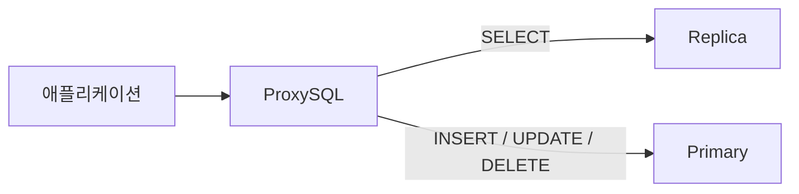

애플리케이션 코드 변경이 전혀 없다.

### 복제 지연 (Replication Lag)

비동기 복제에서 Primary → Replica 복제가 늦어지는 문제다.

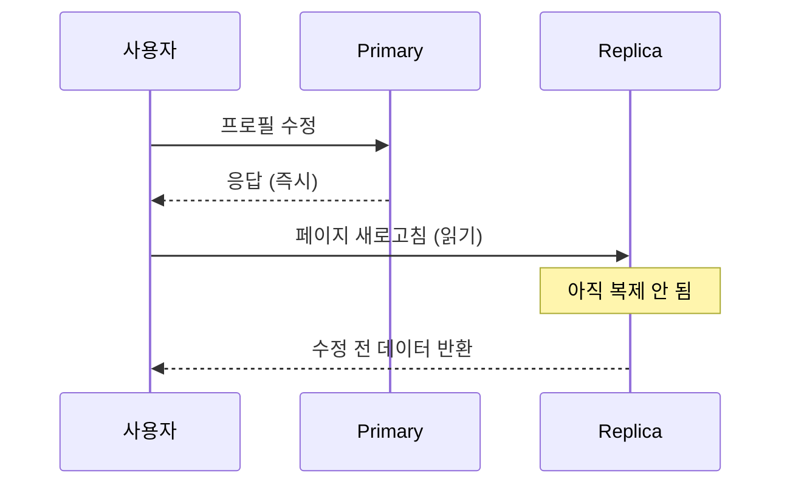

방금 수정했는데 새로고침하면 원래 데이터가 보이는 현상이다. 이를 **Read-Your-Writes Consistency** 문제라고 한다.

#### 해결 방법

**1. 쓰기 직후엔 Primary에서 읽기**

```java
public User findUser(Long id) {
    // 최근 N초 안에 쓰기가 있었으면 Primary에서 읽기
    if (recentlyWritten(id)) {
        return primaryRepository.findById(id);
    }
    return replicaRepository.findById(id);
}
```

**2. 세션 기반 라우팅**

```
쓰기 발생 → 세션에 "방금 썼음" 플래그 저장 (예: 5초)
읽기 요청 → 플래그 있으면 Primary, 없으면 Replica
5초 후    → 복제 완료됐다고 가정, 다시 Replica로
```

**3. 복제 지연 모니터링 + 임계값 설정**

```
Replica 복제 지연 > 1초 → Primary로 라우팅
Replica 복제 지연 < 1초 → Replica로 라우팅
```

#### Monotonic Read 문제

여러 Replica가 있을 때, Replica마다 복제 속도가 달라서 생기는 문제다.

```
Replica A에서 읽기 → 데이터 버전 10
Replica B에서 읽기 → 데이터 버전 8 (B가 더 느림)
→ 시간이 지날수록 더 오래된 데이터가 보임
```

해결책: 같은 사용자는 항상 같은 Replica에서 읽도록 고정한다. (세션 기반 Replica 고정)

## 트레이드오프

### 읽기/쓰기 분리 구현 방식 비교

| | 애플리케이션 레벨 | 미들웨어 레벨 |
|---|---|---|
| 코드 변경 | 필요 | 불필요 |
| 유연성 | 높음 | 낮음 |
| 인프라 추가 | 없음 | ProxySQL 필요 |
| SPOF | 없음 | ProxySQL 자체가 SPOF 가능 |

### 일관성/가용성/지연/비용/운영부담

| 항목 | 내용 |
|---|---|
| 일관성 | 동기 복제는 강한 일관성, 비동기는 약한 일관성(Read-Your-Writes 문제), 반동기는 절충 |
| 가용성 | 동기 복제는 Replica 장애 시 전체 멈춤 위험, 비동기/반동기는 Primary 장애 영향 적음 |
| 지연 | 동기 > 반동기 > 비동기 순으로 쓰기 응답 지연 증가 |
| 비용 | Replica 수만큼 스토리지·인스턴스 비용 증가, 미들웨어 레벨은 ProxySQL 등 인프라 추가 비용 |
| 운영부담 | Failover 시 최신 Replica 선택, Split-Brain 방지(Raft), 복제 지연 모니터링이 상시 운영 부담 |

## 실무 경험

해당 없음

## 참고

원본 학습 노트(TIL)에서 이전한 링크. 확인일 미기재 — 필요 시 재검증.

- [Raft 알고리즘 시각화](https://raft.github.io/)
- [MongoDB Replica Set 공식 문서](https://www.mongodb.com/docs/manual/replication/)
- [Cassandra Replication 공식 문서](https://cassandra.apache.org/doc/latest/cassandra/architecture/dynamo.html)
- [Designing Data-Intensive Applications — Martin Kleppmann](https://dataintensive.net/)

## 관련 내용

- [샤딩](샤딩.md)
- [분산-id-생성](분산-id-생성.md)
- [nosql-와이드컬럼](nosql-와이드컬럼.md)
