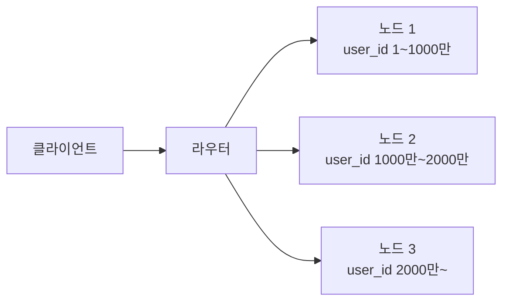
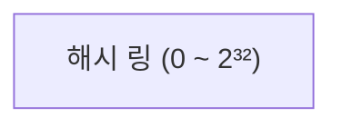
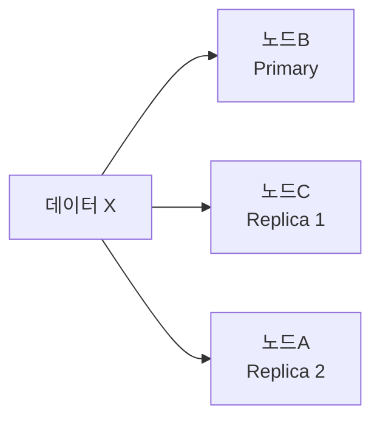

# 샤딩 (Sharding)

> 태그: `#db` `#sharding` `#distributed-systems` `#consistent-hashing`<br>
> 작성일: 2026-06-23<br>
> 최종 수정일: 2026-06-23

## 정의

샤딩은 데이터를 여러 노드에 분산 저장해 단일 노드의 한계를 넘어 수평 확장하는 기법으로, 해시/범위/디렉토리 샤딩 중 샤드 키 설계에 따라 핫스팟과 리샤딩 비용이 갈리며 Consistent Hashing이 노드 추가 시 재배치 범위를 최소화한다.

## 특징 / 상세

### 개념

데이터를 여러 노드에 분산 저장하는 기법이다. 단일 노드로 감당할 수 없는 대용량 데이터를 수평 확장으로 처리하기 위해 사용한다.



샤드(Shard) 하나가 전체 데이터의 일부를 담당한다. 어느 샤드에 데이터가 있는지 결정하는 기준을 **샤드 키(Shard Key)** 라고 한다.

### 샤딩 방식 3가지

#### 1. 해시 샤딩 (Hash Sharding)

샤드 키를 해시 함수에 넣어 노드를 결정한다.

```
hash(user_id) % 3 = 0 → 노드 1
hash(user_id) % 3 = 1 → 노드 2
hash(user_id) % 3 = 2 → 노드 3
```

**장점**
- 데이터가 균등하게 분산됨
- 특정 키로 조회 시 노드를 바로 특정 가능 (O(1))

**단점**
- 범위 조회 불가 — `user_id 1000~2000` 조회 시 전체 노드 탐색 필요
- 노드 추가 시 대규모 리샤딩 발생

```
노드 3개 → 4개로 증가
hash(key) % 3 → hash(key) % 4
→ 거의 모든 데이터의 소속 노드가 바뀜 → 대규모 재배치
```

#### 2. 범위 샤딩 (Range Sharding)

샤드 키의 값 범위를 기준으로 노드를 나눈다.

```
user_id 1 ~ 1000만       → 노드 1
user_id 1000만 ~ 2000만  → 노드 2
user_id 2000만 ~         → 노드 3
```

**장점**
- 범위 조회가 빠름 — 특정 범위의 데이터가 같은 노드에 있음
- 노드 추가 시 해당 범위만 분리하면 됨

**단점**
- **핫스팟(Hotspot) 문제** — 특정 범위에 데이터가 몰리면 해당 노드에 부하 집중

```
시간 기반 샤딩의 경우
→ 최신 데이터는 항상 마지막 노드로 집중
→ 오래된 노드는 한산, 최신 노드는 과부하
```

#### 3. 디렉토리 샤딩 (Directory Sharding)

별도 매핑 테이블로 어떤 키가 어느 노드에 있는지 관리한다.

```
매핑 테이블
user_id 1234 → 노드 2
user_id 5678 → 노드 1
user_id 9999 → 노드 3
```

**장점**
- 유연한 배치 가능 — 특정 데이터를 원하는 노드에 직접 지정
- 핫스팟 발생 시 수동 재배치 가능

**단점**
- 매핑 테이블 자체가 단일 장애점(SPOF)이자 병목
- 매핑 테이블 관리 비용

### Consistent Hashing

#### 문제 배경

일반 해시 샤딩은 노드 수가 바뀌면 거의 모든 데이터가 재배치된다. 수평 확장이 자유로워야 하는 NoSQL에서 치명적인 단점이다.

#### 개념

노드와 데이터를 같은 **원형 해시 공간(링)** 에 배치한다.



```
         0
     ┌───────┐
     │  노드A │  ← 해시값 60
 270 │       │ 90
     │  노드C │  ← 해시값 300
     └───────┘
        180
      노드B ← 해시값 180

데이터 X (해시값 80)  → 시계 방향 가장 가까운 노드 = 노드B
데이터 Y (해시값 200) → 시계 방향 가장 가까운 노드 = 노드C
```

#### 노드 추가 시

노드 D (해시값 240) 추가:

```
기존: 해시값 180~300 → 노드C 담당
변경: 해시값 180~240 → 노드D 담당
      해시값 240~300 → 노드C 유지
```

영향받는 데이터가 `1/N` 만큼만 이동한다. 전체 재배치가 없다.

#### 가상 노드 (Virtual Node)

노드가 적으면 링에서 불균형이 생긴다.

```
노드A → 해시값 10
노드B → 해시값 15  ← A와 너무 가까움, B가 5만큼만 담당
노드C → 해시값 200 ← B~C 구간이 너무 넓음, C가 대부분 담당
```

실제 노드 1개를 링에 여러 개의 가상 노드로 배치해 균등하게 분산한다.

```
노드A → 10, 120, 250 (가상 노드 3개)
노드B → 50, 170, 310
노드C → 90, 210, 350
```

Cassandra, ScyllaDB가 이 방식을 사용한다.

### 핫스팟 문제 해결

#### 1. 키에 랜덤 접두사 추가

```
timestamp_20240101 → 3_timestamp_20240101
timestamp_20240101 → 1_timestamp_20240101
timestamp_20240101 → 2_timestamp_20240101
```

같은 시간대 데이터가 여러 노드로 분산된다.

**트레이드오프**: 조회 시 접두사를 모르니 전체 노드를 다 뒤져야 해서 읽기가 느려진다.

#### 2. 해시 + 범위 복합 샤딩

```
파티션 키 (해시) → 어느 노드에 저장할지 결정
클러스터링 키 (범위) → 노드 안에서 정렬 순서 결정
```

Cassandra의 핵심 설계 방식이다. 노드는 해시로 빠르게 찾고, 노드 안에서는 범위로 정렬해서 범위 조회도 가능하다.

```sql
-- Cassandra 테이블 예시
CREATE TABLE events (
    user_id  UUID,        -- 파티션 키 (해시 샤딩)
    event_time TIMESTAMP, -- 클러스터링 키 (범위 정렬)
    event_type TEXT,
    PRIMARY KEY (user_id, event_time)
);

-- user_id로 노드 결정, 그 안에서 시간 범위 조회 가능
SELECT * FROM events
WHERE user_id = ? AND event_time > ?;
```

#### 3. 핫스팟 키 분리

특정 키가 유독 많이 몰리면 해당 키만 별도 노드로 분리한다. 운영 개입이 필요하므로 모니터링이 전제되어야 한다.

### 복제 (Replication) 와의 조합

샤딩만으로는 노드 장애 시 데이터가 유실된다. 복제와 함께 사용해야 한다.



Cassandra의 경우 `Replication Factor = 3` 으로 설정하면 데이터가 3개 노드에 복제된다. 노드 1개가 죽어도 데이터는 유실되지 않는다.

### 샤딩 설계 시 고려사항

#### 좋은 샤드 키 조건

```
1. 카디널리티가 높아야 한다  → 값의 종류가 많아야 균등 분산 가능
2. 쓰기가 균등하게 분산돼야 한다 → 핫스팟 방지
3. 자주 쓰는 쿼리 패턴에 맞아야 한다 → 샤드 키 기준 조회는 빠름
```

#### 나쁜 샤드 키 예시

```
성별 (M/F) → 카디널리티 2개 → 두 노드에만 집중
생성 시간  → 최신 데이터 항상 같은 노드 → 핫스팟
```

#### 샤딩 후 불가능해지는 것들

```
- 샤드를 넘나드는 JOIN → 불가 또는 애플리케이션 레벨에서 처리
- 샤드 전체를 대상으로 하는 집계 → 성능 저하
- 샤드 키 변경 → 사실상 불가 (전체 재배치 필요)
```

샤드 키는 한번 정하면 바꾸기 매우 어렵다. 초기 설계가 중요하다.

## 트레이드오프

### Consistency Level (복제 환경에서의 읽기/쓰기 응답 기준)

복제 환경에서 읽기/쓰기 시 몇 개 노드의 응답을 받을지 결정한다.

| Level | 조건 | 특징 |
|---|---|---|
| ANY | 아무 노드 1개 | 가장 빠름, 가장 위험 |
| ONE | 1개 노드 응답 | 빠름, 불일치 가능 |
| QUORUM | 과반수 응답 (RF=3이면 2개) | 속도와 안전성 균형 |
| ALL | 전체 노드 응답 | 가장 느림, 가장 안전 |

실무에서는 **QUORUM** 이 가장 많이 쓰인다. 과반수가 성공하면 Eventually Consistent로 나머지도 맞춰지기 때문이다.

| 항목 | 내용 |
|---|---|
| 일관성 | ANY/ONE은 약한 일관성, QUORUM은 균형, ALL은 강한 일관성 |
| 가용성 | ALL은 노드 1개만 죽어도 응답 불가, ANY/ONE은 노드 장애에도 응답 |
| 지연 | ALL > QUORUM > ONE > ANY 순으로 지연 증가 |
| 비용 | Replication Factor가 높을수록(복제본 多) 스토리지 비용 증가 |
| 운영부담 | 해시 샤딩은 리샤딩 비용, 범위 샤딩은 핫스팟 모니터링, 디렉토리 샤딩은 매핑 테이블 관리 부담 |

## 실무 경험

해당 없음

## 참고

원본 학습 노트(TIL)에서 이전한 링크. 확인일 미기재 — 필요 시 재검증.

- [MongoDB Sharding 공식 문서](https://www.mongodb.com/docs/manual/sharding/)
- [Cassandra Consistent Hashing](https://cassandra.apache.org/doc/latest/cassandra/architecture/dynamo.html)
- [System Design — Consistent Hashing (ByteByteGo)](https://bytebytego.com/concepts/consistent-hashing)

## 관련 내용

- [복제](복제.md)
- [분산-id-생성](분산-id-생성.md)
- [nosql-와이드컬럼](nosql-와이드컬럼.md)
- [nosql-개요](nosql-개요.md)
