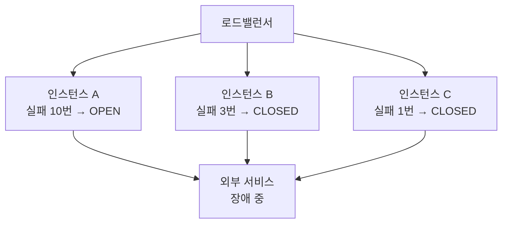
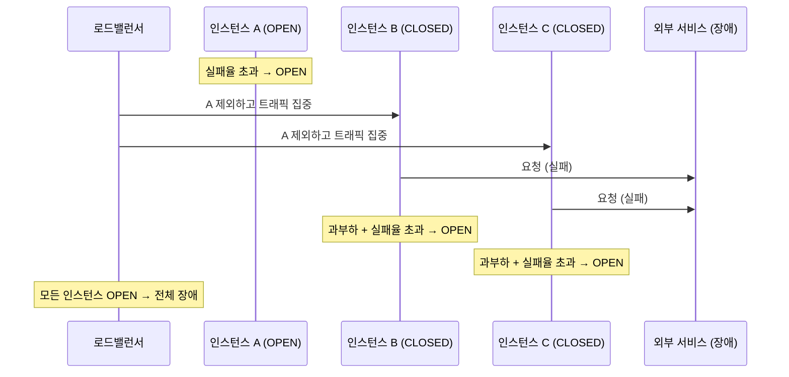
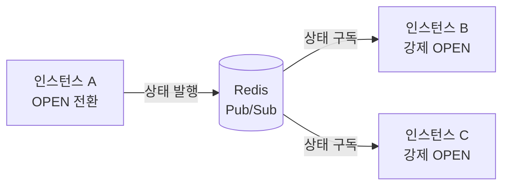
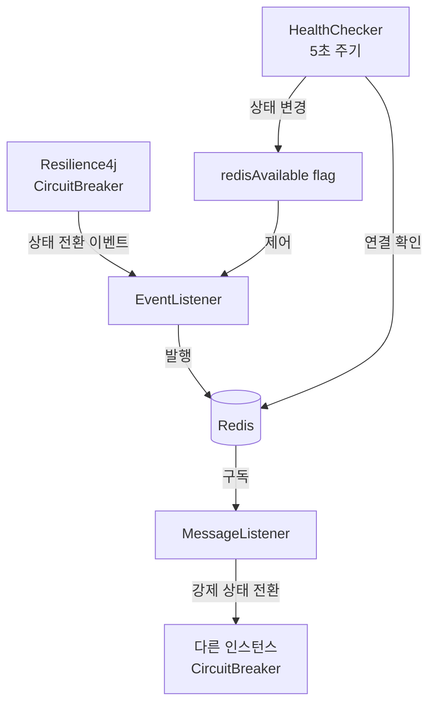
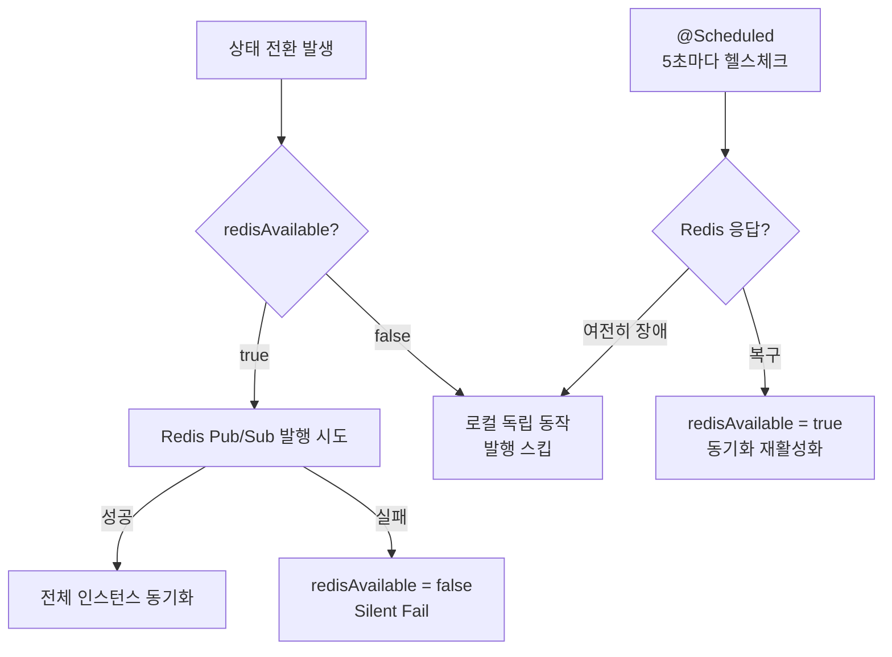

# 분산 환경에서의 서킷 브레이커

## 문제

Resilience4j의 서킷 브레이커는 **인스턴스마다 독립적인 상태**를 가진다. 각 인스턴스는 자신이 경험한 실패만 보고 판단한다.



외부 서비스가 죽어도 인스턴스마다 서킷 상태가 다를 수 있다. 전체 상황을 아무도 모른다.

---

## 장애 확산 시나리오

문제는 단계적으로 커진다.



**1단계 — 불균형 트래픽**

A가 OPEN 되면 로드밸런서는 A를 피해 B, C에 트래픽을 몰아준다. B, C는 원래 트래픽 + A 몫까지 처리해야 한다.

**2단계 — 연쇄 OPEN**

과부하로 B, C도 실패율이 올라가 결국 OPEN. 전체 서비스 장애로 확산된다.

**3단계 — 복구 실패**

B가 HALF_OPEN이 되는 순간, A와 C의 트래픽까지 B로 몰려 테스트 요청이 실패한다. B는 다시 OPEN으로 돌아가고 복구가 되지 않는다.

---

## 해결 방법

### 1. Redis Pub/Sub 상태 동기화 (권장)

**핵심 아이디어**

Resilience4j 로컬 CircuitBreaker를 그대로 유지하면서, 상태가 전환되는 순간에만 Redis로 다른 인스턴스에게 알린다.



Resilience4j가 실패율 계산, 슬라이딩 윈도우, slow call 감지 등 모든 핵심 로직을 그대로 수행한다. Redis는 "나 OPEN됐어"를 전달하는 통로 역할만 한다.

**Redis가 죽으면?**

Redis는 상태 전파에만 관여하지 로컬 CircuitBreaker 동작에는 관여하지 않는다. Redis가 죽어도 각 인스턴스의 Resilience4j는 독립적으로 계속 동작한다. 동기화가 안 될 뿐, 서킷 브레이커 자체는 살아있다.

### 2. 서비스 메시 (Istio / Linkerd)

애플리케이션 코드 밖에서 인프라 레이어(사이드카 프록시)가 서킷 브레이커를 처리한다. 코드 변경 없이 전체 동기화가 가능하지만 인프라 복잡도가 크게 올라간다.

### 3. 현실적 타협

`slidingWindowSize`를 작게 잡아 빠르게 반응하고, 로드밸런서 헬스체크 + 모니터링으로 빠른 감지/대응을 택한다.

---

## Redis Pub/Sub 구현

### 전체 구조



### RedisCircuitBreakerSynchronizer

```java
@Component
@Slf4j
public class RedisCircuitBreakerSynchronizer {

    private static final String CHANNEL = "circuit-breaker:state";
    private static final String STATE_KEY_PREFIX = "circuit-breaker:state:";

    private final RedisTemplate<String, String> redisTemplate;
    private final CircuitBreakerRegistry circuitBreakerRegistry;

    // Redis가 살아있는지 추적하는 플래그
    // volatile: 여러 스레드에서 읽기 때문에 가시성 보장 필요
    private volatile boolean redisAvailable = true;

    // 상태 발행: Redis가 살아있을 때만 시도
    public void publishStateChange(String serviceName, CircuitBreaker.State state) {
        if (!redisAvailable) return;

        try {
            String message = serviceName + ":" + state.name();
            redisTemplate.convertAndSend(CHANNEL, message);

            // 새로 뜬 인스턴스가 초기 상태를 읽어올 수 있도록 현재 상태도 저장
            // TTL을 waitDurationInOpenState보다 길게 잡아야 OPEN 상태가 유실되지 않음
            redisTemplate.opsForValue()
                .set(STATE_KEY_PREFIX + serviceName, state.name(), Duration.ofMinutes(5));

        } catch (Exception e) {
            // Redis 예외를 삼켜서 로컬 CircuitBreaker 동작에 영향 주지 않음
            // 이 시점에 로컬 상태 전환은 이미 완료된 상태
            redisAvailable = false;
            log.warn("Redis 연결 실패 - 로컬 독립 동작으로 전환: {}", e.getMessage());
        }
    }

    // 구독: 다른 인스턴스의 상태 변경을 받아 강제 전환
    @Bean
    public MessageListenerAdapter circuitBreakerMessageListener() {
        return new MessageListenerAdapter(new MessageListener() {
            @Override
            public void onMessage(Message message, byte[] pattern) {
                try {
                    String[] parts = message.toString().split(":");
                    String serviceName = parts[0];
                    CircuitBreaker.State newState = CircuitBreaker.State.valueOf(parts[1]);

                    CircuitBreaker cb = circuitBreakerRegistry.circuitBreaker(serviceName);

                    switch (newState) {
                        case OPEN      -> cb.transitionToOpenState();
                        case CLOSED    -> cb.transitionToClosedState();
                        case HALF_OPEN -> cb.transitionToHalfOpenState();
                    }

                    log.info("서킷 상태 동기화: {} → {}", serviceName, newState);

                } catch (Exception e) {
                    log.error("서킷 상태 동기화 실패: {}", e.getMessage());
                }
            }
        });
    }

    // Redis 헬스체크: 5초마다 확인해서 복구되면 동기화 모드 재활성화
    @Scheduled(fixedDelay = 5000)
    public void redisHealthCheck() {
        try {
            redisTemplate.opsForValue().get("health-check");

            if (!redisAvailable) {
                log.info("Redis 복구 감지 - 동기화 모드 재활성화");
                redisAvailable = true;
            }
        } catch (Exception e) {
            if (redisAvailable) {
                log.warn("Redis 장애 감지 - 로컬 독립 동작으로 전환");
                redisAvailable = false;
            }
        }
    }
}
```

### CircuitBreakerConfig — 이벤트 리스너 등록

```java
@Configuration
@RequiredArgsConstructor
public class CircuitBreakerSyncConfig {

    private final RedisCircuitBreakerSynchronizer synchronizer;
    private final CircuitBreakerRegistry circuitBreakerRegistry;

    // 모든 CircuitBreaker에 이벤트 리스너 등록
    // @PostConstruct: 빈 초기화 후 자동 실행
    @PostConstruct
    public void registerSyncListeners() {
        circuitBreakerRegistry.getAllCircuitBreakers().forEach(this::attachListener);

        // 나중에 동적으로 생성되는 CircuitBreaker도 감지
        circuitBreakerRegistry.getEventPublisher()
            .onEntryAdded(event -> attachListener(event.getAddedEntry()));
    }

    private void attachListener(CircuitBreaker cb) {
        cb.getEventPublisher()
            .onStateTransition(event ->
                synchronizer.publishStateChange(
                    cb.getName(),
                    event.getStateTransition().getToState()
                )
            );
    }
}
```

### MyService — 신규 인스턴스 초기 상태 동기화

```java
@Service
@RequiredArgsConstructor
public class MyService {

    private final CircuitBreakerRegistry circuitBreakerRegistry;
    private final RedisTemplate<String, String> redisTemplate;

    // 인스턴스가 새로 뜰 때 Redis에서 현재 상태를 읽어서 맞춤
    // 안 하면: 새 인스턴스만 CLOSED로 트래픽이 몰리는 문제 발생
    @PostConstruct
    public void syncInitialState() {
        CircuitBreaker cb = circuitBreakerRegistry.circuitBreaker("myService");

        try {
            String savedState = redisTemplate.opsForValue()
                .get("circuit-breaker:state:myService");

            if ("OPEN".equals(savedState)) {
                cb.transitionToOpenState();
                log.info("초기 상태 동기화: OPEN");
            }
        } catch (Exception e) {
            // Redis 못 읽어도 로컬 기본값(CLOSED)으로 시작
            log.warn("초기 상태 동기화 실패 - 기본값(CLOSED)으로 시작");
        }
    }

    // 기존 체인 완전히 그대로
    @CircuitBreaker(name = "myService", fallbackMethod = "fallback")
    @Retry(name = "myService")
    @TimeLimiter(name = "myService")
    public CompletableFuture<String> call() {
        return CompletableFuture.supplyAsync(() -> externalService.call());
    }

    public CompletableFuture<String> fallback(Exception e) {
        return CompletableFuture.completedFuture("fallback");
    }
}
```

### Redis 구독 설정

```java
@Configuration
@RequiredArgsConstructor
public class RedisSubscribeConfig {

    private final RedisConnectionFactory redisConnectionFactory;
    private final RedisCircuitBreakerSynchronizer synchronizer;

    @Bean
    public RedisMessageListenerContainer redisMessageListenerContainer() {
        RedisMessageListenerContainer container = new RedisMessageListenerContainer();
        container.setConnectionFactory(redisConnectionFactory);
        container.addMessageListener(
            synchronizer.circuitBreakerMessageListener(),
            new ChannelTopic("circuit-breaker:state")
        );
        return container;
    }
}
```

---

## Redis 장애 시 동작 흐름



| 상황 | 동작 |
|---|---|
| Redis 정상 | 로컬 판단 + 전체 인스턴스 동기화 |
| Redis 장애 감지 | 로컬 독립 동작으로 자동 전환, 예외 삼킴 |
| Redis 복구 감지 | 동기화 모드 자동 재활성화 |
| 신규 인스턴스 기동 | Redis에서 현재 상태 읽어 초기화 |

---

## 설계 결정 요약

| 결정 | 이유 |
|---|---|
| Resilience4j 로컬 CB 유지 | 슬라이딩 윈도우, 실패율 계산, slow call 등 핵심 로직을 직접 구현하지 않기 위해 |
| 이벤트 리스너로 후킹 | 기존 `@CircuitBreaker` 어노테이션 체인을 건드리지 않기 위해 |
| Redis 예외 삼킴 | Redis 장애가 서킷 브레이커 동작 자체에 영향을 주지 않도록 |
| `volatile boolean` 플래그 | 불필요한 Redis 연결 시도를 줄이고, 멀티스레드 환경에서 가시성 보장 |
| `@PostConstruct` 초기 동기화 | 새로 뜬 인스턴스에만 트래픽이 몰리는 문제 방지 |
| 주기적 헬스체크 | Redis 복구 시 자동으로 동기화 모드로 돌아오기 위해 |

---

## 세 가지 접근법 비교

| | Redis Pub/Sub | 서비스 메시 | 현실적 타협 |
|---|---|---|---|
| 동기화 수준 | 상태 전환 시점 동기화 | 완전 동기화 | 없음 |
| Resilience4j 기능 | 100% 유지 | 미사용 (인프라 대체) | 100% 유지 |
| 코드 변경 | 리스너 추가만 | 불필요 | 설정 조정만 |
| Redis 장애 내성 | 자동 로컬 전환 | 해당 없음 | 해당 없음 |
| 인프라 복잡도 | 중간 (Redis 고가용성) | 높음 (Istio 운영) | 낮음 |
| 적합한 상황 | 동기화 필요 + k8s 미도입 | 이미 k8s + 서비스 메시 환경 | 대부분의 일반 환경 |

---

## 참고 자료

- [Resilience4j 공식 문서](https://resilience4j.readme.io/docs)
- [Istio Circuit Breaking 문서](https://istio.io/latest/docs/tasks/traffic-management/circuit-breaking/)
- [Spring Data Redis Pub/Sub 문서](https://docs.spring.io/spring-data/redis/reference/redis/pubsub.html)
- [Medium — Building a Distributed Circuit Breaker in Node.js with Redis](https://medium.com/@mdminhajgdr/building-a-distributed-circuit-breaker-in-node-js-with-redis-ed40852101cc) — 언어는 다르지만 Redis로 분산 서킷 브레이커 상태를 공유하는 동일한 개념을 다룸
- [Medium — Circuit Breaker Pattern Part 3: Advanced Concepts](https://solutionsarchitecture.medium.com/circuit-breaker-pattern-part-3-advanced-concepts-ed210ab6e9a1) — 분산 환경에서의 서킷 브레이커 고급 개념 정리
