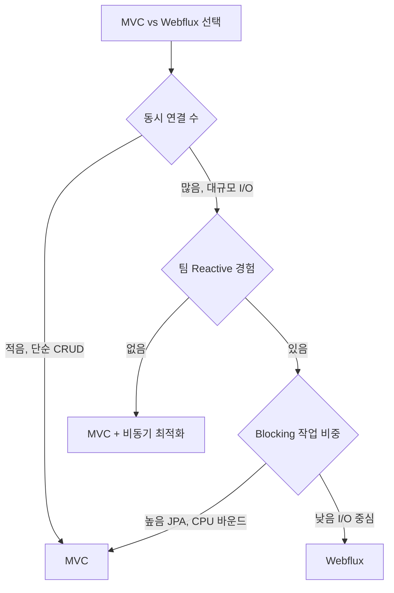

# Spring MVC vs Spring Webflux

## 핵심 차이

```
Spring MVC     → 요청당 스레드 (Thread per Request)
Spring Webflux → 이벤트 루프 (Event Loop)
```

---

## 스레드 모델 비교

### Spring MVC — 스레드 풀

요청이 들어오면 스레드 풀에서 스레드를 할당한다. 요청이 처리되는 동안 스레드가 점유된다.

```
요청 1000개, 스레드 풀 100개

→ 100개 처리 중
→ 900개 대기 큐에서 대기
→ DB 조회 100ms 동안 스레드 100개가 멍하니 대기 (Blocking)
→ 대기 큐 꽉 차면 503 또는 타임아웃
```

**스레드가 일을 안 하면서 자리만 차지하는 게 문제다.**

### Spring Webflux — 이벤트 루프

소수의 스레드(CPU 코어 수)가 이벤트 루프로 동작한다.

```
요청 1000개, 스레드 8개 (CPU 코어 수)

→ 요청 받음
→ DB 조회 요청 → "결과 오면 알려줘" 하고 스레드 반환
→ 스레드는 다른 요청 처리
→ DB 결과 도착 → 콜백 실행 → 응답 전송
```

스레드가 I/O 대기 중에 다른 요청을 처리해서 적은 스레드로 많은 요청을 처리할 수 있다.

---

## 성능 비교

```
단순 CRUD          → MVC와 Webflux 처리량 차이 크지 않음
대규모 동시 I/O    → Webflux 압도적으로 유리
CPU 바운드 작업    → MVC가 유리 (이벤트 루프 블로킹 위험)
```

Webflux가 무조건 빠른 게 아니다. I/O가 많고 대기 시간이 긴 상황에서만 이점이 있다.

---

## Blocking 작업 주의

Webflux 이벤트 루프에서 Blocking 작업이 발생하면 전체 처리가 멈춘다.

```
❌ 이벤트 루프에서 Blocking 작업
→ Thread.sleep(), JDBC, 동기 외부 API 호출
→ 이벤트 루프 스레드가 블로킹
→ 다른 요청 전부 대기
→ Webflux 이점 사라짐
```

```java
// ❌ Webflux에서 절대 하면 안 되는 것
@GetMapping("/users")
public Flux<User> getUsers() {
    Thread.sleep(1000);  // 이벤트 루프 블로킹!
    return userRepository.findAll();
}

// ✅ Blocking 작업이 필요하면 별도 스케줄러로 분리
@GetMapping("/users")
public Flux<User> getUsers() {
    return Flux.defer(() -> Flux.fromIterable(blockingService.getUsers()))
               .subscribeOn(Schedulers.boundedElastic());  // 별도 스레드풀
}
```

---

## DB 드라이버 차이

JPA/JDBC는 Blocking이라 Webflux와 함께 쓸 수 없다.

```
MVC
→ JPA + JDBC → Blocking → 문제없음

Webflux
→ JPA + JDBC → 이벤트 루프 블로킹 → 사용 불가
→ R2DBC (Reactive DB 드라이버) 사용 필요
→ MongoDB Reactive Driver
→ Redis Reactive (Lettuce)
```

R2DBC로 트랜잭션도 가능하지만 JPA만큼 성숙하지 않아 기능 제약이 있다.

---

## 트랜잭션 관리

```
MVC
→ @Transactional → ThreadLocal 기반 → 단순

Webflux
→ 스레드가 바뀌니까 ThreadLocal 못 씀
→ ReactiveTransactionManager 사용
→ @Transactional 은 R2DBC에서 지원
```

---

## Mono와 Flux

Webflux의 핵심 타입이다.

```
Mono<T> → 0개 또는 1개 데이터 (단건 조회)
Flux<T> → 0개 또는 N개 데이터 (스트림, 다건 조회)
```

```java
Mono<User> findById(Long id)    // 유저 1명
Flux<User> findAll()            // 유저 N명, 하나씩 흘러옴
```

### Lazy 실행

구독하기 전까지 아무것도 실행되지 않는다.

```java
Mono<User> mono = userRepository.findById(1L);
// 이 시점엔 DB 조회 안 함. 파이프라인 정의만 한 것

mono.subscribe(user -> System.out.println(user));
// 여기서 실제 DB 조회 시작
```

Spring이 알아서 구독해줘서 개발자가 직접 `subscribe()` 호출할 일은 거의 없다.

### MVC vs Webflux 코드 비교

```java
// MVC
@GetMapping("/users/{id}")
public User getUser(@PathVariable Long id) {
    return userService.findById(id);  // 즉시 실행, User 반환
}

// Webflux
@GetMapping("/users/{id}")
public Mono<User> getUser(@PathVariable Long id) {
    return userService.findById(id);  // 파이프라인 반환, Spring이 구독
}
```

---

## 에러 처리

### MVC

```java
// 동기라 try-catch 또는 @ExceptionHandler
@ExceptionHandler(UserNotFoundException.class)
public ResponseEntity<?> handle(UserNotFoundException e) {
    return ResponseEntity.notFound().build();
}
```

### Webflux

파이프라인 중간에 선언적으로 처리한다.

```java
// 에러 발생 시 대체값으로 스트림 종료
flux.onErrorReturn(-1)

// 에러 발생 시 다른 스트림으로 전환
flux.onErrorResume(e -> Flux.just(0, 0, 0))

// 해당 아이템만 건너뛰고 계속 진행
flux.onErrorContinue((e, item) -> log.error("에러: {}", item))

// 예외 변환 후 종료
flux.onErrorMap(e -> new CustomException(e))
```

| 방식 | 동작 |
|---|---|
| `onErrorReturn` | 에러 나면 대체값 반환 후 스트림 종료 |
| `onErrorResume` | 에러 나면 다른 스트림으로 전환 |
| `onErrorContinue` | 해당 아이템만 건너뛰고 계속 |
| `onErrorMap` | 예외 변환 후 종료 |

전역 처리는 MVC와 동일하게 `@ExceptionHandler` 지원한다.

---

## Webflux가 유리한 유스케이스

```
SSE / WebSocket      → 장기 연결 다수 처리
API Gateway          → 외부 API 다중 동시 호출
데이터 스트리밍      → 대용량 데이터 실시간 전송
실시간 알림 서버     → 많은 클라이언트 연결 유지
마이크로서비스 통신  → 서비스간 대량 비동기 호출
```

API Gateway 예시 — 여러 서비스 병렬 호출

```java
// MVC → A, B, C 순서대로 호출 (스레드 대기)
// Webflux → A, B, C 동시에 호출 (스레드 대기 없음)
Mono.zip(
    serviceA.call(),
    serviceB.call(),
    serviceC.call()
).map(results -> merge(results));
```

---

## MVC가 유리한 경우

```
단순 CRUD 서비스       → 처리량 차이 크지 않음
복잡한 트랜잭션 비즈니스 로직 → JPA + @Transactional 그대로
CPU 바운드 작업 중심   → 이벤트 루프 블로킹 위험
팀 러닝커브가 중요할 때 → Reactive 학습 비용 높음
```

---

## 선택 기준



---

## 참고 자료

- [Spring Webflux 공식 문서](https://docs.spring.io/spring-framework/docs/current/reference/html/web-reactive.html)
- [Spring MVC 공식 문서](https://docs.spring.io/spring-framework/docs/current/reference/html/web.html)
- [R2DBC 공식 문서](https://r2dbc.io/)
