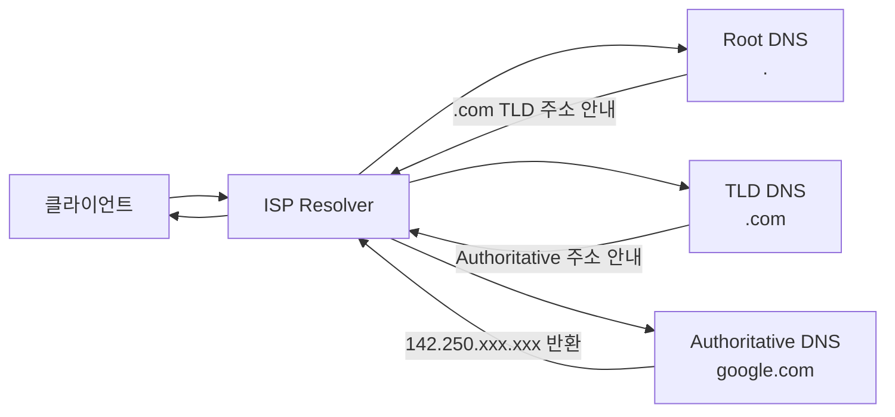
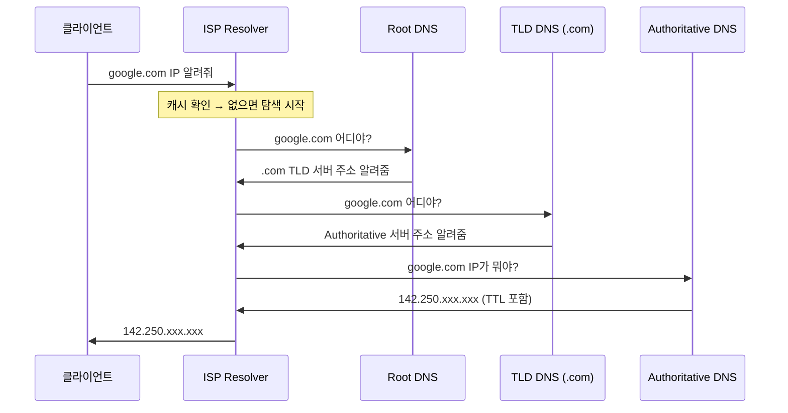

# DNS (Domain Name System)

> 태그: `#network` `#dns` `#infra`<br>
> 작성일: 2026-06-23<br>
> 최종 수정일: 2026-06-23

## 정의

DNS는 사람이 읽기 쉬운 도메인 이름을 컴퓨터가 사용하는 IP 주소로 변환하는 시스템으로, Root→TLD→Authoritative 계층 구조를 ISP Resolver가 대신 탐색하며 각 레이어의 캐싱과 TTL로 조회 비용과 변경 반영 속도의 균형을 맞춘다.

## 특징 / 상세

### 개념

```
google.com → 142.250.xxx.xxx
```

### DNS 계층 구조

DNS 조회는 4단계 계층을 거친다.



| 단계 | 역할 |
|---|---|
| Root DNS | 전세계 13개 루트 서버. "`.com`이면 TLD 서버에 물어봐" 안내 |
| TLD DNS | `.com`, `.kr`, `.net` 등 최상위 도메인 담당. Authoritative 서버 주소 안내 |
| Authoritative DNS | 해당 도메인의 실제 주소록. 여기서 최종 IP 반환 |
| ISP Resolver | 클라이언트 대신 위 3단계를 순서대로 조회해주는 중간 서버 |

Root DNS는 실제 IP를 모른다. 단계마다 "다음 단계로 가봐" 를 안내하는 구조다.

### 캐싱 레이어

매번 Root부터 탐색하면 느리다. 각 레이어에서 캐싱이 일어난다.

```
브라우저 캐시
    ↓ 없으면
OS 캐시 (hosts 파일 포함)
    ↓ 없으면
라우터 캐시
    ↓ 없으면
ISP DNS Resolver 캐시   ← 캐시 히트율 가장 높음
    ↓ 없으면
Root → TLD → Authoritative 탐색
```

**hosts 파일**

DNS 조회 자체를 건너뛴다. 로컬 개발 시 도메인 설정에 활용한다.

```
# /etc/hosts (Mac/Linux)
# C:\Windows\System32\drivers\etc\hosts (Windows)

127.0.0.1   localhost
192.168.0.1 my-local-server
```

### TTL (Time To Live)

DNS 레코드에는 캐시 만료 시간이 붙어있다.

```
google.com.  300  IN  A  142.250.xxx.xxx
             ↑
             TTL (초 단위, 300 = 5분)
```

TTL이 만료되면 캐시를 버리고 다시 조회한다.

#### 실무 전략

```
평상시       → TTL 길게 (트래픽 절약)
배포 전날    → TTL 짧게 줄여놓기
IP 변경 완료 → 다시 TTL 길게
```

서버 이전 전에 TTL을 미리 줄여놓지 않으면 사용자들이 한참 동안 옛날 IP로 접속하는 문제가 생긴다.

### DNS 레코드 타입

DNS는 "도메인 → IP" 외에도 다양한 정보를 저장한다.

| 타입 | 역할 | 예시 |
|---|---|---|
| A | 도메인 → IPv4 | `google.com → 142.250.xxx.xxx` |
| AAAA | 도메인 → IPv6 | `google.com → 2404:6800:xxxx::xxxx` |
| CNAME | 도메인 → 도메인 (별칭) | `www.google.com → google.com` |
| MX | 메일 서버 지정 | `google.com → aspmx.l.google.com` |
| TXT | 텍스트 정보 | 도메인 소유권 인증, SPF 스팸 방지 |

### A vs CNAME 선택 기준

```
A 레코드    → IP가 고정되어 있을 때 (EC2 탄력적 IP 등)
CNAME       → IP가 자주 바뀌거나 모를 때
```

AWS ELB, CloudFront, Vercel, Netlify 등은 내부적으로 IP를 수시로 변경한다.
이 경우 A 레코드로 IP를 직접 연결하면 안 되고, 제공된 도메인에 CNAME으로 연결해야 한다.

```
# Vercel 배포
myapp.com → CNAME → cname.vercel-dns.com → Vercel 서버 IP

# EC2 직접 배포
myapp.com → A → 123.456.789.0 (탄력적 IP)
```

### 전체 조회 흐름 요약



## 트레이드오프

### TTL 길이

```
TTL 짧게 (예: 60초)
→ IP 변경 시 빠르게 반영
→ DNS 서버 쿼리 자주 발생

TTL 길게 (예: 86400초 = 1일)
→ DNS 서버 부하 적음
→ IP 변경 반영이 느림
```

| 항목 | 내용 |
|---|---|
| 일관성 | TTL이 길수록 IP 변경 후 일부 클라이언트가 옛 IP를 더 오래 바라봄 (캐시 불일치) |
| 가용성 | 캐싱 레이어가 많을수록 Authoritative DNS 장애 시에도 캐시 히트로 서비스 영향 적음 |
| 지연 | 캐시 히트 시 0에 가까운 지연, 캐시 미스 시 Root→TLD→Authoritative 전체 탐색 지연 발생 |
| 비용 | TTL 짧을수록 DNS 서버(Authoritative/Resolver) 쿼리량 증가 → 비용 증가 |
| 운영부담 | 배포/IP 변경 전 TTL을 미리 줄여야 하는 수동 운영 절차 필요 |

## 실무 경험

해당 없음

## 참고

원본 학습 노트(TIL)에서 이전한 링크. 확인일 미기재 — 필요 시 재검증.

- [IANA Root Servers](https://www.iana.org/domains/root/servers)
- [Cloudflare DNS 개념 설명](https://www.cloudflare.com/learning/dns/what-is-dns/)

## 관련 내용

- [웹-요청-흐름](웹-요청-흐름.md)
- [TCP-3-way-핸드셰이크](TCP-3-way-핸드셰이크.md)
