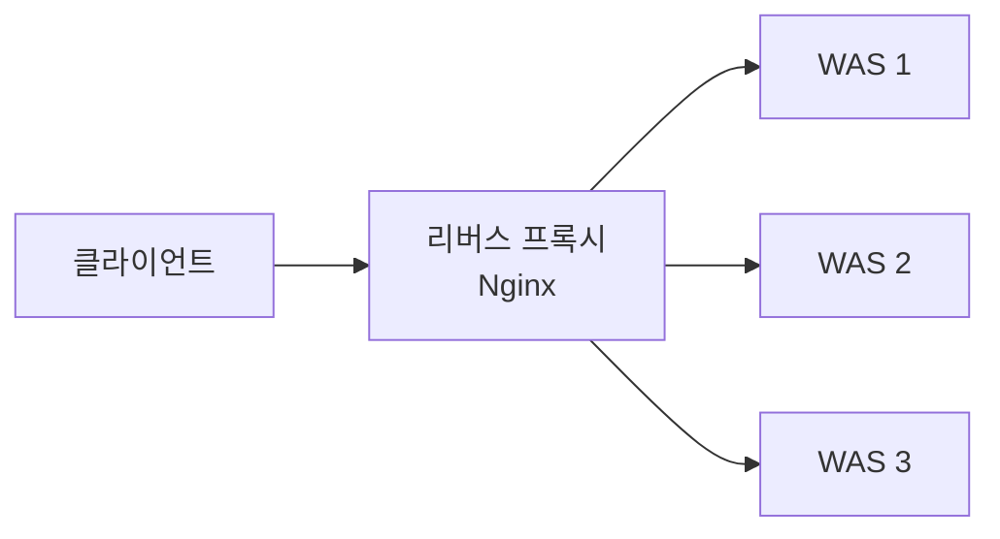
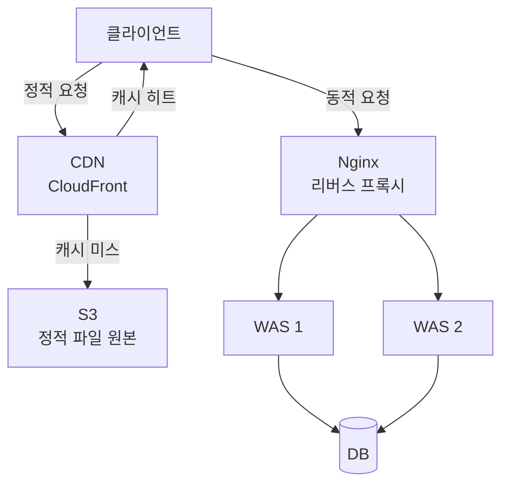

# 리버스 프록시

## 프록시란

프록시는 클라이언트와 서버 사이에서 요청을 대리하는 중간 서버다. 방향에 따라 두 가지로 나뉜다.

```
포워드 프록시 → 클라이언트를 대리 (서버가 클라이언트 모름)
리버스 프록시 → 서버를 대리 (클라이언트가 서버 모름)
```

---

## 포워드 프록시

클라이언트가 인터넷으로 나갈 때 앞단에 위치한다.


```
용도
→ 회사 내부망 보호 (외부 접근 통제)
→ 특정 사이트 차단 (유해 사이트 필터링)
→ 익명성 (서버 입장에서 클라이언트 IP 모름)
→ 캐싱 (같은 요청 재사용)
```

---

## 리버스 프록시

인터넷에서 서버로 들어올 때 앞단에 위치한다.



클라이언트 입장에서는 서버가 몇 대인지 모르고 리버스 프록시만 보인다.

---

## 리버스 프록시가 없다면

```
클라이언트 → WAS 직접 접근
```

```
문제
→ 서버 IP 직접 노출 → 공격 대상
→ SSL 인증서를 WAS마다 따로 관리
→ WAS가 정적 파일(이미지, CSS, JS)까지 처리 → 비효율
→ 트래픽 분산 불가 → 서버 1대가 전부 받아야 함
→ WAS 포트(8080) 직접 노출
```

---

## 리버스 프록시 역할

### 1. SSL Termination

클라이언트와의 TLS 연결을 리버스 프록시에서 끊고, 내부는 HTTP로 통신한다.

```
클라이언트 ←— HTTPS —→ Nginx ←— HTTP —→ WAS
```

```
장점
→ WAS가 암복호화 부담 없음
→ 인증서 관리를 한 곳에서 집중

주의
→ Nginx ↔ WAS 구간은 평문 HTTP
→ 내부 네트워크 신뢰가 전제되어야 함
```

### 2. 로드 밸런싱

트래픽을 여러 서버에 분산한다.

| 알고리즘 | 동작 방식 | 적합한 상황 |
|---|---|---|
| Round Robin | 순서대로 분배 | 서버 스펙이 동일할 때 |
| Weighted Round Robin | 가중치 비율로 분배 | 서버 스펙이 다를 때 |
| Least Connection | 현재 연결 가장 적은 서버로 | 요청 처리 시간이 들쭉날쭉할 때 |
| IP Hash | 클라이언트 IP 해시 → 항상 같은 서버 | 세션 유지가 필요할 때 |

**Sticky Session 문제**

세션을 서버에 저장하면 특정 서버에 트래픽이 몰린다.

```
해결 1 — 세션을 Redis로 분리
서버 A ─┐
서버 B ─┼→ Redis (세션 저장소)
서버 C ─┘
→ 어느 서버로 가도 세션 조회 가능

해결 2 — JWT (Stateless)
→ 서버에 상태 없음
→ 어느 서버로 가도 상관없음
```

### 3. 정적 파일 서빙

Nginx가 정적 파일을 직접 서빙해서 WAS까지 요청이 가지 않도록 한다.

```nginx
location / {
    root /var/www/html;          # 정적 파일 직접 서빙
}

location /api {
    proxy_pass http://was:8080;  # 동적 요청은 WAS로
}
```

### 4. 라우팅

URL 경로나 도메인 기준으로 요청을 분기한다.

```
/ → 정적 파일
/api → WAS
/admin → 관리자 서버
```

---

## 웹서버 vs WAS

```
웹서버 (Nginx, Apache)
→ 정적 파일 처리 (HTML, CSS, JS, 이미지)
→ 리버스 프록시 역할
→ SSL Termination

WAS (Tomcat, Spring Boot)
→ 동적 처리 (비즈니스 로직, DB 조회)
```

---

## 전체 아키텍처



---

## CDN vs 리버스 프록시

CDN은 리버스 프록시 역할을 포함하지만 같은 개념은 아니다.

| | 리버스 프록시 (Nginx) | CDN (CloudFront) |
|---|---|---|
| 위치 | 서버 1대 | 전세계 수백 개 엣지 서버 |
| 주목적 | 라우팅, SSL, 로드밸런싱 | 지리적 분산 캐싱 |
| 캐싱 범위 | 같은 서버로 온 요청 | 전세계 엣지 서버 |
| 리버스 프록시 기능 | ✅ | ✅ (포함) |

```
CDN ⊃ 리버스 프록시 기능

Nginx   → 리버스 프록시 O, CDN X
CloudFront → CDN O, 리버스 프록시 기능도 포함
```

---

## 참고 자료

- [Nginx 공식 문서](https://nginx.org/en/docs/)
- [Cloudflare — 리버스 프록시](https://www.cloudflare.com/learning/cdn/glossary/reverse-proxy/)
- [AWS CloudFront 공식 문서](https://docs.aws.amazon.com/cloudfront/)
