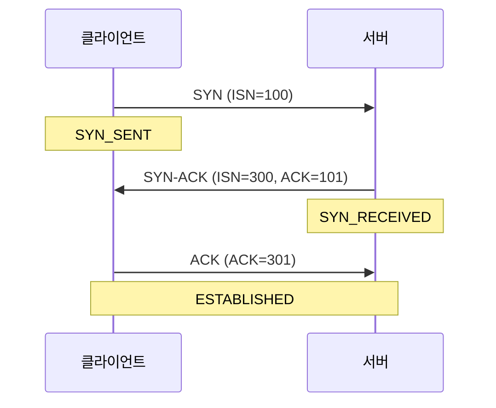
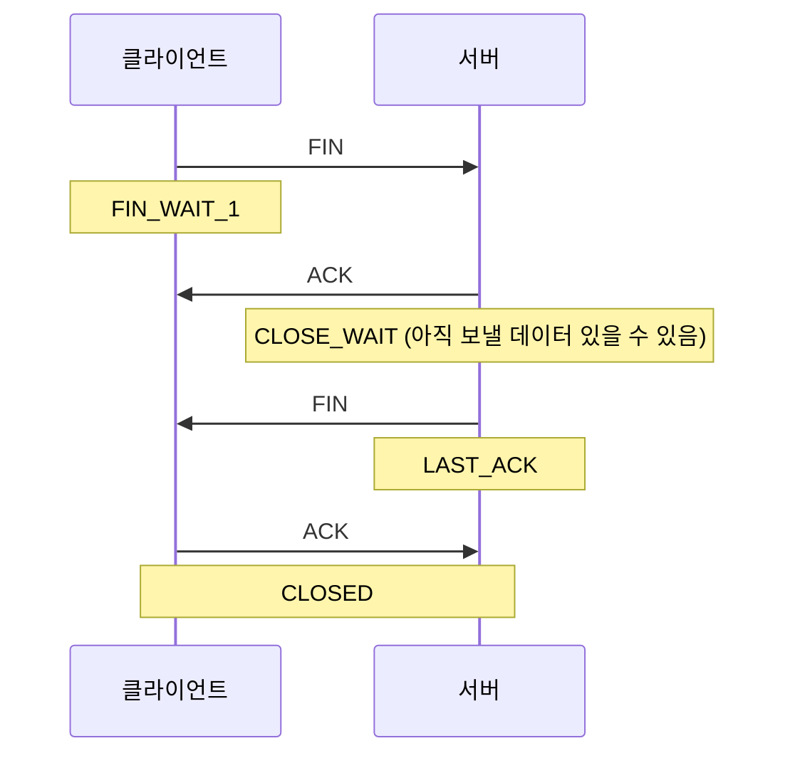

# TCP 3-way Handshake

## TCP란

TCP(Transmission Control Protocol)는 신뢰성 있는 연결을 보장하는 연결 지향형 프로토콜이다.

```
TCP 핵심 특징
→ 연결 지향 (3-way handshake로 연결 수립)
→ 순서 보장 (Sequence Number 기반)
→ 신뢰성 보장 (ACK + 재전송)
→ 흐름 제어 / 혼잡 제어
```

---

## 왜 3번인가

2번으로는 부족하다.

```
클라이언트 → SYN     → 서버
클라이언트 ← SYN-ACK ← 서버
```

이 시점에서 클라이언트는 "서버 살아있네" 를 확인했지만, **서버는 자기 SYN-ACK가 클라이언트에게 도달했는지 모른다.**

3번째 ACK가 있어야 서버도 연결을 확신할 수 있다.

```
3-way handshake가 하는 일
1. 연결 가능 여부 확인 (양방향)
2. ISN 교환 (순서 번호 동기화)
```

---

## 3-way Handshake 흐름



| 단계 | 방향 | 내용 |
|---|---|---|
| SYN | 클라이언트 → 서버 | "연결할게. 나 100번부터 시작" |
| SYN-ACK | 서버 → 클라이언트 | "ㅇㅇ. 나는 300번부터 시작. 너 100번 받았어(ACK=101)" |
| ACK | 클라이언트 → 서버 | "너 300번 받았어(ACK=301)" |

---

## ISN (Initial Sequence Number)

TCP는 데이터에 순서 번호를 붙여 전송한다. ISN은 그 시작값이다.

### 왜 필요한가

네트워크에서 패킷은 순서대로 도착한다는 보장이 없다.

```
전송: 패킷1[Hello ] → 패킷2[World!]

도착: 패킷2[World!] → 패킷1[Hello ]
→ 순서 번호 없으면 "World!Hello" 로 조립됨
```

Sequence Number가 있으면 순서를 복원할 수 있다.

```
Seq 100: "Hello "
Seq 106: "World!"

→ 106이 먼저 와도 100 기다렸다가 순서대로 조립
```

### ACK와의 관계

```
Seq 100짜리 받으면 → ACK 106 ("여기까지 받았어, 106번 줘")
Seq 106짜리 받으면 → ACK 112 ("여기까지 받았어, 112번 줘")
```

"여기까지 받았어, 다음 거 줘" 를 번호로 주고받는 구조다.

### ISN을 랜덤으로 쓰는 이유

```
항상 0번부터 시작하면
→ 이전 연결의 늦게 도착한 패킷과 섞일 수 있음
→ 공격자가 순서 번호 예측해서 패킷 위조 가능
```

매 연결마다 랜덤한 값으로 시작한다.

---

## 연결 종료 — 4-way Handshake

연결 종료는 4번을 주고받는다. 종료 요청을 받은 쪽이 아직 보낼 데이터가 남아있을 수 있기 때문에 ACK와 FIN이 분리된다.



| 단계 | 내용 |
|---|---|
| FIN | "나 이제 끊을게" |
| ACK | "ㅇㅇ 알겠어. 근데 나 아직 보낼 거 있어" |
| FIN | "나도 다 보냈어. 끊을게" |
| ACK | "ㅇㅇ 확인" |

3-way와 달리 서버의 ACK와 FIN이 분리되는 것이 핵심이다.

---

## SYN Flood 공격

3-way handshake의 구조를 악용한 공격이다.

```
공격자 → SYN (가짜 IP) → 서버
서버   → SYN-ACK       → 가짜 IP (응답 없음)
서버   → 반쯤 열린 연결 대기 (백로그 큐에 쌓임)
```

```
공격자가 SYN을 대량으로 보내면
→ 서버의 백로그 큐가 가득 참
→ 정상적인 연결 요청을 처리 못함
→ 서비스 거부 (DoS)
```

**방어 방법**

```
SYN Cookie  → 백로그 큐 없이 쿠키로 연결 상태 관리
방화벽       → 동일 IP에서 과도한 SYN 차단
Rate Limit  → 단위 시간당 SYN 수 제한
```

---

## 참고 자료

- [RFC 793 — TCP 명세](https://www.rfc-editor.org/rfc/rfc793)
- [Cloudflare — TCP Handshake](https://www.cloudflare.com/learning/ddos/glossary/tcp-ip/)
- [Cloudflare — SYN Flood 공격](https://www.cloudflare.com/learning/ddos/syn-flood-ddos-attack/)
