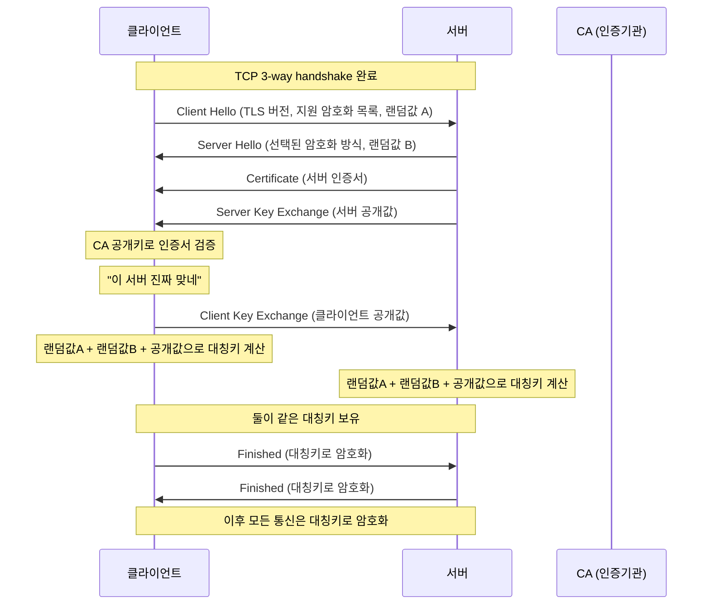

# TLS Handshake

## 개념

TLS(Transport Layer Security)는 TCP 연결 위에서 동작하는 보안 프로토콜이다. HTTPS = HTTP + TLS다.

```
역할
→ 인증: 접속한 서버가 진짜인지 확인
→ 암호화: 통신 내용을 중간에서 볼 수 없도록
→ 무결성: 데이터가 중간에 변조되지 않았는지 확인
```

---

## 사전 작업 — 서버 인증서 발급

TLS 연결 전에 서버가 미리 CA에서 인증서를 발급받아 들고 있어야 한다.

```
[사전 작업]
서버 → CA에 인증서 발급 요청
CA  → 서버 인증서 발급 (CA 개인키로 서명)
서버 → 인증서 보관

[연결 시]
서버 → 클라이언트에게 인증서 전달
클라이언트 → CA 공개키로 서명 검증
→ "CA가 보증한 진짜 서버네" 확인
```

CA(Certificate Authority)는 연결 시점에 직접 관여하지 않는다. 인증서는 서버가 들고 있다가 클라이언트에게 준다.

---

## TLS Handshake 전체 흐름



| 단계 | 내용 |
|---|---|
| Client Hello | 지원하는 TLS 버전, 암호화 방식 목록, 랜덤값 A 전달 |
| Server Hello | 암호화 방식 선택, 랜덤값 B 응답 |
| Certificate | 서버 인증서 전달 (CA가 서명한) |
| Key Exchange | 디피-헬만 공개값 교환 |
| 대칭키 계산 | 양쪽이 독립적으로 계산 (네트워크에 절대 안 나감) |
| Finished | 대칭키로 암호화 시작 확인 |

---

## 키 교환 방식

### RSA 방식 (구버전 TLS 1.2 이하)

```
클라이언트가 대칭키 생성
→ 서버 공개키로 암호화해서 전송
→ 서버 개인키로 복호화
```

**치명적 단점 — Forward Secrecy 없음**

```
나중에 서버 개인키가 유출되면
→ 과거에 녹화해둔 모든 트래픽 복호화 가능
→ 과거 통신이 전부 털림
```

### ECDHE 디피-헬만 방식 (현재 표준 TLS 1.3)

개인키 없이 공개된 값만으로 양쪽이 같은 대칭키를 독립적으로 계산해내는 방식이다.

```
클라이언트 → 공개값 A 전송
서버       → 공개값 B 전송
클라이언트 → A + B로 대칭키 계산
서버       → A + B로 대칭키 계산
→ 둘이 같은 대칭키를 가지게 됨
→ 대칭키 자체는 네트워크에 절대 안 나감
```

**Forward Secrecy 보장**

```
매 연결마다 새로운 키 쌍 생성
→ 서버 개인키 유출돼도 과거 트래픽 복호화 불가
→ 각 세션 키가 독립적
```

### 비교

| | RSA | ECDHE |
|---|---|---|
| 키 교환 방식 | 서버 공개키로 암호화 전송 | 양쪽이 독립적으로 계산 |
| 대칭키 네트워크 노출 | O | X |
| Forward Secrecy | ❌ | ✅ |
| TLS 1.3 지원 | ❌ 제거됨 | ✅ 표준 |

---

## 대칭키 vs 비대칭키 역할 분리

```
비대칭키 (RSA / ECDHE)
→ 느림
→ 인증, 키 교환에만 사용

대칭키 (AES 등)
→ 빠름
→ 실제 데이터 암호화에 사용
```

인증과 키 교환은 비대칭키, 실제 통신은 대칭키. 둘의 장점을 조합한 구조다.

---

## SSL Termination

리버스 프록시(Nginx 등)에서 TLS 연결을 끊고, 내부 통신은 HTTP로 넘기는 방식이다.

```
클라이언트 ←— HTTPS —→ Nginx (SSL Termination) ←— HTTP —→ WAS
```

```
장점
→ WAS가 암복호화 부담 없음
→ 인증서 관리를 Nginx 한 곳에서 집중
→ 내부 통신 성능 향상

주의
→ Nginx ↔ WAS 구간은 평문 HTTP
→ 내부 네트워크 신뢰가 전제되어야 함
→ 내부까지 암호화가 필요하면 mTLS 고려
```

---

## 참고 자료

- [Cloudflare — TLS Handshake](https://www.cloudflare.com/learning/ssl/what-happens-in-a-tls-handshake/)
- [Mozilla — TLS 1.3](https://developer.mozilla.org/en-US/docs/Web/Security/Transport_Layer_Security)
- [RFC 8446 — TLS 1.3 명세](https://www.rfc-editor.org/rfc/rfc8446)
