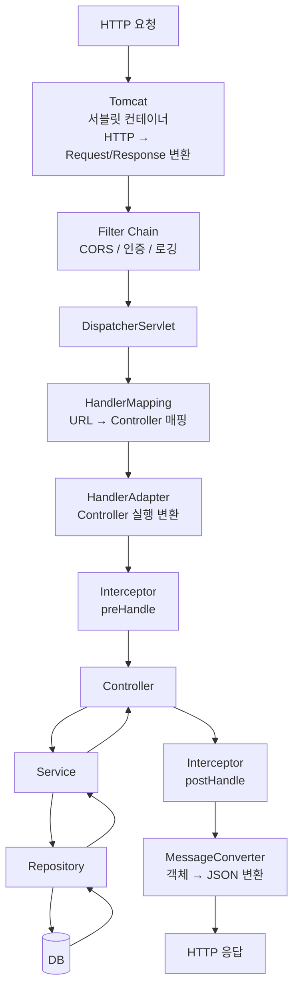

# WAS (Web Application Server)

> 태그: `#network` `#was` `#tomcat` `#servlet` `#spring`<br>
> 작성일: 2026-06-23<br>
> 최종 수정일: 2026-06-23

## 정의

WAS는 동적 요청(비즈니스 로직, DB 조회)을 처리하는 서버로, Tomcat 같은 서블릿 컨테이너가 HTTP 텍스트를 Java 객체로 변환하고 Filter Chain → DispatcherServlet → Controller로 이어지는 흐름을 거쳐 응답을 만든다.

## 특징 / 상세

### 개념

```
웹서버 (Nginx)  → 정적 리소스 처리 (HTML, CSS, JS, 이미지)
WAS (Tomcat)   → 동적 리소스 처리 (비즈니스 로직, DB 조회)
```

### Tomcat = WAS = 서블릿 컨테이너

세 가지는 같은 의미로 봐도 된다.

```
Tomcat = WAS = 서블릿 컨테이너
```

Tomcat 외에도 다른 WAS가 있다.

| WAS | 특징 |
|---|---|
| Tomcat | 가장 널리 쓰임. Spring Boot 기본값 |
| Jetty | 경량화 |
| Undertow | JBoss 계열. Spring Boot에서 선택 가능 |

### 서블릿 컨테이너 역할

HTTP는 그냥 텍스트다.

```
POST /api/users HTTP/1.1
Content-Type: application/json
{"name": "철수"}
```

서블릿 컨테이너(Tomcat)는 이 날 것의 HTTP 텍스트를 Java 객체로 변환한다.

```
HTTP 텍스트 (날 것)
    ↓
Tomcat 서블릿 컨테이너
    ↓
HttpServletRequest  → request.getBody(), request.getHeader() 등
HttpServletResponse → response.setStatus(), response.getWriter() 등
```

변환 후 Filter Chain을 순서대로 실행하고, 통과하면 DispatcherServlet을 호출한다.

```
Tomcat이 하는 일
1. HTTP 텍스트 → HttpServletRequest/Response 변환
2. Filter Chain 순서대로 실행
3. 다 통과하면 DispatcherServlet 호출
```

### Spring vs Spring Boot — Tomcat 차이

**Spring (구버전)**

Tomcat을 외부에 별도 설치하고, 프로젝트를 WAR로 빌드해서 배포한다.

```
1. Tomcat 별도 설치
2. 프로젝트를 WAR 파일로 빌드
3. WAR를 Tomcat의 webapps 폴더에 배포
4. Tomcat 실행 → 앱 구동

Tomcat (외부)
    └── webapps/
            └── myapp.war
```

**Spring Boot**

Tomcat이 JAR 안에 내장되어 있다.

```
java -jar app.jar 실행 → 끝

app.jar
    ├── 내장 Tomcat
    └── Spring 애플리케이션
```

```
외부 Tomcat 방식 불편한 점
→ Tomcat 따로 설치/관리
→ WAR 빌드 후 배포 과정 복잡
→ 환경마다 Tomcat 버전 다를 수 있음

Spring Boot 내장 방식 장점
→ JAR 하나로 어디서든 실행
→ 개발/운영 환경 동일
→ Docker 컨테이너화 쉬움
```

### Spring Boot 요청 처리 흐름



### Filter Chain

Filter가 여러 개 있을 때 순서대로 체인처럼 연결된 구조다. Tomcat 서블릿 컨테이너 안에 위치한다.

```
요청
 ↓
Filter 1 (CharacterEncodingFilter)
 ↓
Filter 2 (CorsFilter)
 ↓
Filter 3 (Spring Security)
 ↓
DispatcherServlet
```

각 Filter는 다음 Filter를 호출할지 결정한다.

```java
public void doFilter(request, response, chain) {
    // 요청 전처리

    chain.doFilter(request, response); // 다음 Filter로 넘김
                                       // 호출 안 하면 여기서 차단

    // 응답 후처리
}
```

Spring Security 인증 실패 시 `chain.doFilter()` 를 호출하지 않아 Controller까지 가지 않고 즉시 401 반환한다.

**기본 Filter (Spring Security 없어도 존재)**

| Filter | 역할 |
|---|---|
| CharacterEncodingFilter | 인코딩 설정 (UTF-8) |
| FormContentFilter | PUT/PATCH form 데이터 파싱 |
| RequestContextFilter | 요청 컨텍스트 관리 |

**Spring Security 추가 시**

| Filter | 역할 |
|---|---|
| SecurityContextPersistenceFilter | SecurityContext 로드 |
| UsernamePasswordAuthenticationFilter | 로그인 처리 |
| ExceptionTranslationFilter | 인증 예외 처리 |
| FilterSecurityInterceptor | 인가 처리 |

**Filter vs Interceptor**

```
Filter      → Spring 컨텍스트 밖, 서블릿 레벨
Interceptor → Spring 컨텍스트 안, DispatcherServlet 이후
```

| | Filter | Interceptor |
|---|---|---|
| 위치 | 서블릿 컨테이너 (Tomcat) | Spring MVC |
| Spring Bean 주입 | 어려움 (예전) | 자유로움 |
| 적용 범위 | 모든 요청 (정적 파일 포함) | Spring이 처리하는 요청만 |
| 예외 처리 | @ExceptionHandler 불가 | @ExceptionHandler 가능 |
| 주요 용도 | Spring Security, CORS, 인코딩 | 로그인 체크, API 로깅, 권한 체크 |

### DispatcherServlet

Spring MVC의 프론트 컨트롤러다. 모든 요청이 여기를 거쳐간다.

```
DispatcherServlet
    ├── HandlerMapping   → URL 보고 Controller 찾기
    ├── HandlerAdapter   → 찾은 Controller 실행 가능하게 변환
    └── MessageConverter → 반환값 JSON으로 변환
```

**HandlerMapping**

Spring 시작 시점에 모든 Controller의 URL 매핑을 미리 스캔해서 Map으로 들고 있다.

```
"/api/users GET"  → UserController.getUsers()
"/api/users POST" → UserController.createUser()
"/api/users/1"    → UserController.getUser(1)
```

요청이 오면 이 Map에서 찾아서 해당 메서드 실행한다.

**HandlerAdapter**

찾아낸 Controller를 DispatcherServlet이 실행할 수 있는 형태로 변환한다.

**MessageConverter vs ModelAndView**

| | ModelAndView | MessageConverter |
|---|---|---|
| 반환 | HTML (JSP 렌더링) | JSON |
| 방식 | 서버사이드 렌더링 | REST API |
| 어노테이션 | @Controller | @RestController |

```java
// ModelAndView — 구버전 (JSP 시절)
@Controller
public String getUsers(Model model) {
    model.addAttribute("users", userList);
    return "user/list";  // user/list.jsp 렌더링 → HTML 반환
}

// MessageConverter — 현재 (REST API)
@RestController
public List<User> getUsers() {
    return userList;  // Jackson이 JSON으로 변환
}
```

`@RestController = @Controller + @ResponseBody`

`@ResponseBody` 가 있어야 MessageConverter가 동작한다.

## 트레이드오프

해당 없음

## 실무 경험

해당 없음

## 참고

원본 학습 노트(TIL)에서 이전한 링크. 확인일 미기재 — 필요 시 재검증.

- [Apache Tomcat 공식 문서](https://tomcat.apache.org/tomcat-10.1-doc/)
- [Spring MVC 공식 문서](https://docs.spring.io/spring-framework/docs/current/reference/html/web.html)
- [Spring Boot 내장 서버](https://docs.spring.io/spring-boot/docs/current/reference/html/web.html#web.servlet.embedded-container)

## 관련 내용

- [리버스-프록시](리버스-프록시.md)
- [웹-요청-흐름](웹-요청-흐름.md)
