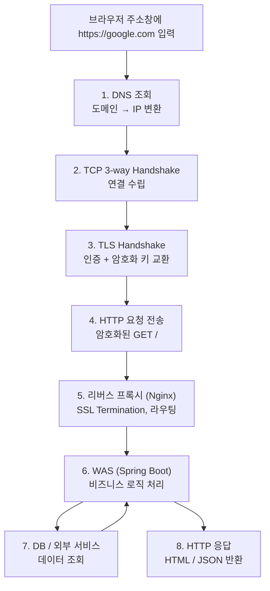
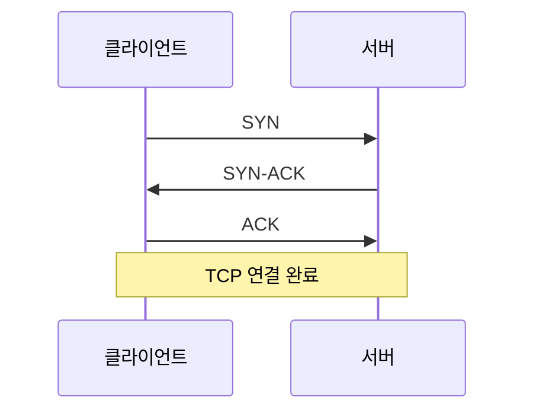

# https://google.com 을 치면 일어나는 일

브라우저 주소창에 `https://google.com` 을 입력하고 엔터를 누르는 순간부터 화면이 뜨기까지의 전체 흐름이다.

---

## 전체 흐름



---

## 1단계 — DNS 조회

도메인을 IP로 변환한다.

```
브라우저 캐시 확인
    ↓ 없으면
OS 캐시 (hosts 파일)
    ↓ 없으면
ISP DNS Resolver
    ↓ 없으면
Root DNS → TLD DNS (.com) → Authoritative DNS
    ↓
142.250.xxx.xxx 반환
```

→ 자세한 내용: [DNS.md](DNS.md)

---

## 2단계 — TCP 3-way Handshake

IP를 얻었으면 해당 서버와 TCP 연결을 맺는다.



TLS는 TCP 연결이 맺어진 후에 시작된다.

→ 자세한 내용: [TCP-3-way-handshake.md](TCP-3-way-handshake.md)

---

## 3단계 — TLS Handshake

HTTPS이므로 암호화 연결을 수립한다.

```
1. 서버 인증서 전달 (CA가 서명한)
2. 클라이언트가 CA 공개키로 인증서 검증
3. ECDHE로 대칭키 교환 (키 자체는 네트워크에 안 나감)
4. 이후 모든 통신은 대칭키로 암호화
```

→ 자세한 내용: [TLS-Handshake.md](TLS-Handshake.md)

---

## 4단계 — HTTP 요청 전송

TCP + TLS 연결이 완료되면 암호화된 HTTP 요청을 전송한다.

```
GET / HTTP/1.1
Host: google.com
```

---

## 5단계 — 리버스 프록시 (Nginx)

요청이 서버 인프라로 들어오면 리버스 프록시가 먼저 받는다.

```
클라이언트 ←— HTTPS —→ Nginx (SSL Termination)
                            ↓
                    정적 파일 요청 → 직접 반환
                    동적 요청     → WAS로 전달
```

```
역할
→ SSL Termination (TLS 연결 종료)
→ 정적 파일 서빙 (HTML, CSS, JS, 이미지)
→ 로드 밸런싱 (여러 WAS로 분산)
→ 라우팅 (/api → WAS, / → 정적 파일)
```

→ 자세한 내용: [Reverse-Proxy.md](Reverse-Proxy.md)

---

## 6단계 — WAS (Spring Boot)

동적 요청이 WAS로 전달되면 내부에서 순서대로 처리된다.

```
Tomcat 서블릿 컨테이너
    → HTTP 텍스트 → HttpServletRequest/Response 변환
    ↓
Filter Chain
    → 인증/인가, CORS, 인코딩 처리
    ↓
DispatcherServlet
    → HandlerMapping: URL → Controller 매핑
    → HandlerAdapter: Controller 실행
    ↓
Interceptor → Controller → Service → Repository
    ↓
MessageConverter → JSON 변환
    ↓
HTTP 응답
```

→ 자세한 내용: [WAS.md](WAS.md)

---

## 7단계 — DB / 외부 서비스

Controller → Service → Repository를 거쳐 DB나 외부 서비스에서 데이터를 조회한다.

```
DB 조회     → MySQL, PostgreSQL, MongoDB 등
캐시 조회   → Redis
외부 API    → 서킷 브레이커 (Resilience4j) 적용
```

---

## 8단계 — HTTP 응답

처리된 결과가 역순으로 올라와 클라이언트에게 전달된다.

```
Repository → Service → Controller
    ↓
MessageConverter → JSON
    ↓
Nginx → 클라이언트
    ↓
브라우저 렌더링
```

---

## 전체 요약

```
1. DNS       → 도메인을 IP로 변환
2. TCP       → 서버와 연결 수립
3. TLS       → 암호화 채널 수립
4. HTTP 요청 → 암호화된 요청 전송
5. Nginx     → SSL 종료, 라우팅, 로드밸런싱
6. WAS       → 비즈니스 로직 처리
7. DB        → 데이터 조회
8. HTTP 응답 → 결과 반환
```
