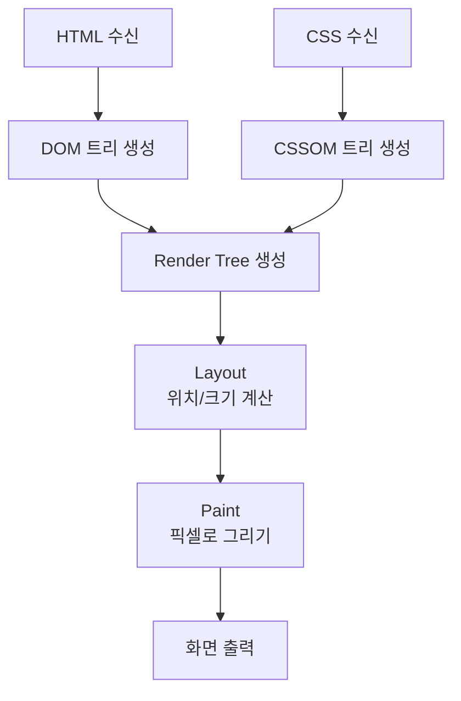
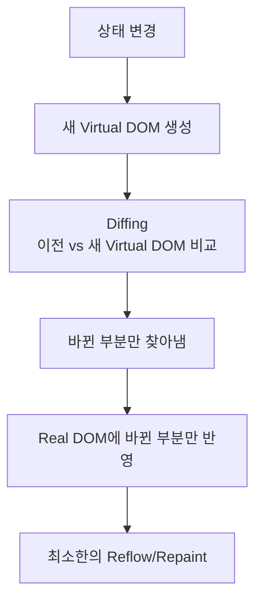

# 브라우저 렌더링

## 개념

브라우저가 HTML/CSS/JS를 받아서 화면에 픽셀로 그려내는 과정이다.

---

## 렌더링 전체 흐름



---

## 1단계 — DOM 트리

HTML은 텍스트다. 브라우저가 파싱해서 트리 구조로 변환한다.

```html
<html>
  <body>
    <h1>안녕</h1>
    <p>반가워</p>
  </body>
</html>
```

```
html
 └── body
      ├── h1 ("안녕")
      └── p ("반가워")
```

이게 **DOM(Document Object Model)** 이다. JavaScript에서 `document.querySelector()` 로 요소를 찾을 수 있는 이유가 이 DOM 트리가 메모리에 있기 때문이다.

---

## 2단계 — CSSOM 트리

CSS도 파싱해서 트리로 만든다.

```css
h1 { color: red; font-size: 24px; }
p  { color: blue; }
```

```
root
 ├── h1 (color: red, font-size: 24px)
 └── p  (color: blue)
```

이게 **CSSOM(CSS Object Model)** 이다.

---

## 3단계 — Render Tree

DOM + CSSOM을 합쳐서 Render Tree를 만든다.

```
h1 ("안녕",  color: red,  font-size: 24px)
p  ("반가워", color: blue)
```

**화면에 보이지 않는 요소는 Render Tree에서 제외된다.**

| CSS | Render Tree 포함 | 설명 |
|---|---|---|
| `display: none` | ❌ | 공간도 차지 안 함 |
| `visibility: hidden` | ✅ | 공간은 차지, 안 보임 |

---

## 4단계 — Layout (Reflow)

각 요소의 **위치와 크기를 계산**한다.

```
h1 → x: 0,   y: 0,    width: 800px, height: 40px
p  → x: 0,   y: 40px, width: 800px, height: 20px
```

---

## 5단계 — Paint (Repaint)

계산된 위치에 **실제 픽셀을 그린다.** 색상, 텍스트, 이미지, 테두리 등.

---

## JavaScript와 Reflow/Repaint

JavaScript가 DOM을 변경하면 렌더링이 다시 발생한다.

```javascript
document.querySelector('h1').style.fontSize = '48px'
```

```
DOM 변경
    ↓
Layout 다시 계산 (Reflow)  ← 비쌈
    ↓
Paint 다시 (Repaint)
    ↓
화면 갱신
```

### Reflow vs Repaint 비용

```
Reflow  → 레이아웃 전체 재계산 → 비쌈
Repaint → 픽셀만 다시 그림    → 그나마 쌈
```

Reflow를 최소화하는 게 성능 최적화의 핵심이다.

```javascript
// ❌ 나쁜 예 — 1000번 Reflow 발생
for (let i = 0; i < 1000; i++) {
    document.body.appendChild(div)
}

// ✅ 좋은 예 — 1번만 Reflow 발생
const fragment = document.createDocumentFragment()
for (let i = 0; i < 1000; i++) {
    fragment.appendChild(div)  // 메모리에서 작업
}
document.body.appendChild(fragment)  // 한 번만 Real DOM에 반영
```

---

## Virtual DOM (React)

Real DOM을 직접 건드리지 않고 **메모리에 가상의 DOM 복사본**을 들고 있다.

```
Real DOM    → 실제 브라우저 화면
Virtual DOM → 메모리에 있는 JS 객체 (가상)
```

### 동작 방식



### Diffing

```
이전 Virtual DOM         새 Virtual DOM
h1 (color: red)    →    h1 (color: red)    ← 같음, 건드리지 않음
p  (color: blue)   →    p  (color: green)  ← 다름, 이것만 업데이트
div (width: 100px) →    div (width: 100px) ← 같음, 건드리지 않음
```

바뀐 `p` 하나만 Real DOM에 반영. Reflow 최소화.

### Virtual DOM의 진짜 장점

```
성능보다 개발 편의성
→ 개발자가 DOM을 직접 관리 안 해도 됨
→ 상태(State)만 관리하면 UI는 자동으로 동기화
```

Virtual DOM이 항상 빠른 건 아니다. 단순한 변경이면 Diffing 비용이 오히려 더 클 수 있다.

---

## Svelte — Virtual DOM 없는 방식

React 이후 등장한 Svelte는 Virtual DOM을 사용하지 않는다.

### React vs Svelte 비교

```
React (런타임 방식)
→ 앱 실행 중에 Diffing
→ 런타임 오버헤드 발생
→ 런타임 라이브러리 포함 → 번들 무거움

Svelte (컴파일 방식)
→ 빌드 타임에 분석
→ "이 상태가 바뀌면 이 DOM만 업데이트" 미리 결정
→ 런타임에 Diffing 없음 → 오버헤드 없음
→ 컴파일 결과물만 → 번들 가벼움
```

```javascript
// Svelte 코드
let count = 0
```
```html
<h1>{count}</h1>
<button on:click={() => count++}>클릭</button>
```

빌드하면 아래처럼 미리 최적화된 코드가 생성된다.

```javascript
// 컴파일 결과 (간략화)
// count가 바뀌면 h1만 업데이트하는 코드가 빌드 시점에 생성됨
function update() {
    h1.textContent = count  // Virtual DOM 없이 Real DOM 직접 업데이트
}
```

| | React | Svelte |
|---|---|---|
| 방식 | 런타임 Diffing | 빌드타임 컴파일 |
| Virtual DOM | ✅ | ❌ |
| 런타임 오버헤드 | 있음 | 없음 |
| 번들 크기 | 무거움 | 가벼움 |

---

## 참고 자료

- [MDN — 브라우저 렌더링](https://developer.mozilla.org/ko/docs/Web/Performance/How_browsers_work)
- [Google — 렌더링 성능](https://developers.google.com/web/fundamentals/performance/rendering)
- [React — Virtual DOM](https://ko.legacy.reactjs.org/docs/faq-internals.html)
- [Svelte — 컴파일러 방식](https://svelte.dev/blog/virtual-dom-is-pure-overhead)
