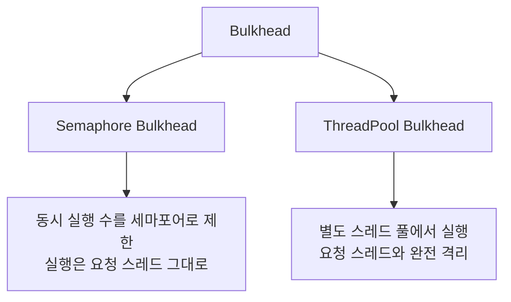
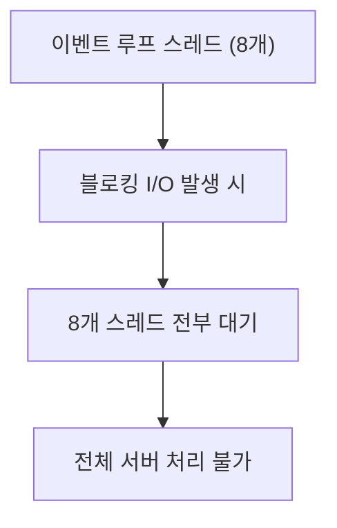
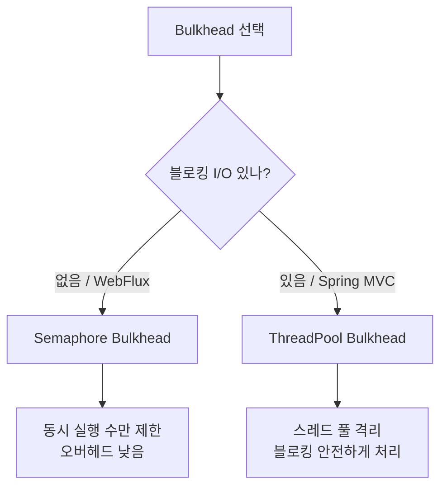

# Bulkhead

> 태그: `#resilience` `#bulkhead` `#resilience4j`<br>
> 작성일: 2026-06-25<br>
> 최종 수정일: 2026-06-25

## 정의

Bulkhead는 선박의 격벽(bulkhead) 개념을 차용해, 특정 서비스 호출이 자원을 모두 점유해도 다른 서비스는 영향받지 않도록 자원 사용량 자체를 격리하는 패턴이다. Resilience4j는 이를 Semaphore Bulkhead와 ThreadPool Bulkhead 두 방식으로 제공한다.

## 특징 / 상세

### 1. 개념

선박의 격벽(bulkhead)에서 온 개념이다. 배 안을 여러 격벽으로 나눠서 한 칸에 물이 차도 다른 칸은 잠기지 않게 한다. 소프트웨어에서도 동일하다. 특정 서비스 호출이 자원을 다 잡아먹어도 다른 서비스는 살아있게 격리하는 것이다.

서킷 브레이커가 "실패율이 높으면 차단"이라면, Bulkhead는 "자원 사용량 자체를 격리"하는 개념이다.

### 2. 두 가지 구현 방식

Resilience4j는 Bulkhead를 두 가지 방식으로 제공한다.



### 3. Semaphore Bulkhead

#### 동작 방식

세마포어는 단순한 카운터다. "지금 동시에 실행 중인 게 N개 넘으면 거절"만 제어한다.

```
요청 스레드 (Tomcat) → 세마포어 획득 → 작업 실행 → 세마포어 반환
```

실행은 **요청이 들어온 스레드 그대로** 한다. 스레드를 격리하지 않는다.

#### 설정

```yaml
resilience4j:
  bulkhead:
    instances:
      myService:
        maxConcurrentCalls: 10   # 동시 실행 최대 10개
        maxWaitDuration: 0ms     # 자리 날 때까지 기다리는 시간 (0이면 즉시 거절)
```

#### 코드

```java
@Service
public class MyService {

    @Bulkhead(name = "myService", fallbackMethod = "fallback")
    public String call() {
        return externalService.call();
    }

    public String fallback(BulkheadFullException e) {
        return "fallback";
    }
}
```

자리가 없으면 `BulkheadFullException`이 발생하고 fallback으로 빠진다.

#### 블로킹 I/O와의 문제

Semaphore는 스레드를 격리하지 않기 때문에, 블로킹 I/O가 있는 상황에서 위험하다.

```
Tomcat 스레드 풀 (200개)
  └─ 요청 100개 동시에 들어옴
       └─ 전부 DB 호출 (블로킹, 응답 3초)
            └─ 100개 스레드가 3초 동안 전부 대기 중
                 └─ 새 요청 처리할 스레드 없음 → 장애
```

`maxConcurrentCalls: 10`으로 설정해도, 그 10개 요청이 Tomcat 스레드를 3초씩 잡고 있는 건 동일하다. 나머지 요청을 빠르게 거절할 뿐, 스레드 풀 소진 자체를 막지는 못한다.

### 4. ThreadPool Bulkhead

#### 동작 방식

아예 별도의 스레드 풀을 만들어 작업을 제출한다. 요청 스레드는 작업 제출만 하고 즉시 반환된다.

```
Tomcat 스레드 → 작업 제출 → 즉시 반환
                    ↓
         Bulkhead 전용 스레드 풀
              └─ 여기서 블로킹 I/O 처리
```

Tomcat 스레드 풀과 Bulkhead 스레드 풀이 완전히 격리되므로, 외부 서비스가 느려져도 Tomcat 스레드 풀은 영향받지 않는다.

#### 설정

```yaml
resilience4j:
  thread-pool-bulkhead:
    instances:
      myService:
        maxThreadPoolSize: 10    # 스레드 풀 최대 크기
        coreThreadPoolSize: 5    # 기본 유지 스레드 수
        queueCapacity: 20        # 대기 큐 크기
```

큐까지 꽉 차면 `RejectedExecutionException`이 발생한다.

#### 코드

```java
@Service
public class MyService {

    @Bulkhead(name = "myService",
              type = Bulkhead.Type.THREADPOOL,
              fallbackMethod = "fallback")
    public CompletableFuture<String> call() {
        return CompletableFuture.supplyAsync(() -> externalService.call());
    }

    public CompletableFuture<String> fallback(BulkheadFullException e) {
        return CompletableFuture.completedFuture("fallback");
    }
}
```

ThreadPool Bulkhead는 반환 타입이 `CompletableFuture`여야 한다.

### 5. 두 방식 비교

| | Semaphore | ThreadPool |
|---|---|---|
| 실행 스레드 | 요청 스레드 그대로 | 별도 스레드 풀 |
| 블로킹 I/O | 위험 (요청 스레드 점유) | 안전 (격리됨) |
| 오버헤드 | 낮음 | 높음 (컨텍스트 스위칭) |
| 반환 타입 | 일반 타입 | CompletableFuture |
| Spring WebFlux | 호환 | 비호환 |

### 6. WebFlux에서의 Bulkhead

WebFlux는 이벤트 루프 기반이라 스레드가 CPU 코어 수만큼만 존재한다 (보통 8개). 이 스레드에서 블로킹이 발생하면 전체 서버가 마비된다.



따라서 WebFlux 환경에서는:

- **원칙**: 블로킹 I/O 자체를 없앤다 (R2DBC, WebClient 등 리액티브 드라이버 사용)
- **어쩔 수 없는 경우**: `Schedulers.boundedElastic()`으로 별도 스레드 풀에서 실행
- **Bulkhead**: ThreadPool Bulkhead는 비호환. Semaphore Bulkhead만 사용 가능

ThreadPool Bulkhead가 WebFlux와 충돌하는 이유는, 내부적으로 스레드를 추가로 생성하는 방식이 논블로킹 이벤트 루프 모델과 맞지 않기 때문이다.

### 7. 언제 무엇을 쓸까



## 트레이드오프

규모 가정: 단일 서비스 내 외부 호출 격리를 기준으로 한다. 여러 인스턴스에 걸친 분산 동시성 제어는 별도 주제다.

| 항목 | 내용 |
|---|---|
| 일관성 | 해당 없음 (자원 격리 패턴이며 데이터 일관성과 무관) |
| 가용성 | 특정 외부 호출이 자원을 고갈시켜도 다른 호출/서비스의 가용성을 보존 — 단 Semaphore 방식은 블로킹 I/O 상황에서 요청 스레드 자체는 점유되어 가용성 보호 효과가 제한적 (특징/상세 3번) |
| 지연 | ThreadPool 방식은 별도 스레드 풀 제출/컨텍스트 스위칭 오버헤드로 지연이 늘어남. Semaphore 방식은 오버헤드가 낮지만 큐잉 시 `maxWaitDuration`만큼 대기 발생 가능 |
| 비용 | ThreadPool Bulkhead는 별도 스레드 풀 유지로 메모리/컨텍스트 스위칭 비용 추가. Semaphore Bulkhead는 카운터 수준이라 비용 낮음 |
| 운영부담 | Semaphore vs ThreadPool 선택 기준(블로킹 I/O 여부, WebFlux 호환성)을 팀이 명확히 알아야 함 — 잘못 선택하면 장애 전파를 막지 못함 (특징/상세 6, 7번) |

## 실무 경험

해당 없음 (관련 실무 내용은 특징/상세 6번 "WebFlux에서의 Bulkhead", 7번 "언제 무엇을 쓸까" 참고)

## 참고

- [Resilience4j Bulkhead 공식 문서](https://resilience4j.readme.io/docs/bulkhead)
- [토리맘의 한글라이즈 프로젝트 — Bulkhead (공식 문서 한국어 번역)](https://godekdls.github.io/Resilience4j/bulkhead/)
- [DEV Community — Bulkhead 패턴: 대용량 데이터 처리 안정성 높이기 (실무 사례)](https://dev.to/headf1rst/resilience4j-bulkhead-paeteon-daeyongryang-deiteo-ceori-anjeongseong-nopigi-3jdn)

## 관련 내용

- [서킷-브레이커-Resilience4j](서킷-브레이커-Resilience4j.md)
- [분산-환경-서킷-브레이커](분산-환경-서킷-브레이커.md)
