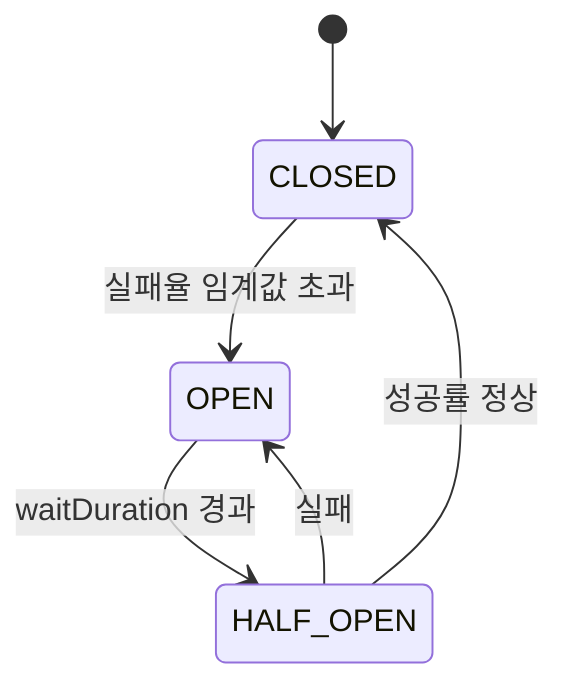
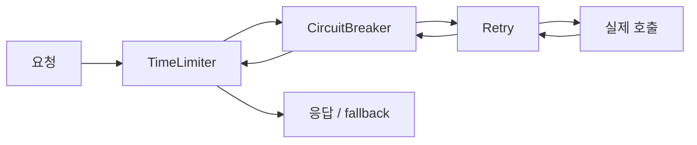
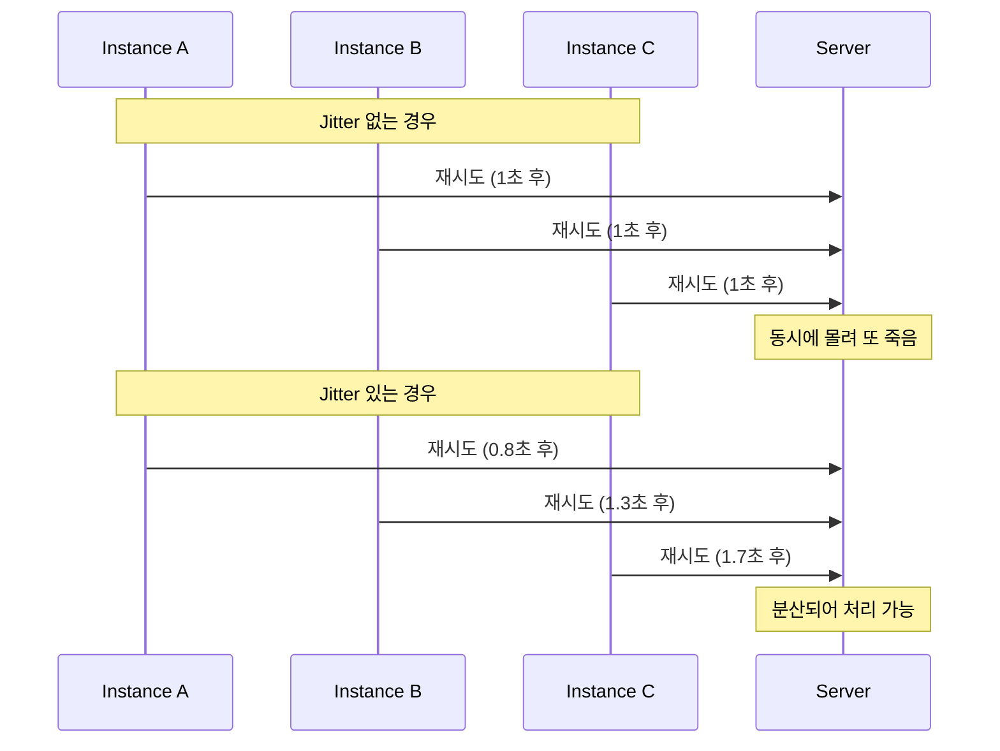
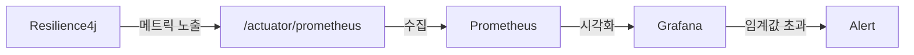

# 서킷 브레이커와 Resilience4j

> 태그: `#resilience` `#circuit-breaker` `#resilience4j`<br>
> 작성일: 2026-06-25<br>
> 최종 수정일: 2026-06-25

## 정의

서킷 브레이커는 전기 회로 차단기 개념을 차용해, 호출 대상의 실패율/응답 지연이 임계값을 넘으면 회로를 차단(요청을 즉시 fallback으로 보냄)해서 장애 전파(Cascading Failure)를 막는 패턴이다. Resilience4j는 Java 진영에서 Netflix Hystrix(2018년 maintenance 모드 전환) 이후 사실상 표준이 된 경량 fault tolerance 라이브러리이며 Spring Cloud Circuit Breaker의 기본 구현체다.

## 특징 / 상세

### 1. 왜 서킷 브레이커가 필요한가

마이크로서비스 환경에서 서비스 A가 서비스 B를 호출할 때, B가 느려지거나 죽으면 어떻게 될까?

A는 응답을 기다리며 스레드를 점유한다. 요청이 쌓일수록 A의 스레드 풀이 고갈되고, 결국 A도 함께 죽는다. 이것이 **장애 전파(Cascading Failure)** 다.

서킷 브레이커는 이를 막기 위해 전기 회로 차단기 개념을 차용했다. 과부하가 감지되면 회로를 차단해서 연쇄 장애를 막는 것이다.

### 2. Resilience4j란

Java용 경량 fault tolerance 라이브러리. Netflix Hystrix가 2018년 maintenance 모드로 전환된 이후 사실상 표준이 됐다. Spring Cloud Circuit Breaker의 기본 구현체이기도 하다.

Hystrix와 달리 함수형/람다 기반으로 설계되어 가볍고 Java 8+ 스타일에 잘 맞는다.

### 3. 서킷 브레이커 3가지 상태



| 상태 | 동작 |
|---|---|
| CLOSED | 정상. 요청 그대로 통과, 실패율 누적 |
| OPEN | 차단. 요청 보내지 않고 즉시 fallback 반환 |
| HALF_OPEN | 테스트. 제한된 수의 요청만 통과시켜 복구 여부 확인 |

### 4. 슬라이딩 윈도우

실패율을 계산하는 기준 윈도우를 어떻게 정의하느냐에 따라 두 가지 방식이 있다.

| | COUNT_BASED | TIME_BASED |
|---|---|---|
| 기준 | 최근 N번 요청 | 최근 N초 요청 |
| 특징 | 트래픽 적으면 윈도우가 느리게 채워짐 | 시간 기준이라 트래픽 양에 무관 |
| 적합한 상황 | 트래픽이 고른 서비스 | 트래픽 변동이 큰 서비스 |

둘 다 **실패율(비율)**을 보는 건 같다. 윈도우를 어떻게 정의하느냐의 차이다.

COUNT_BASED는 윈도우가 채워지기 전까지는 실패율을 계산하지 않는다는 점을 주의해야 한다. 예를 들어 `slidingWindowSize: 10` 이면 최소 10번 요청이 들어와야 판단을 시작한다.

### 5. 실패 판단 기준

실패(failure)로 카운트되는 기준은 생각보다 세분화되어 있다.

#### 5-1. 예외 기반 (기본)

기본적으로 **모든 예외(Exception)** 가 발생하면 실패로 카운트한다.

```yaml
resilience4j:
  circuitbreaker:
    instances:
      myService:
        failureRateThreshold: 50
```

#### 5-2. recordExceptions / ignoreExceptions

특정 예외만 실패로 볼 것인지, 특정 예외는 무시할 것인지 제어할 수 있다.

```yaml
resilience4j:
  circuitbreaker:
    instances:
      myService:
        recordExceptions:
          - java.io.IOException
          - java.util.concurrent.TimeoutException
        ignoreExceptions:
          - com.example.BusinessException  # 비즈니스 예외는 실패로 카운트 안 함
```

`ignoreExceptions`에 등록된 예외는 성공도 실패도 아닌 것으로 처리된다. 서킷 브레이커 입장에서 아예 없는 호출 취급이다.

실무에서는 404 Not Found 같은 비즈니스 예외를 `ignoreExceptions`에 넣는 경우가 많다. 이건 서버 장애가 아니라 정상적인 비즈니스 케이스이기 때문이다.

#### 5-3. Slow Call (느린 호출)

예외 없이 응답이 왔어도 **응답이 느리면** 실패로 카운트한다.

서버가 완전히 죽으면 예외가 나지만, "반죽음" 상태일 때는 응답은 오는데 엄청 느리다. 예외 기반으로만 판단하면 이 상황을 놓친다.

```yaml
resilience4j:
  circuitbreaker:
    instances:
      myService:
        slowCallDurationThreshold: 3s   # 3초 이상 걸리면 느린 호출로 분류
        slowCallRateThreshold: 50       # 느린 호출 비율이 50% 초과하면 OPEN
```

#### 5-4. recordResult (커스텀 결과 판단)

예외도 없고 빠르게 왔는데, **응답 내용 자체가 실패인 경우**도 잡을 수 있다.

예를 들어 HTTP 200으로 왔지만 body에 `"status": "error"` 가 담겨있는 경우, 기본 설정으로는 성공으로 카운트된다. `recordResult` Predicate를 정의하면 응답 내용 기준으로도 실패 처리가 가능하다.

```java
CircuitBreakerConfig config = CircuitBreakerConfig.custom()
    .recordResult(Predicate.not(Response::isSuccess))  // 응답이 성공이 아니면 실패로 기록
    .build();
```

### 6. HALF_OPEN 주요 설정

```yaml
resilience4j:
  circuitbreaker:
    instances:
      myService:
        waitDurationInOpenState: 10s                         # OPEN 유지 시간
        permittedNumberOfCallsInHalfOpenState: 10            # 테스트 요청 수
        automaticTransitionFromOpenToHalfOpenEnabled: false  # 자동 전환 여부 (기본 false)
```

`automaticTransitionFromOpenToHalfOpenEnabled`가 기본 false이므로, 별도 설정 없으면 요청이 들어와야 HALF_OPEN으로 전환된다.

자동 전환을 활성화하면 백그라운드 스레드가 주기적으로 상태를 확인하기 때문에 리소스가 약간 더 소모된다.

### 7. Resilience4j 모듈 구성

| 모듈 | 역할 |
|---|---|
| CircuitBreaker | 실패율 기반 차단 |
| Retry | 실패 시 재시도 |
| TimeLimiter | 응답 시간 초과 시 타임아웃 |
| RateLimiter | 시간당 요청 수 제한 |
| Bulkhead | 동시 실행 수 제한 (스레드 격리) |

### 8. 모듈 조합 순서

실무에서 가장 많이 쓰는 조합은 **CircuitBreaker + Retry + TimeLimiter** 세트다.



어노테이션은 위에서 아래로 감싸기 때문에 실행은 역순(안쪽부터)이다.

**왜 이 순서인가?**

- Retry가 CircuitBreaker 바깥에 있으면 → 서킷 OPEN 됐는데도 재시도를 계속 시도한다. 의미없는 호출이 반복된다.
- Retry가 안쪽에 있어야 → 재시도 결과가 CircuitBreaker 실패율에 반영되고, 서킷이 열리면 Retry 자체를 안 한다.
- TimeLimiter가 가장 바깥 → 전체 흐름(재시도 포함)이 너무 오래 걸리면 끊어낸다.

#### 어노테이션 방식 (Spring Boot)

```java
@Service
public class MyService {

    @CircuitBreaker(name = "myService", fallbackMethod = "fallback")
    @Retry(name = "myService")
    @TimeLimiter(name = "myService")
    public CompletableFuture<String> call() {
        return CompletableFuture.supplyAsync(() -> externalService.call());
    }

    public CompletableFuture<String> fallback(Exception e) {
        return CompletableFuture.completedFuture("fallback");
    }
}
```

> TimeLimiter를 사용할 때는 반환 타입이 반드시 `CompletableFuture`여야 한다. 동기 방식에서는 TimeLimiter가 동작하지 않는다.

#### Decorator 방식 (순서 직접 제어)

어노테이션으로 제어하기 어려운 경우 직접 Decorator 체인을 구성한다.

```java
CircuitBreaker circuitBreaker = CircuitBreaker.ofDefaults("myService");
Retry retry = Retry.ofDefaults("myService");
TimeLimiter timeLimiter = TimeLimiter.ofDefaults("myService");

Supplier<String> supplier = () -> externalService.call();

// 체인 순서 = 감싸는 순서 (실행은 역순)
Supplier<String> decorated = Decorators.ofSupplier(supplier)
    .withRetry(retry)
    .withCircuitBreaker(circuitBreaker)
    .withTimeLimiter(timeLimiter, scheduledExecutorService)
    .decorate();

String result = Try.ofSupplier(decorated)
    .recover(throwable -> "fallback")
    .get();
```

### 9. Retry 정책

#### 지수 백오프 (Exponential Backoff)

재시도마다 대기 시간을 지수적으로 늘린다. 서버가 과부하 상태일 때 즉시 재시도하면 더 힘들게 만드므로, 점점 간격을 벌려서 서버 회복 시간을 준다.

```
1차 실패 → 1초 대기
2차 실패 → 2초 대기
3차 실패 → 4초 대기
```

#### Jitter (지터)

여러 인스턴스가 동시에 재시도하면 한꺼번에 요청이 몰린다. 이를 **Thundering Herd Problem** 이라 한다.

단일 서버에서는 의미 없고, 인스턴스 여러 개가 뜨는 MSA 환경에서 중요하다. 대기 시간에 랜덤 값을 더해 요청을 시간 축으로 분산시킨다.



#### TimeLimiter와의 관계 주의

`maxAttempts: 3`, `waitDuration: 1s`, `exponentialBackoffMultiplier: 2` 이면 최대 소요 시간은:

```
1차 실패 + 1초 대기 + 2차 실패 + 2초 대기 + 3차 실패 = 최소 3초 + 실행 시간
```

`timeoutDuration`이 이보다 짧으면 Retry가 완료되기 전에 TimeLimiter가 끊어버린다. 반드시 **TimeLimiter > Retry 전체 소요 시간** 으로 설정해야 한다.

```yaml
resilience4j:
  retry:
    instances:
      myService:
        maxAttempts: 3
        waitDuration: 1s
        enableExponentialBackoff: true
        exponentialBackoffMultiplier: 2
        enableRandomizedWait: true
        randomizedWaitFactor: 0.5
```

### 10. 전체 설정 예시

```yaml
resilience4j:
  circuitbreaker:
    instances:
      myService:
        slidingWindowType: COUNT_BASED
        slidingWindowSize: 10
        failureRateThreshold: 50
        slowCallDurationThreshold: 3s
        slowCallRateThreshold: 50
        waitDurationInOpenState: 10s
        permittedNumberOfCallsInHalfOpenState: 10
        automaticTransitionFromOpenToHalfOpenEnabled: false
        ignoreExceptions:
          - com.example.BusinessException
  retry:
    instances:
      myService:
        maxAttempts: 3
        waitDuration: 1s
        enableExponentialBackoff: true
        exponentialBackoffMultiplier: 2
        enableRandomizedWait: true
        randomizedWaitFactor: 0.5
  timelimiter:
    instances:
      myService:
        timeoutDuration: 10s  # Retry 전체 소요 시간(1+2+4=7초)보다 크게
```

### 11. 이벤트 리스너

서킷 브레이커는 상태 전환, 실패율 초과, 요청 차단 등의 시점에 이벤트를 발행한다. 이를 구독해서 로그, 알림, 메트릭 수집에 활용할 수 있다.

```java
CircuitBreaker circuitBreaker = circuitBreakerRegistry.circuitBreaker("myService");

circuitBreaker.getEventPublisher()
    .onStateTransition(event ->
        log.warn("서킷 상태 변경: {} → {}",
            event.getStateTransition().getFromState(),
            event.getStateTransition().getToState())
    )
    .onFailureRateExceeded(event ->
        log.error("실패율 초과: {}%", event.getFailureRate())
    )
    .onCallNotPermitted(event ->
        log.warn("OPEN 상태로 요청 차단됨")
    );
```

| 이벤트 | 발생 시점 |
|---|---|
| `onStateTransition` | CLOSED ↔ OPEN ↔ HALF_OPEN 전환 시 |
| `onFailureRateExceeded` | 실패율 임계값 초과 시 |
| `onSlowCallRateExceeded` | 느린 호출 비율 임계값 초과 시 |
| `onCallNotPermitted` | OPEN 상태에서 요청이 차단될 때마다 |
| `onSuccess` / `onError` | 개별 호출 성공/실패마다 |

운영 환경에서는 `onStateTransition`을 반드시 달아두는 게 좋다. 서킷이 열렸는데 인지하지 못하면 장애 대응이 늦어진다.

`onCallNotPermitted`는 OPEN 상태에서 차단되는 요청마다 발생하므로, 트래픽이 많으면 로그가 폭발할 수 있다. 실무에서는 해당 이벤트에 샘플링이나 rate limiting을 걸거나, 카운터 메트릭으로만 수집하는 게 일반적이다.

### 12. Actuator 연동과 모니터링

Spring Boot Actuator와 연동하면 서킷 브레이커 상태를 HTTP 엔드포인트로 노출하고, Prometheus / Grafana로 시각화할 수 있다.

#### 의존성

```gradle
implementation 'io.github.resilience4j:resilience4j-spring-boot3'
implementation 'org.springframework.boot:spring-boot-starter-actuator'
implementation 'io.micrometer:micrometer-registry-prometheus'
```

#### 설정

```yaml
management:
  endpoints:
    web:
      exposure:
        include: health, metrics, prometheus
  health:
    circuitbreakers:
      enabled: true
```

#### Health 엔드포인트

```
GET /actuator/health
```

```json
{
  "components": {
    "circuitBreakers": {
      "details": {
        "myService": {
          "details": {
            "failureRate": "20.0%",
            "slowCallRate": "0.0%",
            "state": "CLOSED"
          },
          "status": "UP"
        }
      }
    }
  }
}
```

서킷이 OPEN 되면 `status`가 `DOWN`으로 바뀐다. 이를 쿠버네티스 헬스체크나 로드밸런서 헬스체크와 연동하면 트래픽 라우팅에도 활용할 수 있다.

#### Prometheus 메트릭

```
# 서킷 상태: 0=CLOSED, 1=OPEN, 2=HALF_OPEN
resilience4j_circuitbreaker_state{name="myService"} 0

# 실패율
resilience4j_circuitbreaker_failure_rate{name="myService"} 20.0

# 호출 횟수 (kind: successful, failed, not_permitted, ignored)
resilience4j_circuitbreaker_calls_total{name="myService", kind="successful"} 80
resilience4j_circuitbreaker_calls_total{name="myService", kind="failed"} 20
resilience4j_circuitbreaker_calls_total{name="myService", kind="not_permitted"} 5
```

`not_permitted`가 급격히 증가한다면 서킷이 OPEN 상태로 오래 유지되고 있다는 신호다. Grafana 알림 조건으로 쓰기 좋다.

#### Grafana 대시보드 구성 예시



### 13. 테스트 전략

서킷 브레이커 테스트는 두 레벨로 나눈다.

#### 단위 테스트 — 서킷이 열리는 조건 검증

실제 외부 서비스 없이 서킷 브레이커 동작 자체를 검증한다. `cb.onError()` / `cb.onSuccess()`로 수동으로 결과를 밀어넣을 수 있다.

```java
@Test
void 실패율_초과시_서킷_오픈() {
    CircuitBreakerConfig config = CircuitBreakerConfig.custom()
        .slidingWindowSize(4)
        .failureRateThreshold(50)  // 50% 이상 실패 시 OPEN
        .build();

    CircuitBreaker cb = CircuitBreaker.of("test", config);

    // 4번 중 2번 실패 → 실패율 50% → OPEN
    cb.onError(0, TimeUnit.NANOSECONDS, new RuntimeException());
    cb.onError(0, TimeUnit.NANOSECONDS, new RuntimeException());
    cb.onSuccess(0, TimeUnit.NANOSECONDS);
    cb.onSuccess(0, TimeUnit.NANOSECONDS);

    assertThat(cb.getState()).isEqualTo(CircuitBreaker.State.OPEN);
}
```

#### 통합 테스트 — fallback 동작 검증

`transitionToOpenState()`로 서킷을 강제로 OPEN 시킨 뒤, fallback이 실제로 동작하는지 확인한다.

```java
@SpringBootTest
class MyServiceTest {

    @Autowired MyService myService;
    @Autowired CircuitBreakerRegistry circuitBreakerRegistry;

    @Test
    void 서킷_오픈시_fallback_반환() throws Exception {
        CircuitBreaker cb = circuitBreakerRegistry.circuitBreaker("myService");
        cb.transitionToOpenState();  // 강제 OPEN

        String result = myService.call().get();

        assertThat(result).isEqualTo("fallback");
    }

    @Test
    void HALF_OPEN_성공시_서킷_복구() {
        CircuitBreaker cb = circuitBreakerRegistry.circuitBreaker("myService");
        cb.transitionToHalfOpenState();  // 강제 HALF_OPEN

        // 성공 호출 → CLOSED로 복구되는지 확인
        cb.onSuccess(0, TimeUnit.NANOSECONDS);

        assertThat(cb.getState()).isEqualTo(CircuitBreaker.State.CLOSED);
    }
}
```

#### 상태 전환 강제 메서드 정리

| 메서드 | 전환 대상 |
|---|---|
| `transitionToOpenState()` | 강제 OPEN |
| `transitionToClosedState()` | 강제 CLOSED |
| `transitionToHalfOpenState()` | 강제 HALF_OPEN |
| `transitionToDisabledState()` | 서킷 브레이커 비활성화 (항상 통과) |
| `transitionToForcedOpenState()` | 강제 OPEN (메트릭 수집도 중단) |

`transitionToDisabledState()`는 테스트나 운영 긴급 상황에서 서킷 브레이커를 잠시 끄고 싶을 때 쓴다. `transitionToForcedOpenState()`는 특정 서비스를 수동으로 완전 차단할 때 사용한다.

## 트레이드오프

규모 가정: 단일 인스턴스(또는 인스턴스별 독립 상태)에서의 서킷 브레이커 적용 기준. 여러 인스턴스 간 상태 동기화 문제는 [분산-환경-서킷-브레이커](분산-환경-서킷-브레이커.md)에서 별도로 다룬다.

| 항목 | 내용 |
|---|---|
| 일관성 | 해당 없음 (서킷 브레이커 자체는 데이터 일관성과 무관 — 상태 전환의 일관성은 분산 환경에서만 문제가 됨) |
| 가용성 | 장애 서비스로의 요청을 즉시 차단해 호출자 스레드 고갈을 막아 호출자 가용성을 보호 — 단 OPEN 상태에서는 해당 기능 자체의 가용성을 fallback 수준으로 낮춤 (특징/상세 1, 3번) |
| 지연 | OPEN 상태에서는 실제 호출 없이 즉시 fallback 반환으로 지연 감소. Retry/TimeLimiter와 조합 시 조합 순서에 따라 전체 지연이 달라짐 — TimeLimiter > Retry 총 소요 시간으로 설정 필요 (특징/상세 8, 9번) |
| 비용 | 라이브러리 자체 오버헤드는 낮음. Actuator+Prometheus+Grafana 연동 시 모니터링 인프라 비용 추가 (특징/상세 12번) |
| 운영부담 | 상태 전환 이벤트 모니터링 필수 — 미인지 시 장애 대응 지연. `onCallNotPermitted` 로그 폭증 가능성 대비 샘플링/카운터 메트릭화 필요 (특징/상세 11번) |

## 실무 경험

해당 없음 (관련 실무 내용은 특징/상세 8번 "모듈 조합 순서", 11번 "이벤트 리스너", 13번 "테스트 전략" 참고)

## 참고

- [Resilience4j 공식 문서](https://resilience4j.readme.io/docs)
- [Resilience4j GitHub](https://github.com/resilience4j/resilience4j)
- [Spring Cloud Circuit Breaker 문서](https://spring.io/projects/spring-cloud-circuitbreaker)
- [Netflix Hystrix → Resilience4j 마이그레이션 가이드](https://resilience4j.readme.io/docs/comparison-to-netflix-hystrix)

## 관련 내용

- [Bulkhead](Bulkhead.md)
- [분산-환경-서킷-브레이커](분산-환경-서킷-브레이커.md)
